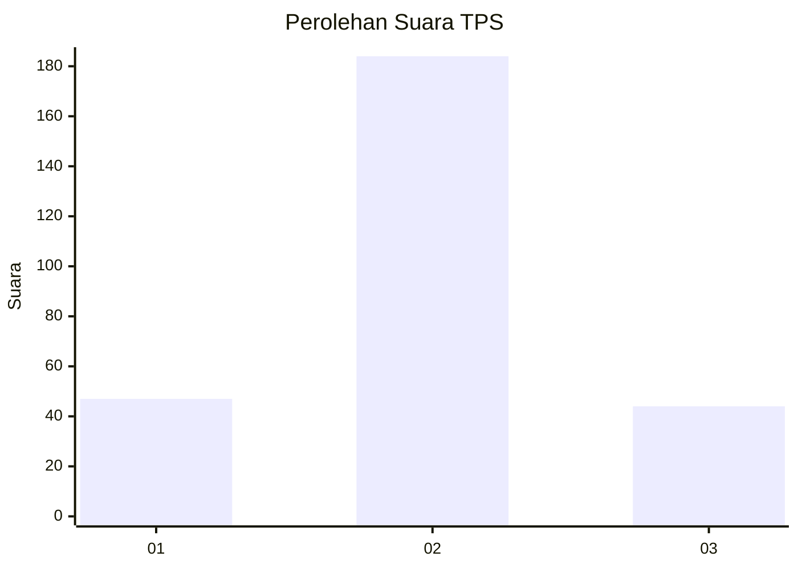
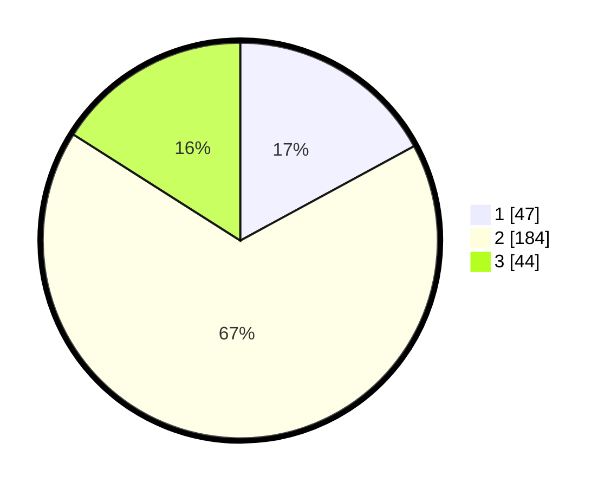

# Hasil

## Grafik

## Tabel

| No. | Nama Paslon    | Suara | Suara (raw) | Persentase |
|:--- |:-------------- | -----:| -----------:| ----------:|
| 1   | ANIES MUHAIMIN | 47    | [47][p-1]   | 17,09      |
| 2   | PRABOWO GIBRAN | 184   | [184][p-2]  | 66,91      |
| 3   | GANJAR MAHFUD  | 44    | [44][p-3]   | 16,00      |

[p-1]: https://github.com/gigit-pemilu/pemilu-2024/blob/main/pilpres/hitung-suara/sub/35-jawa-timur/sub/71-kota-kediri/sub/01-mojoroto/sub/1001-bandar-lor/sub/007-tps/sub/paslon-1.txt
[p-2]: https://github.com/gigit-pemilu/pemilu-2024/blob/main/pilpres/hitung-suara/sub/35-jawa-timur/sub/71-kota-kediri/sub/01-mojoroto/sub/1001-bandar-lor/sub/007-tps/sub/paslon-2.txt
[p-3]: https://github.com/gigit-pemilu/pemilu-2024/blob/main/pilpres/hitung-suara/sub/35-jawa-timur/sub/71-kota-kediri/sub/01-mojoroto/sub/1001-bandar-lor/sub/007-tps/sub/paslon-3.txt

## Foto C Plano

https://sirekap-obj-formc.kpu.go.id/2b5d/pemilu/ppwp/35/71/01/10/01/3571011001007-20240216-200212--046736f1-ec9d-4c76-b562-eda132b7e8bf.jpg

https://sirekap-obj-formc.kpu.go.id/2b5d/pemilu/ppwp/35/71/01/10/01/3571011001007-20240216-201426--a41a82a6-1c12-4e14-bf31-edfb280eaa98.jpg

https://sirekap-obj-formc.kpu.go.id/2b5d/pemilu/ppwp/35/71/01/10/01/3571011001007-20240216-200523--07576f6a-57d8-463d-b521-43338e58832a.jpg

## Metadata

| Key        | Value               |
| ---------- | ------------------- |
| Time Stamp | 2024-02-17 10:30:03 |

## DATA PEMILIH TETAP

Jumlah pemilih dalam DPT: **299**.
 * L: **150**.
 * P: **149**.

## DATA PENGGUNA HAK PILIH

Jumlah pengguna hak pilih dalam DPT: **267**.
 * L: **130**.
 * P: **137**.

Jumlah pengguna hak pilih dalam DPTb: **14**.
 * L: **7**.
 * P: **7**.

Jumlah pengguna hak pilih dalam DPK: **3**.
 * L: **1**.
 * P: **2**.

Jumlah pengguna hak pilih: **284**.
 * L: **138**.
 * P: **146**.

## JUMLAH SUARA SAH DAN TIDAK SAH

JUMLAH SELURUH SUARA SAH: **275**.

JUMLAH SUARA TIDAK SAH: **9**.

JUMLAH SELURUH SUARA SAH DAN SUARA TIDAK SAH: **284**.

