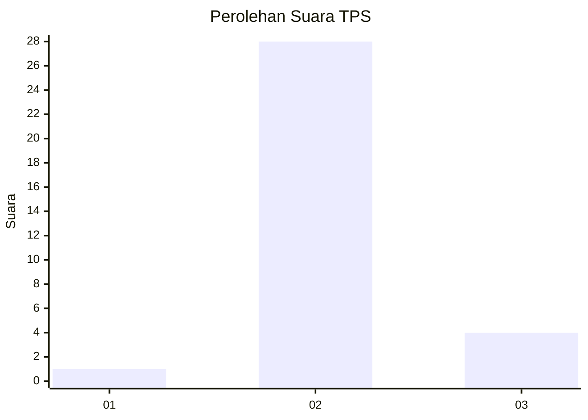
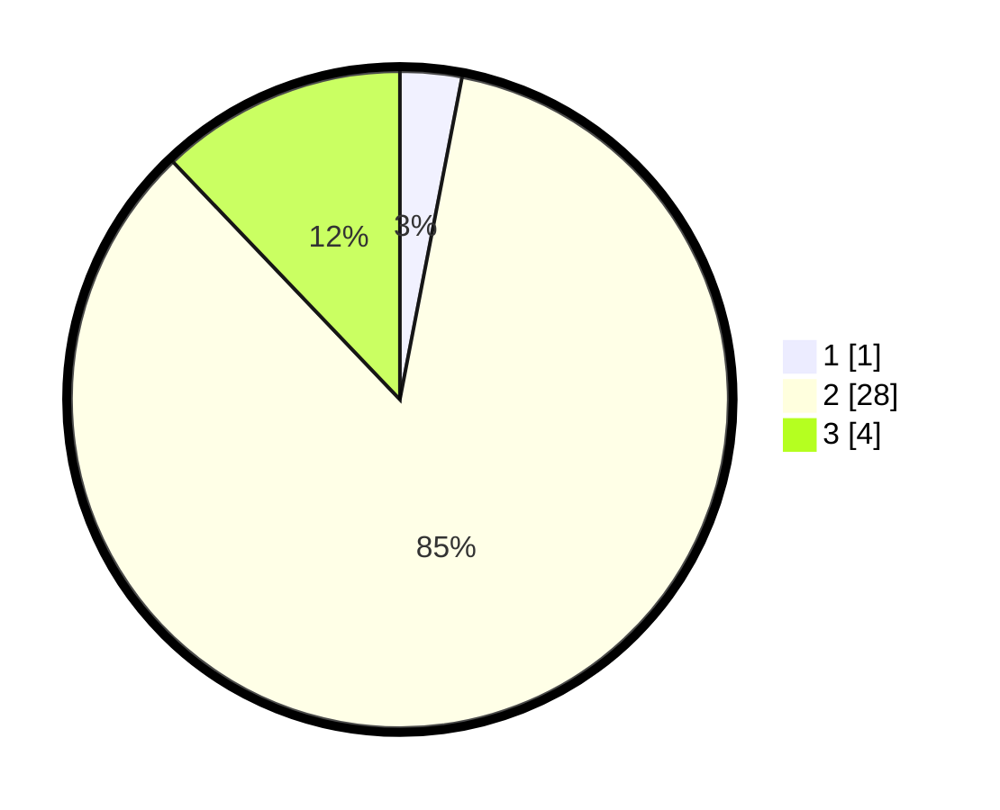

# Hasil

## Grafik

## Tabel

| No. | Nama Paslon    | Suara | Suara (raw) | Persentase |
|:--- |:-------------- | -----:| -----------:| ----------:|
| 1   | ANIES MUHAIMIN | 1     | [1][p-1]    | 3,03       |
| 2   | PRABOWO GIBRAN | 28    | [28][p-2]   | 84,85      |
| 3   | GANJAR MAHFUD  | 4     | [4][p-3]    | 12,12      |

[p-1]: https://github.com/gigit-pemilu/pemilu-2024/blob/main/pilpres/hitung-suara/sub/35-jawa-timur/sub/71-kota-kediri/sub/01-mojoroto/sub/1005-sukorame/sub/901-tps/sub/paslon-1.txt
[p-2]: https://github.com/gigit-pemilu/pemilu-2024/blob/main/pilpres/hitung-suara/sub/35-jawa-timur/sub/71-kota-kediri/sub/01-mojoroto/sub/1005-sukorame/sub/901-tps/sub/paslon-2.txt
[p-3]: https://github.com/gigit-pemilu/pemilu-2024/blob/main/pilpres/hitung-suara/sub/35-jawa-timur/sub/71-kota-kediri/sub/01-mojoroto/sub/1005-sukorame/sub/901-tps/sub/paslon-3.txt

## Foto C Plano

https://sirekap-obj-formc.kpu.go.id/3a55/pemilu/ppwp/35/71/01/10/05/3571011005901-20240216-133802--5747571d-788d-4659-956e-64c6d446e366.jpg

https://sirekap-obj-formc.kpu.go.id/3a55/pemilu/ppwp/35/71/01/10/05/3571011005901-20240216-133803--f5cfb705-0a60-4144-97ef-35a32c2722fa.jpg

https://sirekap-obj-formc.kpu.go.id/3a55/pemilu/ppwp/35/71/01/10/05/3571011005901-20240216-133803--50e1ac31-ecaa-4050-bb0f-de505567869c.jpg

## Metadata

| Key        | Value               |
| ---------- | ------------------- |
| Time Stamp | 2024-02-17 14:45:18 |

## DATA PEMILIH TETAP

Jumlah pemilih dalam DPT: **259**.
 * L: **165**.
 * P: **94**.

## DATA PENGGUNA HAK PILIH

Jumlah pengguna hak pilih dalam DPT: **16**.
 * L: **10**.
 * P: **6**.

Jumlah pengguna hak pilih dalam DPTb: **18**.
 * L: **13**.
 * P: **5**.

Jumlah pengguna hak pilih dalam DPK: **0**.
 * L: **0**.
 * P: **0**.

Jumlah pengguna hak pilih: **34**.
 * L: **23**.
 * P: **11**.

## JUMLAH SUARA SAH DAN TIDAK SAH

JUMLAH SELURUH SUARA SAH: **33**.

JUMLAH SUARA TIDAK SAH: **1**.

JUMLAH SELURUH SUARA SAH DAN SUARA TIDAK SAH: **34**.

