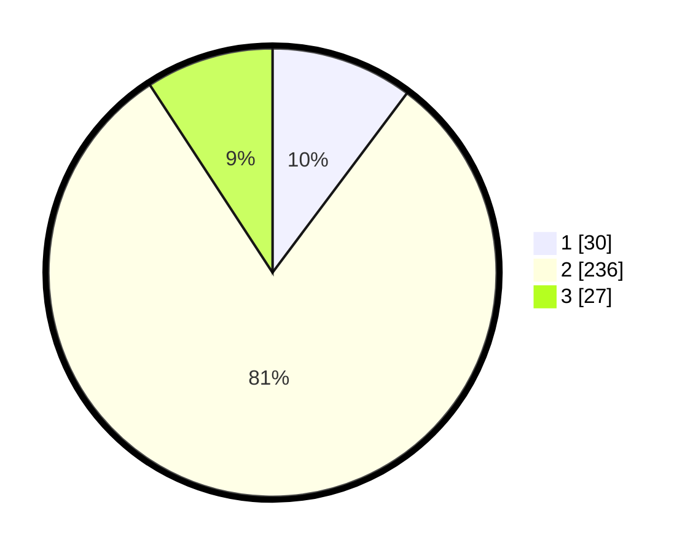

# Hasil

## Grafik

## Tabel

| No. | Nama Paslon    | Suara | Suara (raw) | Persentase |
|:--- |:-------------- | -----:| -----------:| ----------:|
| 1   | ANIES MUHAIMIN | 30    | [30][p-1]   | 10,24      |
| 2   | PRABOWO GIBRAN | 236   | [236][p-2]  | 80,55      |
| 3   | GANJAR MAHFUD  | 27    | [27][p-3]   | 9,22       |

[p-1]: https://github.com/gigit-pemilu/pemilu-2024-35-jawa-timur/blob/main/pilpres/hitung-suara/sub/35-jawa-timur/sub/71-kota-kediri/sub/01-mojoroto/sub/1010-ngampel/sub/901-tps/sub/paslon-1.txt
[p-2]: https://github.com/gigit-pemilu/pemilu-2024-35-jawa-timur/blob/main/pilpres/hitung-suara/sub/35-jawa-timur/sub/71-kota-kediri/sub/01-mojoroto/sub/1010-ngampel/sub/901-tps/sub/paslon-2.txt
[p-3]: https://github.com/gigit-pemilu/pemilu-2024-35-jawa-timur/blob/main/pilpres/hitung-suara/sub/35-jawa-timur/sub/71-kota-kediri/sub/01-mojoroto/sub/1010-ngampel/sub/901-tps/sub/paslon-3.txt

## Foto C Plano

https://sirekap-obj-formc.kpu.go.id/deef/pemilu/ppwp/35/71/01/10/10/3571011010901-20240216-152450--9463d51b-35b3-44ef-8fd3-86d5ae85ed70.jpg

https://sirekap-obj-formc.kpu.go.id/deef/pemilu/ppwp/35/71/01/10/10/3571011010901-20240216-152451--d386249b-67c8-4540-b4f7-0170f7c63042.jpg

https://sirekap-obj-formc.kpu.go.id/deef/pemilu/ppwp/35/71/01/10/10/3571011010901-20240216-152451--995ae9f3-f68b-46ed-a73c-337a1c8fe031.jpg

## Metadata

| Key        | Value               |
| ---------- | ------------------- |
| Time Stamp | 2024-02-17 11:00:02 |

## DATA PEMILIH TETAP

Jumlah pemilih dalam DPT: **294**.
 * L: **100**.
 * P: **194**.

## DATA PENGGUNA HAK PILIH

Jumlah pengguna hak pilih dalam DPT: **262**.
 * L: **86**.
 * P: **176**.

Jumlah pengguna hak pilih dalam DPTb: **31**.
 * L: **12**.
 * P: **19**.

Jumlah pengguna hak pilih dalam DPK: **0**.
 * L: **0**.
 * P: **0**.

Jumlah pengguna hak pilih: **293**.
 * L: **98**.
 * P: **195**.

## JUMLAH SUARA SAH DAN TIDAK SAH

JUMLAH SELURUH SUARA SAH: **293**.

JUMLAH SUARA TIDAK SAH: **0**.

JUMLAH SELURUH SUARA SAH DAN SUARA TIDAK SAH: **293**.

