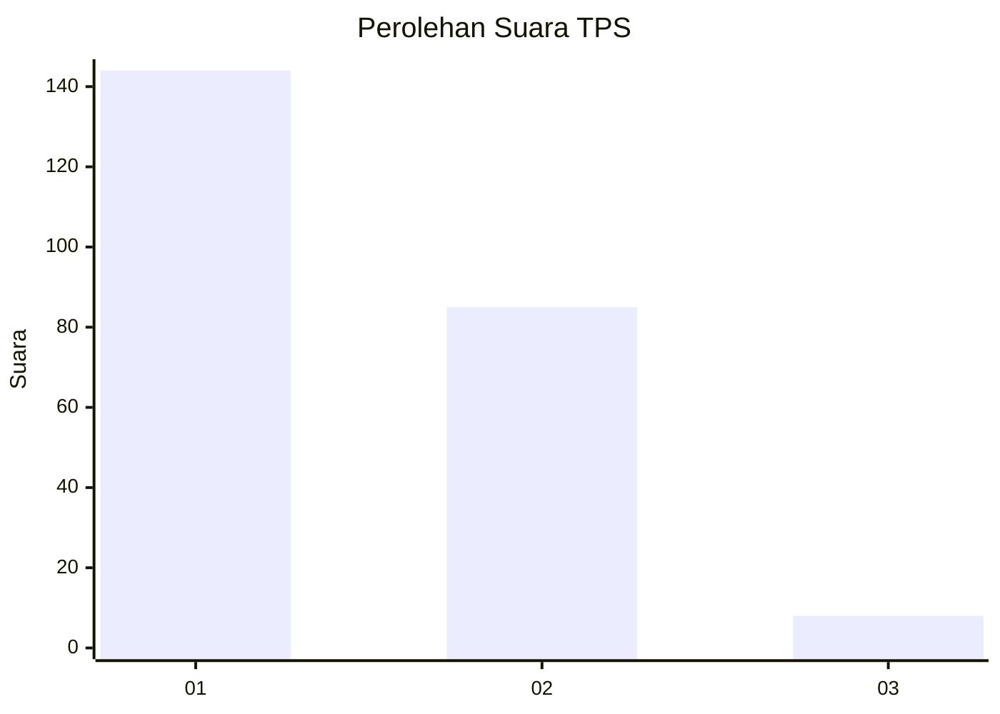
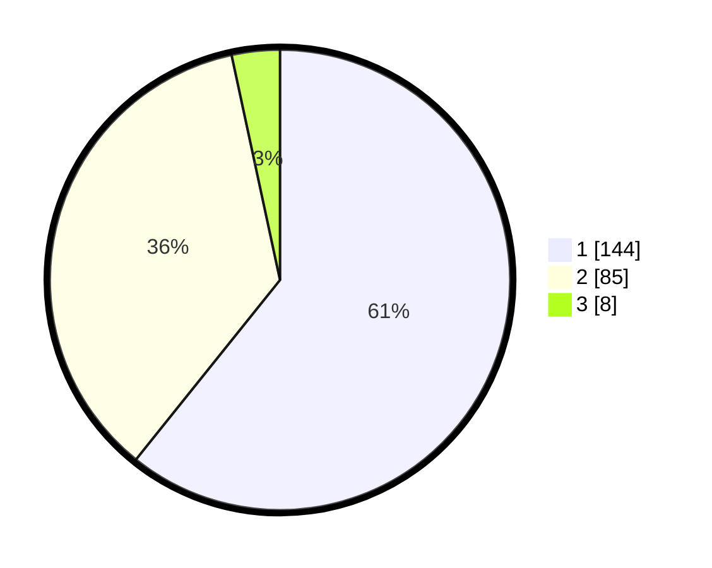

# Hasil

## Grafik

## Tabel

| No. | Nama Paslon    | Suara | Suara (raw) | Persentase |
|:--- |:-------------- | -----:| -----------:| ----------:|
| 1   | ANIES MUHAIMIN | 144   | [144][p-1]  | 60,76      |
| 2   | PRABOWO GIBRAN | 85    | [85][p-2]   | 35,86      |
| 3   | GANJAR MAHFUD  | 8     | [8][p-3]    | 3,38       |

[p-1]: https://github.com/gigit-pemilu/pemilu-2024-35-jawa-timur/blob/main/pilpres/hitung-suara/sub/35-jawa-timur/sub/71-kota-kediri/sub/01-mojoroto/sub/1013-lirboyo/sub/909-tps/sub/paslon-1.txt
[p-2]: https://github.com/gigit-pemilu/pemilu-2024-35-jawa-timur/blob/main/pilpres/hitung-suara/sub/35-jawa-timur/sub/71-kota-kediri/sub/01-mojoroto/sub/1013-lirboyo/sub/909-tps/sub/paslon-2.txt
[p-3]: https://github.com/gigit-pemilu/pemilu-2024-35-jawa-timur/blob/main/pilpres/hitung-suara/sub/35-jawa-timur/sub/71-kota-kediri/sub/01-mojoroto/sub/1013-lirboyo/sub/909-tps/sub/paslon-3.txt

## Foto C Plano

https://sirekap-obj-formc.kpu.go.id/e97d/pemilu/ppwp/35/71/01/10/13/3571011013909-20240219-223907--70fa9a45-bb4c-49c5-aa1c-94f9247d72d1.jpg

https://sirekap-obj-formc.kpu.go.id/e97d/pemilu/ppwp/35/71/01/10/13/3571011013909-20240219-224150--d978768d-e4b3-4d40-9ac7-700cc78b1e11.jpg

https://sirekap-obj-formc.kpu.go.id/e97d/pemilu/ppwp/35/71/01/10/13/3571011013909-20240219-224247--6c3d68fa-86d6-46ba-b3de-6379823a4bdd.jpg

## Metadata

| Key        | Value               |
| ---------- | ------------------- |
| Time Stamp | 2024-02-25 16:00:00 |

