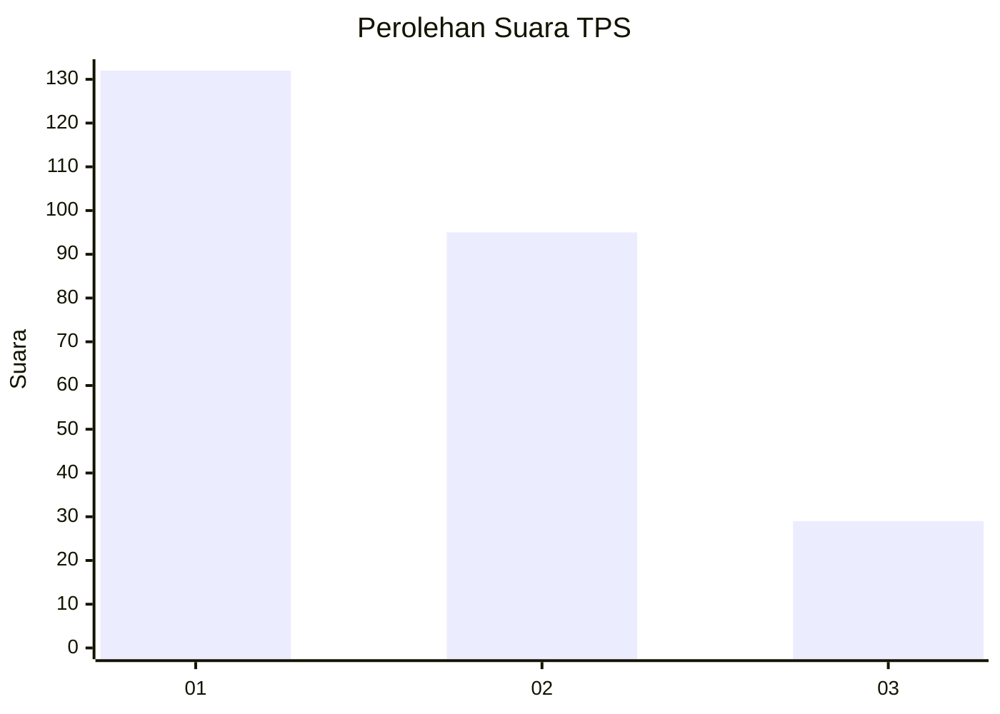
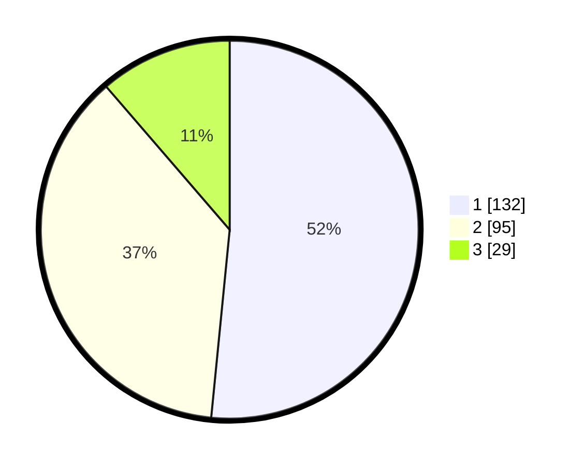

# Hasil

## Grafik

## Tabel

| No. | Nama Paslon    | Suara | Suara (raw) | Persentase |
|:--- |:-------------- | -----:| -----------:| ----------:|
| 1   | ANIES MUHAIMIN | 132   | [132][p-1]  | 51,56      |
| 2   | PRABOWO GIBRAN | 95    | [95][p-2]   | 37,11      |
| 3   | GANJAR MAHFUD  | 29    | [29][p-3]   | 11,33      |

[p-1]: https://github.com/gigit-pemilu/pemilu-2024/blob/main/pilpres/hitung-suara/sub/35-jawa-timur/sub/71-kota-kediri/sub/01-mojoroto/sub/1013-lirboyo/sub/917-tps/sub/paslon-1.txt
[p-2]: https://github.com/gigit-pemilu/pemilu-2024/blob/main/pilpres/hitung-suara/sub/35-jawa-timur/sub/71-kota-kediri/sub/01-mojoroto/sub/1013-lirboyo/sub/917-tps/sub/paslon-2.txt
[p-3]: https://github.com/gigit-pemilu/pemilu-2024/blob/main/pilpres/hitung-suara/sub/35-jawa-timur/sub/71-kota-kediri/sub/01-mojoroto/sub/1013-lirboyo/sub/917-tps/sub/paslon-3.txt

## Foto C Plano

https://sirekap-obj-formc.kpu.go.id/ed17/pemilu/ppwp/35/71/01/10/13/3571011013917-20240214-200633--492d6696-f425-454f-96ed-9fc4994bd87d.jpg

https://sirekap-obj-formc.kpu.go.id/ed17/pemilu/ppwp/35/71/01/10/13/3571011013917-20240217-014732--8e3b8316-e859-4af9-a69b-31cee02261f0.jpg

https://sirekap-obj-formc.kpu.go.id/ed17/pemilu/ppwp/35/71/01/10/13/3571011013917-20240217-014732--6a36b393-41dd-424f-85f5-6f27e2be4a06.jpg

## Metadata

| Key        | Value               |
| ---------- | ------------------- |
| Time Stamp | 2024-02-17 11:00:02 |

