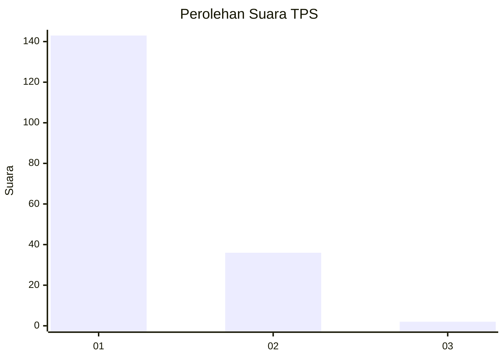
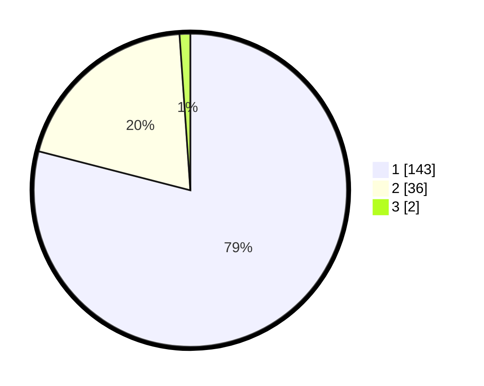

# Hasil

## Grafik

## Tabel

| No. | Nama Paslon    | Suara | Suara (raw) | Persentase |
|:--- |:-------------- | -----:| -----------:| ----------:|
| 1   | ANIES MUHAIMIN | 143   | [143][p-1]  | 79,01      |
| 2   | PRABOWO GIBRAN | 36    | [36][p-2]   | 19,89      |
| 3   | GANJAR MAHFUD  | 2     | [2][p-3]    | 1,10       |

[p-1]: https://github.com/gigit-pemilu/pemilu-2024-35-jawa-timur/blob/main/pilpres/hitung-suara/sub/35-jawa-timur/sub/71-kota-kediri/sub/01-mojoroto/sub/1013-lirboyo/sub/944-tps/sub/paslon-1.txt
[p-2]: https://github.com/gigit-pemilu/pemilu-2024-35-jawa-timur/blob/main/pilpres/hitung-suara/sub/35-jawa-timur/sub/71-kota-kediri/sub/01-mojoroto/sub/1013-lirboyo/sub/944-tps/sub/paslon-2.txt
[p-3]: https://github.com/gigit-pemilu/pemilu-2024-35-jawa-timur/blob/main/pilpres/hitung-suara/sub/35-jawa-timur/sub/71-kota-kediri/sub/01-mojoroto/sub/1013-lirboyo/sub/944-tps/sub/paslon-3.txt

## Foto C Plano

https://sirekap-obj-formc.kpu.go.id/c8a6/pemilu/ppwp/35/71/01/10/13/3571011013944-20240214-203656--e3b8c47e-0175-4256-bc62-0fef57063193.jpg

https://sirekap-obj-formc.kpu.go.id/c8a6/pemilu/ppwp/35/71/01/10/13/3571011013944-20240214-201034--95cb4d3c-d32c-4961-a453-57849bdeb7cf.jpg

https://sirekap-obj-formc.kpu.go.id/c8a6/pemilu/ppwp/35/71/01/10/13/3571011013944-20240214-201053--c4e41e9d-6061-4db3-8131-127bb7fa5934.jpg

## Metadata

| Key        | Value               |
| ---------- | ------------------- |
| Time Stamp | 2024-02-24 22:31:28 |

