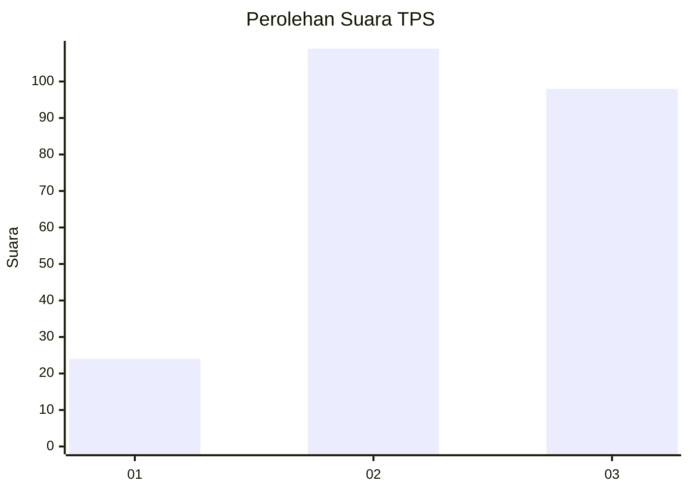
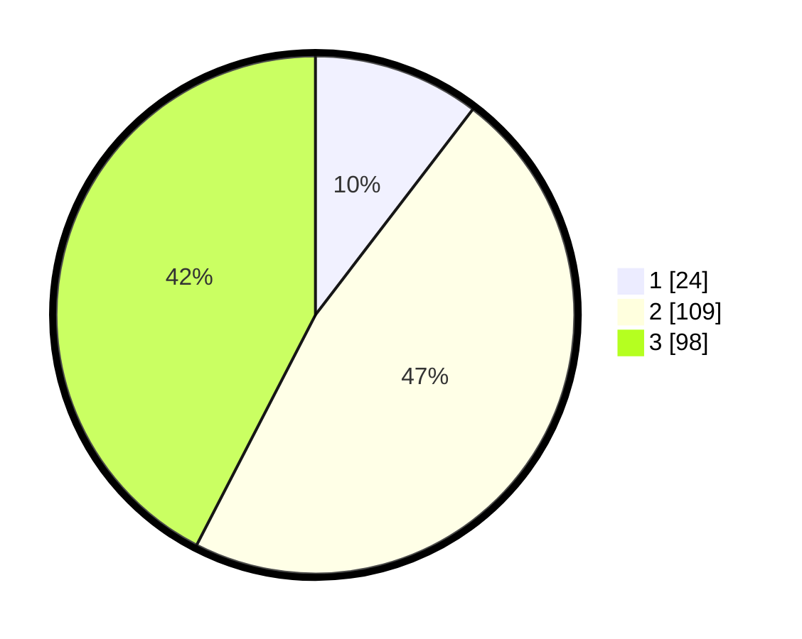

# Hasil

## Grafik

## Tabel

| No. | Nama Paslon    | Suara | Suara (raw) | Persentase |
|:--- |:-------------- | -----:| -----------:| ----------:|
| 1   | ANIES MUHAIMIN | 24    | [24][p-1]   | 10,39      |
| 2   | PRABOWO GIBRAN | 109   | [109][p-2]  | 47,19      |
| 3   | GANJAR MAHFUD  | 98    | [98][p-3]   | 42,42      |

[p-1]: https://github.com/gigit-pemilu/pemilu-2024-35-jawa-timur/blob/main/pilpres/hitung-suara/sub/35-jawa-timur/sub/71-kota-kediri/sub/02-kota/sub/1001-semampir/sub/016-tps/sub/paslon-1.txt
[p-2]: https://github.com/gigit-pemilu/pemilu-2024-35-jawa-timur/blob/main/pilpres/hitung-suara/sub/35-jawa-timur/sub/71-kota-kediri/sub/02-kota/sub/1001-semampir/sub/016-tps/sub/paslon-2.txt
[p-3]: https://github.com/gigit-pemilu/pemilu-2024-35-jawa-timur/blob/main/pilpres/hitung-suara/sub/35-jawa-timur/sub/71-kota-kediri/sub/02-kota/sub/1001-semampir/sub/016-tps/sub/paslon-3.txt

## Foto C Plano

https://sirekap-obj-formc.kpu.go.id/6863/pemilu/ppwp/35/71/02/10/01/3571021001016-20240215-005628--ecbbf950-bf16-46f7-9f88-a393ac840c3e.jpg

https://sirekap-obj-formc.kpu.go.id/6863/pemilu/ppwp/35/71/02/10/01/3571021001016-20240215-005722--89297ed1-70ab-4ba2-8e66-20b0e6ecf046.jpg

https://sirekap-obj-formc.kpu.go.id/6863/pemilu/ppwp/35/71/02/10/01/3571021001016-20240215-005806--0106d726-fe85-46d7-b4db-7e26268d7277.jpg

## Metadata

| Key        | Value               |
| ---------- | ------------------- |
| Time Stamp | 2024-02-16 09:00:28 |

