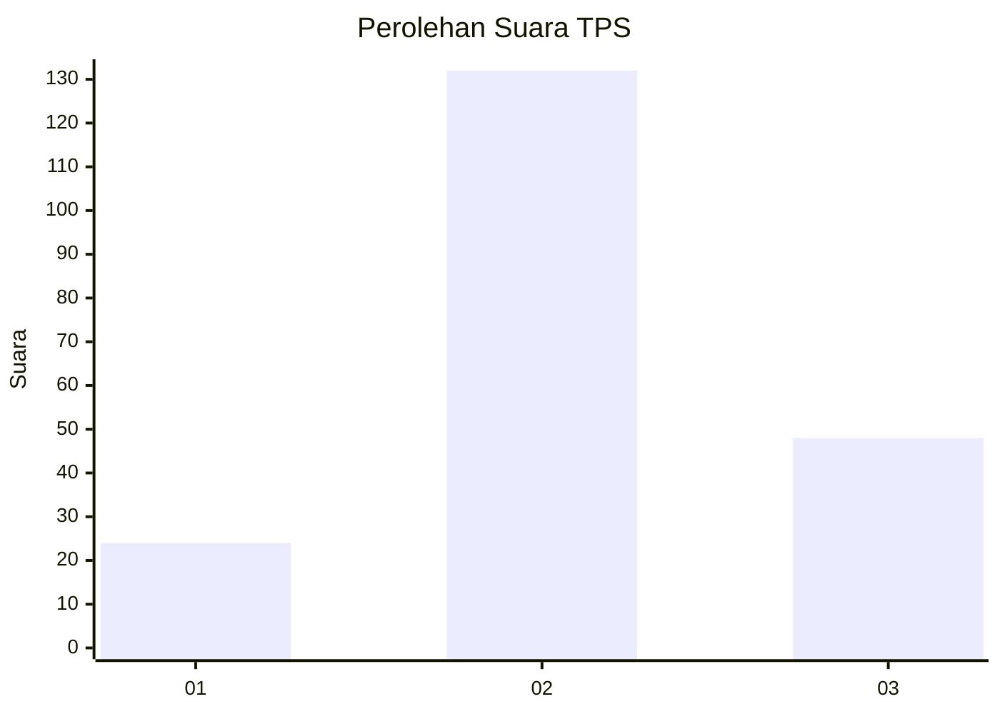
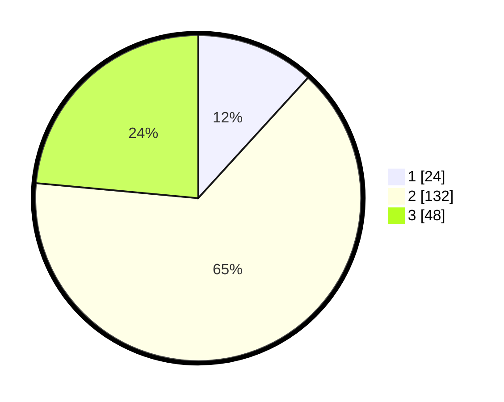

# Hasil

## Grafik

## Tabel

| No. | Nama Paslon    | Suara | Suara (raw) | Persentase |
|:--- |:-------------- | -----:| -----------:| ----------:|
| 1   | ANIES MUHAIMIN | 24    | [24][p-1]   | 11,76      |
| 2   | PRABOWO GIBRAN | 132   | [132][p-2]  | 64,71      |
| 3   | GANJAR MAHFUD  | 48    | [48][p-3]   | 23,53      |

[p-1]: https://github.com/gigit-pemilu/pemilu-2024/blob/main/pilpres/hitung-suara/sub/35-jawa-timur/sub/71-kota-kediri/sub/02-kota/sub/1006-setonopande/sub/008-tps/sub/paslon-1.txt
[p-2]: https://github.com/gigit-pemilu/pemilu-2024/blob/main/pilpres/hitung-suara/sub/35-jawa-timur/sub/71-kota-kediri/sub/02-kota/sub/1006-setonopande/sub/008-tps/sub/paslon-2.txt
[p-3]: https://github.com/gigit-pemilu/pemilu-2024/blob/main/pilpres/hitung-suara/sub/35-jawa-timur/sub/71-kota-kediri/sub/02-kota/sub/1006-setonopande/sub/008-tps/sub/paslon-3.txt

## Foto C Plano

https://sirekap-obj-formc.kpu.go.id/ba5f/pemilu/ppwp/35/71/02/10/06/3571021006008-20240215-010301--661ad74a-db8a-49c8-81fe-a2867d9fc6c8.jpg

https://sirekap-obj-formc.kpu.go.id/ba5f/pemilu/ppwp/35/71/02/10/06/3571021006008-20240215-010404--07b78250-3dbe-4047-9dea-110dbdf3d95f.jpg

https://sirekap-obj-formc.kpu.go.id/ba5f/pemilu/ppwp/35/71/02/10/06/3571021006008-20240215-010455--5d5943f7-b22a-4065-8489-1476fb5f4948.jpg

## Metadata

| Key        | Value               |
| ---------- | ------------------- |
| Time Stamp | 2024-02-24 22:31:28 |

