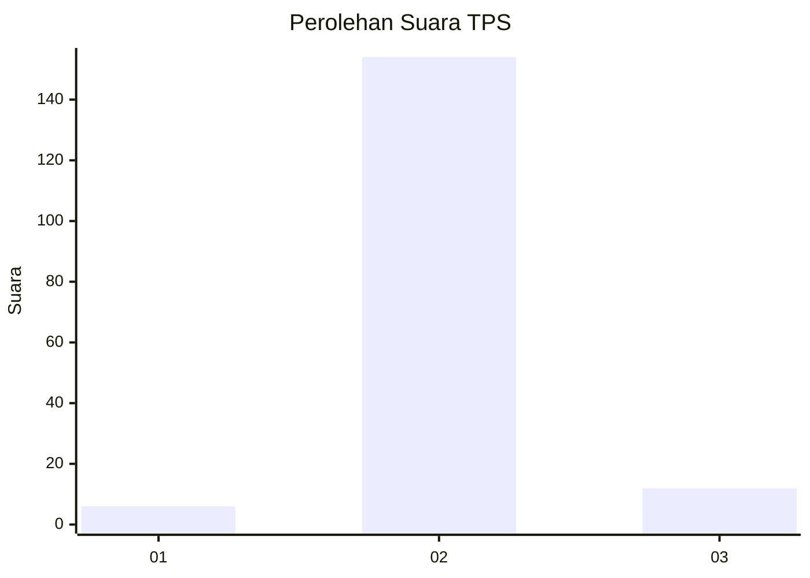
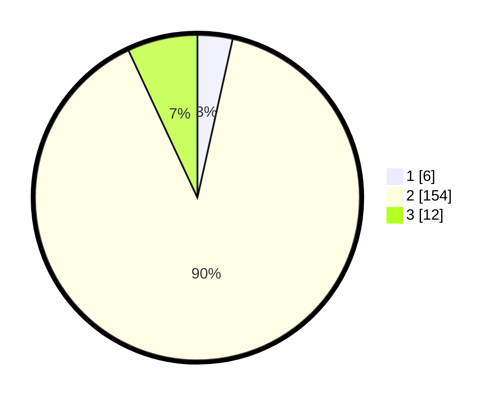

# Hasil

## Grafik

## Tabel

| No. | Nama Paslon    | Suara | Suara (raw) | Persentase |
|:--- |:-------------- | -----:| -----------:| ----------:|
| 1   | ANIES MUHAIMIN | 6     | [6][p-1]    | 3,49       |
| 2   | PRABOWO GIBRAN | 154   | [154][p-2]  | 89,53      |
| 3   | GANJAR MAHFUD  | 12    | [12][p-3]   | 6,98       |

[p-1]: https://github.com/gigit-pemilu/pemilu-2024-35-jawa-timur/blob/main/pilpres/hitung-suara/sub/35-jawa-timur/sub/71-kota-kediri/sub/02-kota/sub/1012-banjaran/sub/024-tps/sub/paslon-1.txt
[p-2]: https://github.com/gigit-pemilu/pemilu-2024-35-jawa-timur/blob/main/pilpres/hitung-suara/sub/35-jawa-timur/sub/71-kota-kediri/sub/02-kota/sub/1012-banjaran/sub/024-tps/sub/paslon-2.txt
[p-3]: https://github.com/gigit-pemilu/pemilu-2024-35-jawa-timur/blob/main/pilpres/hitung-suara/sub/35-jawa-timur/sub/71-kota-kediri/sub/02-kota/sub/1012-banjaran/sub/024-tps/sub/paslon-3.txt

## Foto C Plano

https://sirekap-obj-formc.kpu.go.id/0d4c/pemilu/ppwp/35/71/02/10/12/3571021012024-20240216-161427--32b7127a-3fd9-43ce-a941-8018b54dcf56.jpg

https://sirekap-obj-formc.kpu.go.id/0d4c/pemilu/ppwp/35/71/02/10/12/3571021012024-20240216-161428--a4ac7a15-18e1-4f5b-981d-30aa4f831e9f.jpg

https://sirekap-obj-formc.kpu.go.id/0d4c/pemilu/ppwp/35/71/02/10/12/3571021012024-20240216-161428--d59449c7-8dec-4241-9654-6abab91d6f53.jpg

## Metadata

| Key        | Value               |
| ---------- | ------------------- |
| Time Stamp | 2024-02-17 16:36:25 |

## DATA PEMILIH TETAP

Jumlah pemilih dalam DPT: **196**.
 * L: **49**.
 * P: **147**.

## DATA PENGGUNA HAK PILIH

Jumlah pengguna hak pilih dalam DPT: **140**.
 * L: **34**.
 * P: **106**.

Jumlah pengguna hak pilih dalam DPTb: **21**.
 * L: **0**.
 * P: **21**.

Jumlah pengguna hak pilih dalam DPK: **11**.
 * L: **2**.
 * P: **9**.

Jumlah pengguna hak pilih: **172**.
 * L: **36**.
 * P: **136**.

## JUMLAH SUARA SAH DAN TIDAK SAH

JUMLAH SELURUH SUARA SAH: **172**.

JUMLAH SUARA TIDAK SAH: **0**.

JUMLAH SELURUH SUARA SAH DAN SUARA TIDAK SAH: **172**.

