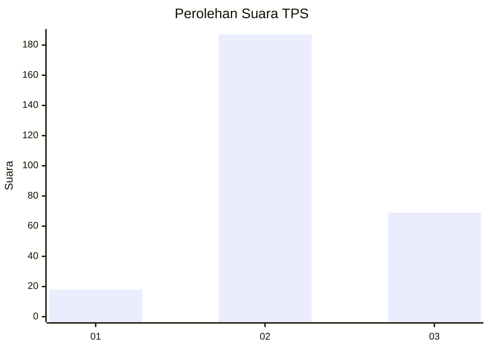
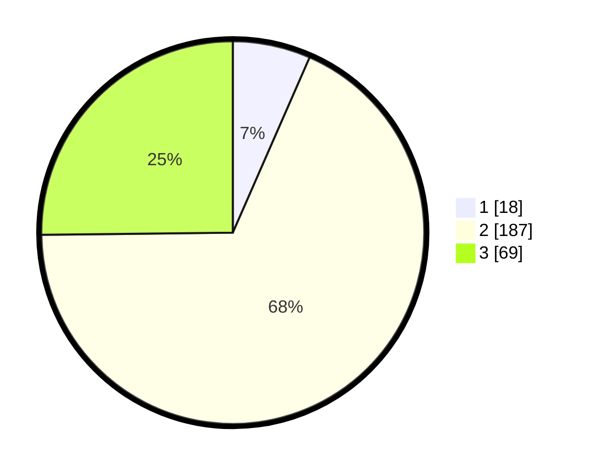

# Hasil

## Grafik

## Tabel

| No. | Nama Paslon    | Suara | Suara (raw) | Persentase |
|:--- |:-------------- | -----:| -----------:| ----------:|
| 1   | ANIES MUHAIMIN | 18    | [18][p-1]   | 6,57       |
| 2   | PRABOWO GIBRAN | 187   | [187][p-2]  | 68,25      |
| 3   | GANJAR MAHFUD  | 69    | [69][p-3]   | 25,18      |

[p-1]: https://github.com/gigit-pemilu/pemilu-2024/blob/main/pilpres/hitung-suara/sub/35-jawa-timur/sub/71-kota-kediri/sub/03-pesantren/sub/1001-bangsal/sub/003-tps/sub/paslon-1.txt
[p-2]: https://github.com/gigit-pemilu/pemilu-2024/blob/main/pilpres/hitung-suara/sub/35-jawa-timur/sub/71-kota-kediri/sub/03-pesantren/sub/1001-bangsal/sub/003-tps/sub/paslon-2.txt
[p-3]: https://github.com/gigit-pemilu/pemilu-2024/blob/main/pilpres/hitung-suara/sub/35-jawa-timur/sub/71-kota-kediri/sub/03-pesantren/sub/1001-bangsal/sub/003-tps/sub/paslon-3.txt

## Foto C Plano

https://sirekap-obj-formc.kpu.go.id/8183/pemilu/ppwp/35/71/03/10/01/3571031001003-20240214-210637--79a0d7cb-9b7a-4bf8-9bc0-d48fe128e784.jpg

https://sirekap-obj-formc.kpu.go.id/8183/pemilu/ppwp/35/71/03/10/01/3571031001003-20240214-210826--5a1b4864-25eb-4626-956e-c63ff34bb462.jpg

https://sirekap-obj-formc.kpu.go.id/8183/pemilu/ppwp/35/71/03/10/01/3571031001003-20240214-211050--1675a381-f542-4770-b33c-8cfd9d7f81c6.jpg

## Metadata

| Key        | Value               |
| ---------- | ------------------- |
| Time Stamp | 2024-02-19 06:16:00 |

## DATA PEMILIH TETAP

Jumlah pemilih dalam DPT: **277**.
 * L: **131**.
 * P: **146**.

## DATA PENGGUNA HAK PILIH

Jumlah pengguna hak pilih dalam DPT: **241**.
 * L: **109**.
 * P: **132**.

Jumlah pengguna hak pilih dalam DPTb: **20**.
 * L: **4**.
 * P: **16**.

Jumlah pengguna hak pilih dalam DPK: **15**.
 * L: **7**.
 * P: **8**.

Jumlah pengguna hak pilih: **276**.
 * L: **120**.
 * P: **156**.

## JUMLAH SUARA SAH DAN TIDAK SAH

JUMLAH SELURUH SUARA SAH: **274**.

JUMLAH SUARA TIDAK SAH: **2**.

JUMLAH SELURUH SUARA SAH DAN SUARA TIDAK SAH: **276**.

