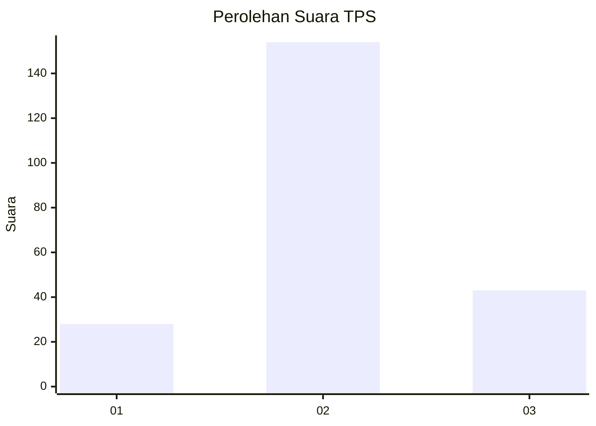
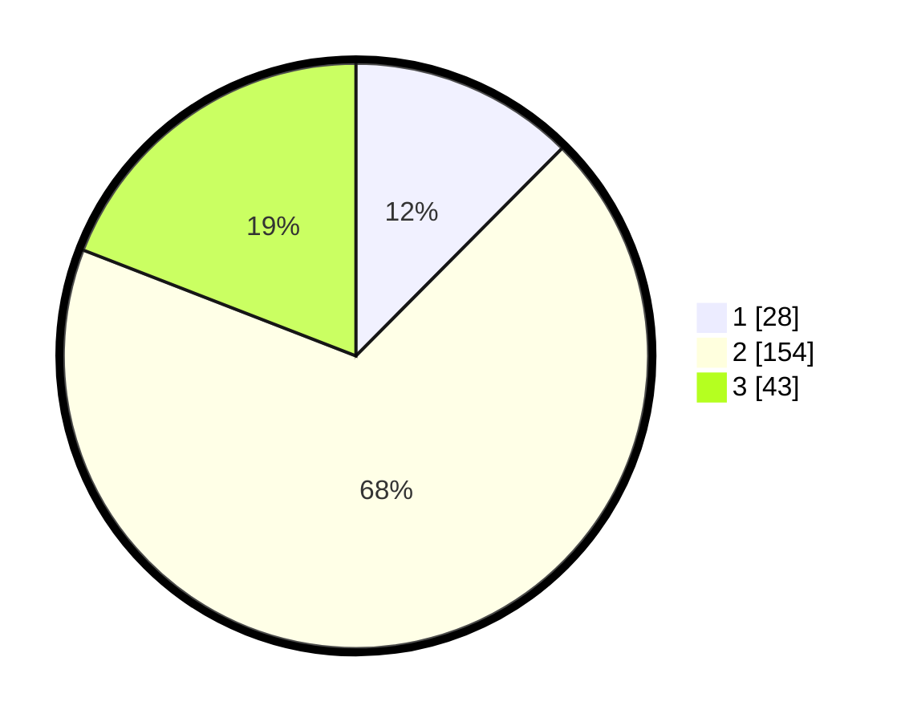

# Hasil

## Grafik

## Tabel

| No. | Nama Paslon    | Suara | Suara (raw) | Persentase |
|:--- |:-------------- | -----:| -----------:| ----------:|
| 1   | ANIES MUHAIMIN | 28    | [28][p-1]   | 12,44      |
| 2   | PRABOWO GIBRAN | 154   | [154][p-2]  | 68,44      |
| 3   | GANJAR MAHFUD  | 43    | [43][p-3]   | 19,11      |

[p-1]: https://github.com/gigit-pemilu/pemilu-2024/blob/main/pilpres/hitung-suara/sub/35-jawa-timur/sub/71-kota-kediri/sub/03-pesantren/sub/1004-jamsaren/sub/010-tps/sub/paslon-1.txt
[p-2]: https://github.com/gigit-pemilu/pemilu-2024/blob/main/pilpres/hitung-suara/sub/35-jawa-timur/sub/71-kota-kediri/sub/03-pesantren/sub/1004-jamsaren/sub/010-tps/sub/paslon-2.txt
[p-3]: https://github.com/gigit-pemilu/pemilu-2024/blob/main/pilpres/hitung-suara/sub/35-jawa-timur/sub/71-kota-kediri/sub/03-pesantren/sub/1004-jamsaren/sub/010-tps/sub/paslon-3.txt

## Foto C Plano

https://sirekap-obj-formc.kpu.go.id/2e32/pemilu/ppwp/35/71/03/10/04/3571031004010-20240214-191459--7e14c241-7b89-4e68-8902-e24a1e28e747.jpg

https://sirekap-obj-formc.kpu.go.id/2e32/pemilu/ppwp/35/71/03/10/04/3571031004010-20240214-191527--fe6354b7-9632-44c6-bd3f-17b69ed1981f.jpg

https://sirekap-obj-formc.kpu.go.id/2e32/pemilu/ppwp/35/71/03/10/04/3571031004010-20240214-191658--3004d499-44b9-4bf6-84fa-4bd0d057c98a.jpg

## Metadata

| Key        | Value               |
| ---------- | ------------------- |
| Time Stamp | 2024-03-05 15:00:00 |

