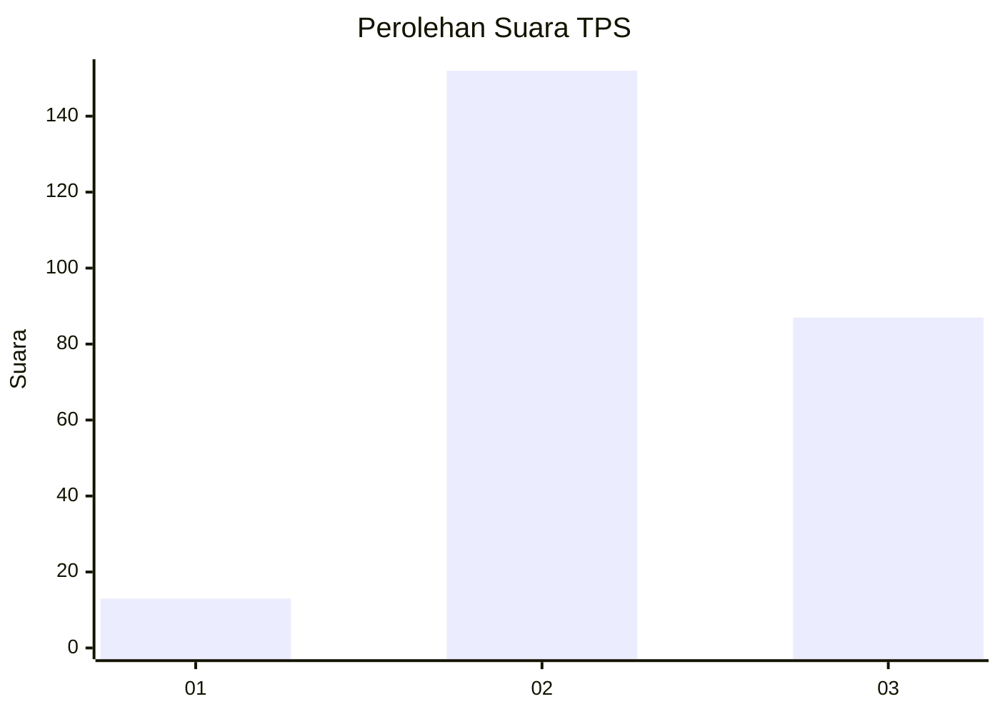
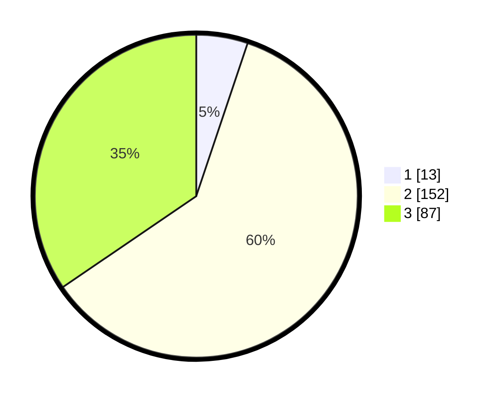

# Hasil

## Grafik

## Tabel

| No. | Nama Paslon    | Suara | Suara (raw) | Persentase |
|:--- |:-------------- | -----:| -----------:| ----------:|
| 1   | ANIES MUHAIMIN | 13    | [13][p-1]   | 5,16       |
| 2   | PRABOWO GIBRAN | 152   | [152][p-2]  | 60,32      |
| 3   | GANJAR MAHFUD  | 87    | [87][p-3]   | 34,52      |

[p-1]: https://github.com/gigit-pemilu/pemilu-2024-35-jawa-timur/blob/main/pilpres/hitung-suara/sub/35-jawa-timur/sub/71-kota-kediri/sub/03-pesantren/sub/1007-betet/sub/004-tps/sub/paslon-1.txt
[p-2]: https://github.com/gigit-pemilu/pemilu-2024-35-jawa-timur/blob/main/pilpres/hitung-suara/sub/35-jawa-timur/sub/71-kota-kediri/sub/03-pesantren/sub/1007-betet/sub/004-tps/sub/paslon-2.txt
[p-3]: https://github.com/gigit-pemilu/pemilu-2024-35-jawa-timur/blob/main/pilpres/hitung-suara/sub/35-jawa-timur/sub/71-kota-kediri/sub/03-pesantren/sub/1007-betet/sub/004-tps/sub/paslon-3.txt

## Foto C Plano

https://sirekap-obj-formc.kpu.go.id/b04d/pemilu/ppwp/35/71/03/10/07/3571031007004-20240214-214402--5014d00f-20cf-4fbb-88b7-c075feb1edca.jpg

https://sirekap-obj-formc.kpu.go.id/b04d/pemilu/ppwp/35/71/03/10/07/3571031007004-20240214-214447--86d0d224-4781-4ec2-bf1a-bd3ce27a8110.jpg

https://sirekap-obj-formc.kpu.go.id/b04d/pemilu/ppwp/35/71/03/10/07/3571031007004-20240214-214539--494e3fb5-24e6-46d8-bf3e-cd8e40059253.jpg

## Metadata

| Key        | Value               |
| ---------- | ------------------- |
| Time Stamp | 2024-02-24 22:31:28 |

