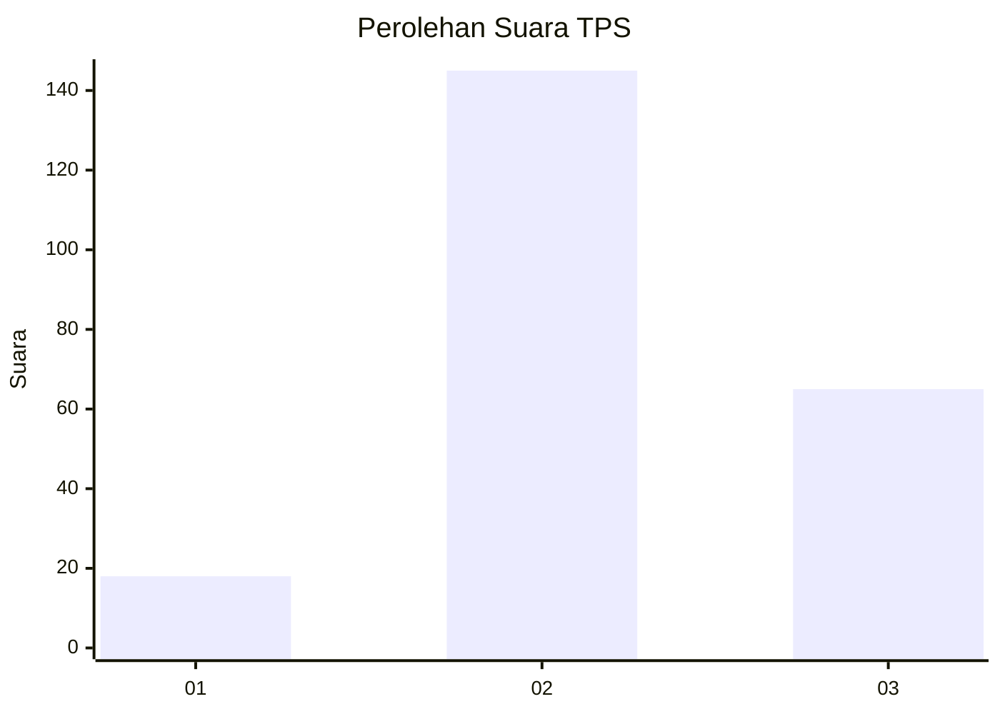
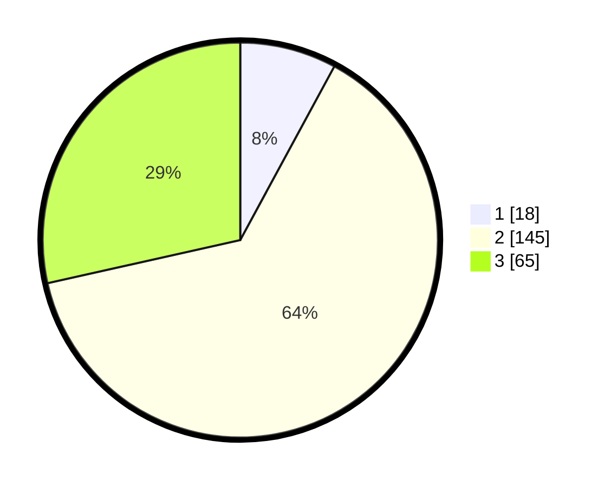

# Hasil

## Grafik

## Tabel

| No. | Nama Paslon    | Suara | Suara (raw) | Persentase |
|:--- |:-------------- | -----:| -----------:| ----------:|
| 1   | ANIES MUHAIMIN | 18    | [18][p-1]   | 7,89       |
| 2   | PRABOWO GIBRAN | 145   | [145][p-2]  | 63,60      |
| 3   | GANJAR MAHFUD  | 65    | [65][p-3]   | 28,51      |

[p-1]: https://github.com/gigit-pemilu/pemilu-2024/blob/main/pilpres/hitung-suara/sub/35-jawa-timur/sub/71-kota-kediri/sub/03-pesantren/sub/1012-ketami/sub/004-tps/sub/paslon-1.txt
[p-2]: https://github.com/gigit-pemilu/pemilu-2024/blob/main/pilpres/hitung-suara/sub/35-jawa-timur/sub/71-kota-kediri/sub/03-pesantren/sub/1012-ketami/sub/004-tps/sub/paslon-2.txt
[p-3]: https://github.com/gigit-pemilu/pemilu-2024/blob/main/pilpres/hitung-suara/sub/35-jawa-timur/sub/71-kota-kediri/sub/03-pesantren/sub/1012-ketami/sub/004-tps/sub/paslon-3.txt

## Foto C Plano

https://sirekap-obj-formc.kpu.go.id/5589/pemilu/ppwp/35/71/03/10/12/3571031012004-20240215-011221--95564c2e-3e46-4c64-bd5e-6cb5f0da484e.jpg

https://sirekap-obj-formc.kpu.go.id/5589/pemilu/ppwp/35/71/03/10/12/3571031012004-20240215-011520--bcc9b558-b4ab-429a-8e1f-160fc5f1da2f.jpg

https://sirekap-obj-formc.kpu.go.id/5589/pemilu/ppwp/35/71/03/10/12/3571031012004-20240215-011801--f0983dcf-d3c7-4fc3-a3dc-f8aa078469f1.jpg

## Metadata

| Key        | Value               |
| ---------- | ------------------- |
| Time Stamp | 2024-02-24 22:31:28 |

