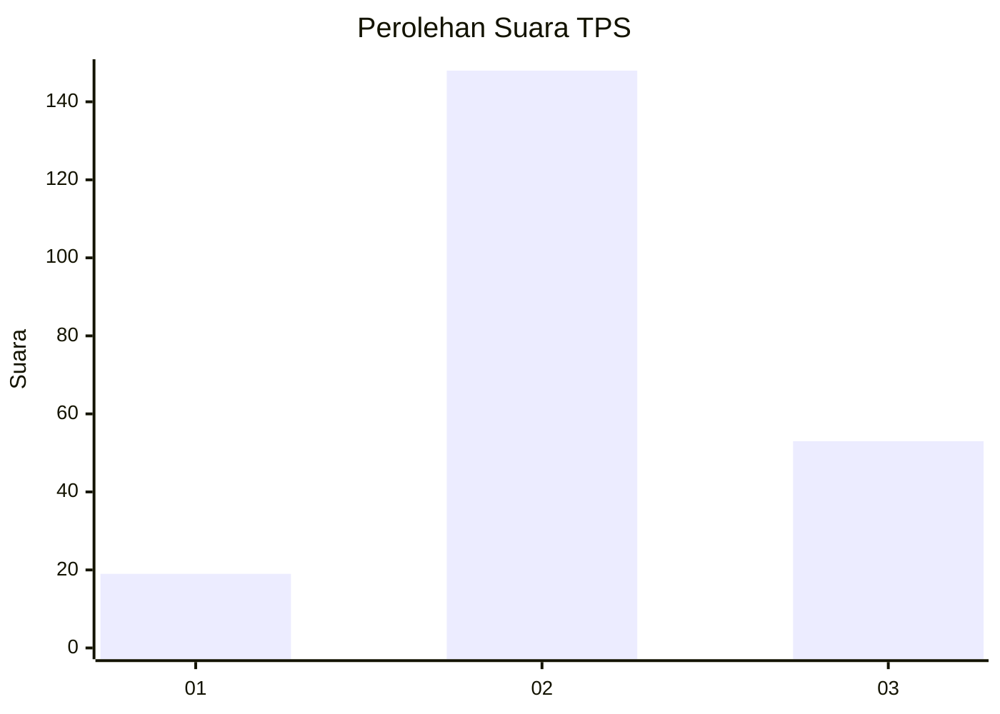
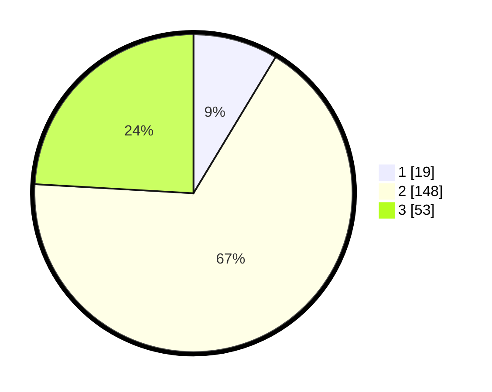

# Hasil

## Grafik

## Tabel

| No. | Nama Paslon    | Suara | Suara (raw) | Persentase |
|:--- |:-------------- | -----:| -----------:| ----------:|
| 1   | ANIES MUHAIMIN | 19    | [19][p-1]   | 8,64       |
| 2   | PRABOWO GIBRAN | 148   | [148][p-2]  | 67,27      |
| 3   | GANJAR MAHFUD  | 53    | [53][p-3]   | 24,09      |

[p-1]: https://github.com/gigit-pemilu/pemilu-2024/blob/main/pilpres/hitung-suara/sub/35-jawa-timur/sub/72-kota-blitar/sub/01-kepanjenkidul/sub/1001-kepanjenkidul/sub/003-tps/sub/paslon-1.txt
[p-2]: https://github.com/gigit-pemilu/pemilu-2024/blob/main/pilpres/hitung-suara/sub/35-jawa-timur/sub/72-kota-blitar/sub/01-kepanjenkidul/sub/1001-kepanjenkidul/sub/003-tps/sub/paslon-2.txt
[p-3]: https://github.com/gigit-pemilu/pemilu-2024/blob/main/pilpres/hitung-suara/sub/35-jawa-timur/sub/72-kota-blitar/sub/01-kepanjenkidul/sub/1001-kepanjenkidul/sub/003-tps/sub/paslon-3.txt

## Foto C Plano

https://sirekap-obj-formc.kpu.go.id/5551/pemilu/ppwp/35/72/01/10/01/3572011001003-20240219-103343--111e7208-482f-468e-8abb-646b03c5ef0a.jpg

https://sirekap-obj-formc.kpu.go.id/5551/pemilu/ppwp/35/72/01/10/01/3572011001003-20240219-103406--81de69c7-ac22-447a-8a26-46b3e1dc2170.jpg

https://sirekap-obj-formc.kpu.go.id/5551/pemilu/ppwp/35/72/01/10/01/3572011001003-20240219-103435--31ba062a-8a14-48e6-9fac-f3538cd65846.jpg

## Metadata

| Key        | Value               |
| ---------- | ------------------- |
| Time Stamp | 2024-02-24 22:31:28 |

