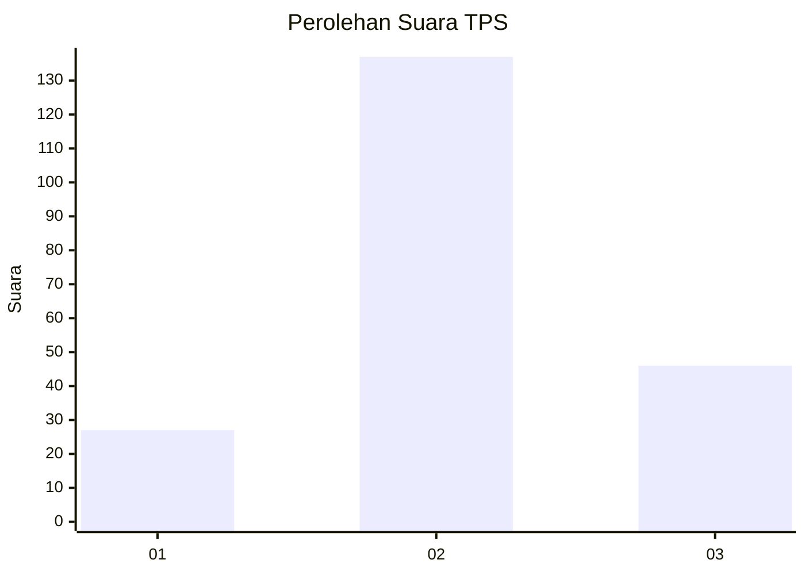
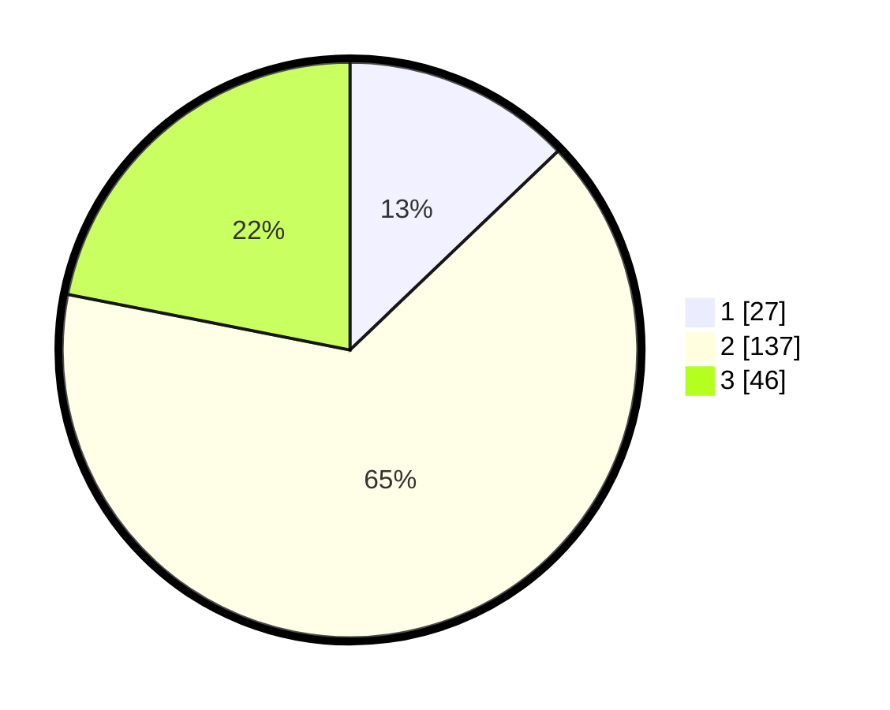

# Hasil

## Grafik

## Tabel

| No. | Nama Paslon    | Suara | Suara (raw) | Persentase |
|:--- |:-------------- | -----:| -----------:| ----------:|
| 1   | ANIES MUHAIMIN | 27    | [27][p-1]   | 12,86      |
| 2   | PRABOWO GIBRAN | 137   | [137][p-2]  | 65,24      |
| 3   | GANJAR MAHFUD  | 46    | [46][p-3]   | 21,90      |

[p-1]: https://github.com/gigit-pemilu/pemilu-2024/blob/main/pilpres/hitung-suara/sub/35-jawa-timur/sub/72-kota-blitar/sub/01-kepanjenkidul/sub/1001-kepanjenkidul/sub/005-tps/sub/paslon-1.txt
[p-2]: https://github.com/gigit-pemilu/pemilu-2024/blob/main/pilpres/hitung-suara/sub/35-jawa-timur/sub/72-kota-blitar/sub/01-kepanjenkidul/sub/1001-kepanjenkidul/sub/005-tps/sub/paslon-2.txt
[p-3]: https://github.com/gigit-pemilu/pemilu-2024/blob/main/pilpres/hitung-suara/sub/35-jawa-timur/sub/72-kota-blitar/sub/01-kepanjenkidul/sub/1001-kepanjenkidul/sub/005-tps/sub/paslon-3.txt

## Foto C Plano

https://sirekap-obj-formc.kpu.go.id/ca10/pemilu/ppwp/35/72/01/10/01/3572011001005-20240219-104300--e13b9894-2c9d-4c6e-9fef-0e2f2d3d768c.jpg

https://sirekap-obj-formc.kpu.go.id/ca10/pemilu/ppwp/35/72/01/10/01/3572011001005-20240219-104406--b3b6926d-267e-4ad2-9c18-90d01c60be0e.jpg

https://sirekap-obj-formc.kpu.go.id/ca10/pemilu/ppwp/35/72/01/10/01/3572011001005-20240219-104428--adf076eb-b603-42c6-8ec3-2a8d1b0ca98a.jpg

## Metadata

| Key        | Value               |
| ---------- | ------------------- |
| Time Stamp | 2024-02-24 22:31:28 |

