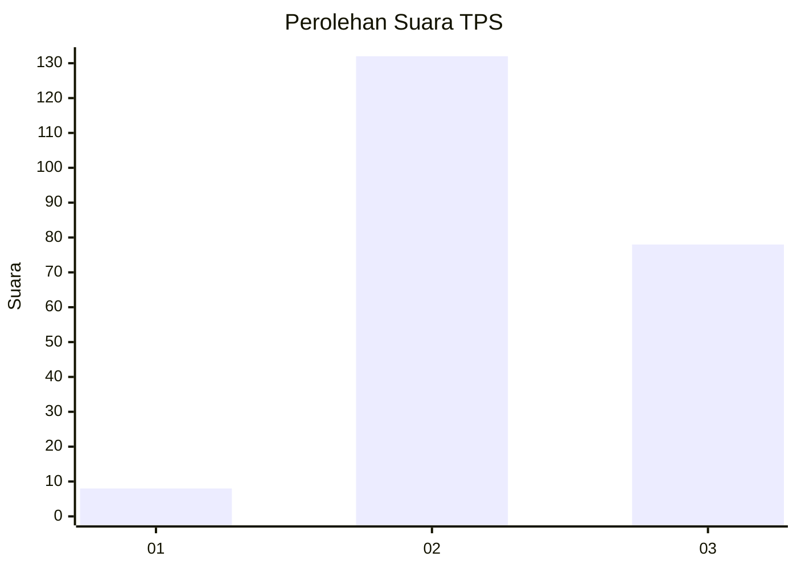
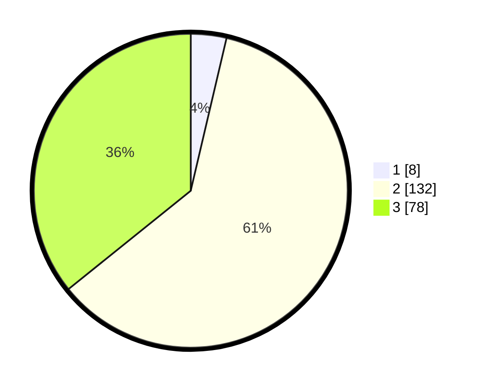

# Hasil

## Grafik

## Tabel

| No. | Nama Paslon    | Suara | Suara (raw) | Persentase |
|:--- |:-------------- | -----:| -----------:| ----------:|
| 1   | ANIES MUHAIMIN | 8     | [8][p-1]    | 3,67       |
| 2   | PRABOWO GIBRAN | 132   | [132][p-2]  | 60,55      |
| 3   | GANJAR MAHFUD  | 78    | [78][p-3]   | 35,78      |

[p-1]: https://github.com/gigit-pemilu/pemilu-2024-35-jawa-timur/blob/main/pilpres/hitung-suara/sub/35-jawa-timur/sub/72-kota-blitar/sub/01-kepanjenkidul/sub/1001-kepanjenkidul/sub/007-tps/sub/paslon-1.txt
[p-2]: https://github.com/gigit-pemilu/pemilu-2024-35-jawa-timur/blob/main/pilpres/hitung-suara/sub/35-jawa-timur/sub/72-kota-blitar/sub/01-kepanjenkidul/sub/1001-kepanjenkidul/sub/007-tps/sub/paslon-2.txt
[p-3]: https://github.com/gigit-pemilu/pemilu-2024-35-jawa-timur/blob/main/pilpres/hitung-suara/sub/35-jawa-timur/sub/72-kota-blitar/sub/01-kepanjenkidul/sub/1001-kepanjenkidul/sub/007-tps/sub/paslon-3.txt

## Foto C Plano

https://sirekap-obj-formc.kpu.go.id/ce2f/pemilu/ppwp/35/72/01/10/01/3572011001007-20240214-200650--8ef8704d-d09a-49d0-b11b-515589177858.jpg

https://sirekap-obj-formc.kpu.go.id/ce2f/pemilu/ppwp/35/72/01/10/01/3572011001007-20240214-155338--bf2bd971-3adf-491c-bfc8-2e572fa00c25.jpg

https://sirekap-obj-formc.kpu.go.id/ce2f/pemilu/ppwp/35/72/01/10/01/3572011001007-20240214-155904--1b010e38-1dc9-4235-b0e8-fb6543e37fe3.jpg

## Metadata

| Key        | Value               |
| ---------- | ------------------- |
| Time Stamp | 2024-02-15 21:30:27 |

