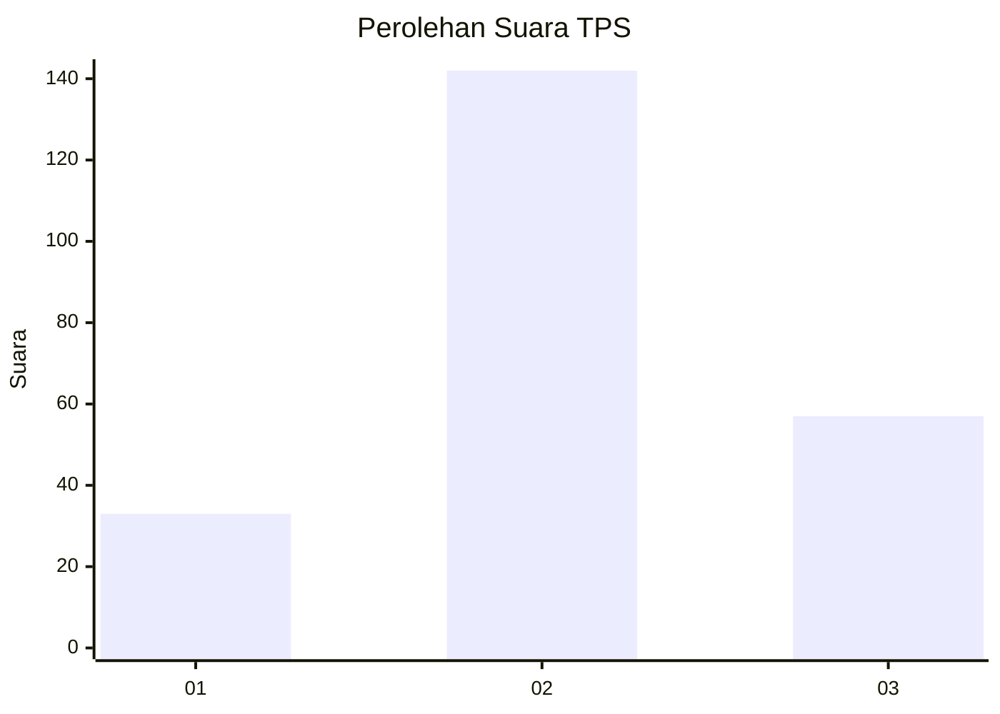
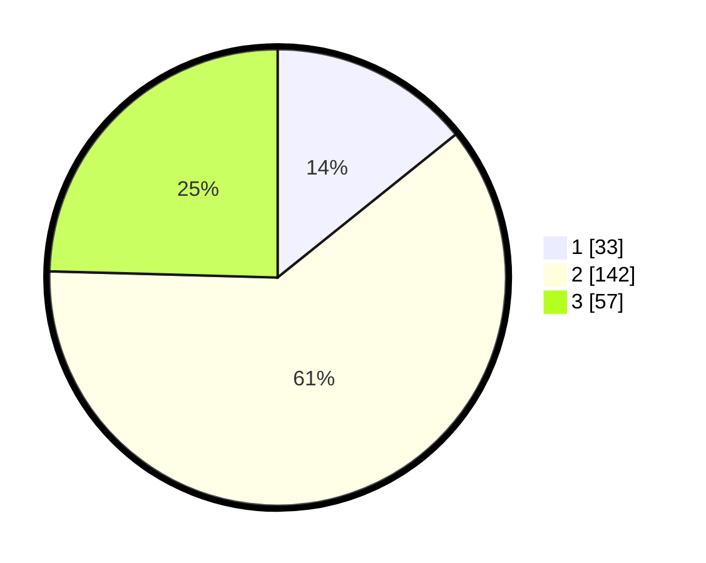

# Hasil

## Grafik

## Tabel

| No. | Nama Paslon    | Suara | Suara (raw) | Persentase |
|:--- |:-------------- | -----:| -----------:| ----------:|
| 1   | ANIES MUHAIMIN | 33    | [33][p-1]   | 14,22      |
| 2   | PRABOWO GIBRAN | 142   | [142][p-2]  | 61,21      |
| 3   | GANJAR MAHFUD  | 57    | [57][p-3]   | 24,57      |

[p-1]: https://github.com/gigit-pemilu/pemilu-2024-35-jawa-timur/blob/main/pilpres/hitung-suara/sub/35-jawa-timur/sub/72-kota-blitar/sub/01-kepanjenkidul/sub/1001-kepanjenkidul/sub/009-tps/sub/paslon-1.txt
[p-2]: https://github.com/gigit-pemilu/pemilu-2024-35-jawa-timur/blob/main/pilpres/hitung-suara/sub/35-jawa-timur/sub/72-kota-blitar/sub/01-kepanjenkidul/sub/1001-kepanjenkidul/sub/009-tps/sub/paslon-2.txt
[p-3]: https://github.com/gigit-pemilu/pemilu-2024-35-jawa-timur/blob/main/pilpres/hitung-suara/sub/35-jawa-timur/sub/72-kota-blitar/sub/01-kepanjenkidul/sub/1001-kepanjenkidul/sub/009-tps/sub/paslon-3.txt

## Foto C Plano

https://sirekap-obj-formc.kpu.go.id/fbeb/pemilu/ppwp/35/72/01/10/01/3572011001009-20240219-105321--5916656b-00ac-4919-ae55-6e455e7fb507.jpg

https://sirekap-obj-formc.kpu.go.id/fbeb/pemilu/ppwp/35/72/01/10/01/3572011001009-20240219-105353--9bf160df-f93a-4e9f-948c-4ce4f6f17522.jpg

https://sirekap-obj-formc.kpu.go.id/fbeb/pemilu/ppwp/35/72/01/10/01/3572011001009-20240219-105417--2351fcb2-a67e-4b48-83e5-507ab548944f.jpg

## Metadata

| Key        | Value               |
| ---------- | ------------------- |
| Time Stamp | 2024-02-24 22:31:28 |

