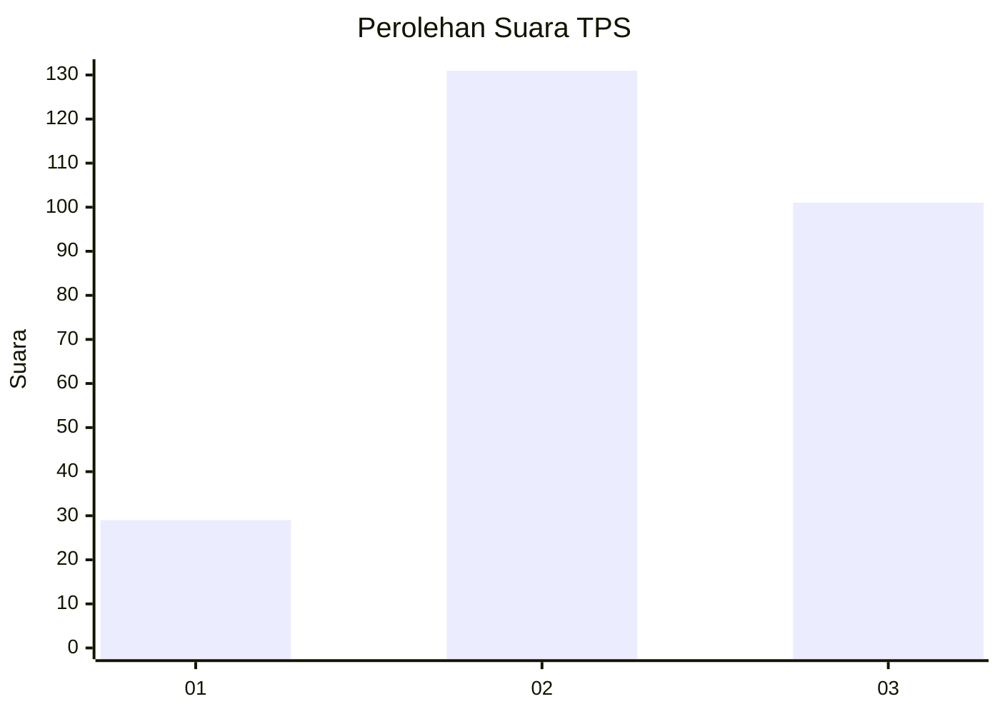
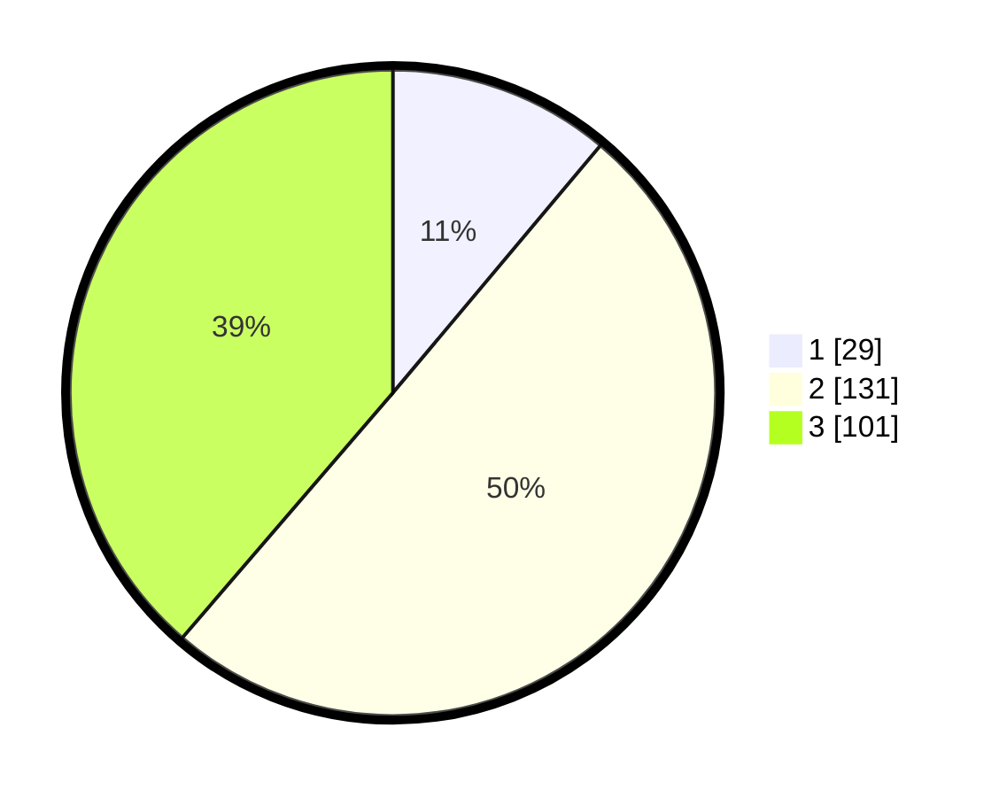

# Hasil

## Grafik

## Tabel

| No. | Nama Paslon    | Suara | Suara (raw) | Persentase |
|:--- |:-------------- | -----:| -----------:| ----------:|
| 1   | ANIES MUHAIMIN | 29    | [29][p-1]   | 11,11      |
| 2   | PRABOWO GIBRAN | 131   | [131][p-2]  | 50,19      |
| 3   | GANJAR MAHFUD  | 101   | [101][p-3]  | 38,70      |

[p-1]: https://github.com/gigit-pemilu/pemilu-2024-35-jawa-timur/blob/main/pilpres/hitung-suara/sub/35-jawa-timur/sub/72-kota-blitar/sub/01-kepanjenkidul/sub/1002-ngadirejo/sub/005-tps/sub/paslon-1.txt
[p-2]: https://github.com/gigit-pemilu/pemilu-2024-35-jawa-timur/blob/main/pilpres/hitung-suara/sub/35-jawa-timur/sub/72-kota-blitar/sub/01-kepanjenkidul/sub/1002-ngadirejo/sub/005-tps/sub/paslon-2.txt
[p-3]: https://github.com/gigit-pemilu/pemilu-2024-35-jawa-timur/blob/main/pilpres/hitung-suara/sub/35-jawa-timur/sub/72-kota-blitar/sub/01-kepanjenkidul/sub/1002-ngadirejo/sub/005-tps/sub/paslon-3.txt

## Foto C Plano

https://sirekap-obj-formc.kpu.go.id/b2b9/pemilu/ppwp/35/72/01/10/02/3572011002005-20240224-111849--e5b38c65-025c-488e-a29f-7e23a2fee1e5.jpg

https://sirekap-obj-formc.kpu.go.id/b2b9/pemilu/ppwp/35/72/01/10/02/3572011002005-20240224-111918--8847e1a9-ac8d-4ed5-881b-3ebdc9007d4b.jpg

https://sirekap-obj-formc.kpu.go.id/b2b9/pemilu/ppwp/35/72/01/10/02/3572011002005-20240224-111952--cf6df838-8737-437f-b072-01bc76ff8639.jpg

## Metadata

| Key        | Value               |
| ---------- | ------------------- |
| Time Stamp | 2024-02-24 22:31:28 |

