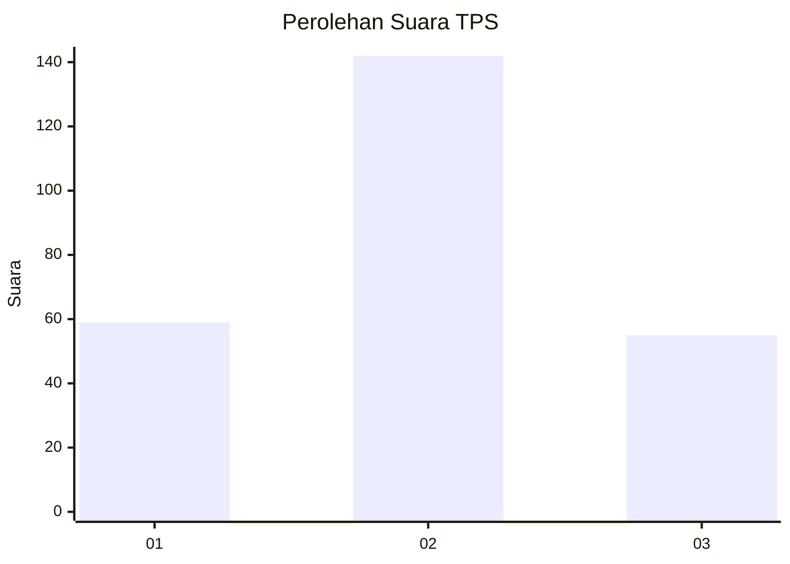
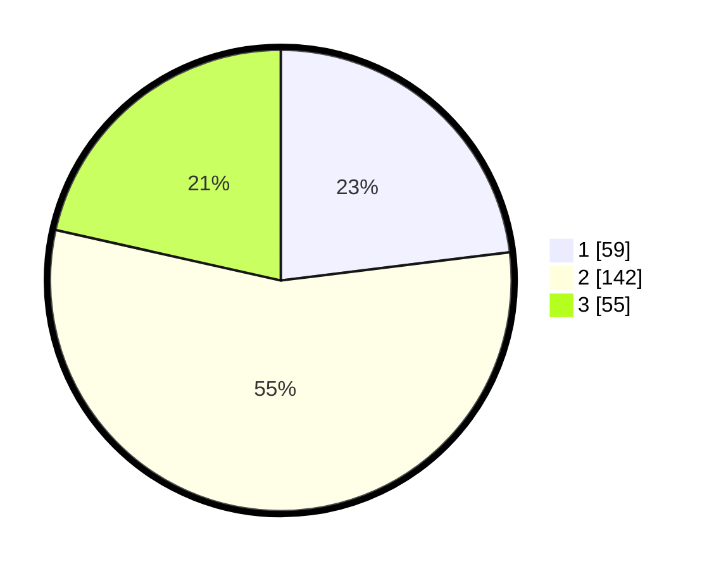

# Hasil

## Grafik

## Tabel

| No. | Nama Paslon    | Suara | Suara (raw) | Persentase |
|:--- |:-------------- | -----:| -----------:| ----------:|
| 1   | ANIES MUHAIMIN | 59    | [59][p-1]   | 23,05      |
| 2   | PRABOWO GIBRAN | 142   | [142][p-2]  | 55,47      |
| 3   | GANJAR MAHFUD  | 55    | [55][p-3]   | 21,48      |

[p-1]: https://github.com/gigit-pemilu/pemilu-2024/blob/main/pilpres/hitung-suara/sub/35-jawa-timur/sub/72-kota-blitar/sub/01-kepanjenkidul/sub/1004-kauman/sub/010-tps/sub/paslon-1.txt
[p-2]: https://github.com/gigit-pemilu/pemilu-2024/blob/main/pilpres/hitung-suara/sub/35-jawa-timur/sub/72-kota-blitar/sub/01-kepanjenkidul/sub/1004-kauman/sub/010-tps/sub/paslon-2.txt
[p-3]: https://github.com/gigit-pemilu/pemilu-2024/blob/main/pilpres/hitung-suara/sub/35-jawa-timur/sub/72-kota-blitar/sub/01-kepanjenkidul/sub/1004-kauman/sub/010-tps/sub/paslon-3.txt

## Foto C Plano

https://sirekap-obj-formc.kpu.go.id/c49f/pemilu/ppwp/35/72/01/10/04/3572011004010-20240214-155906--86f4d134-99a0-4c5b-9243-ead96ba8dd0e.jpg

https://sirekap-obj-formc.kpu.go.id/c49f/pemilu/ppwp/35/72/01/10/04/3572011004010-20240214-160121--babcec82-6806-48ad-ae8f-72c902f9e079.jpg

https://sirekap-obj-formc.kpu.go.id/c49f/pemilu/ppwp/35/72/01/10/04/3572011004010-20240214-160100--f64074e6-0983-4287-97f9-439a189853b9.jpg

## Metadata

| Key        | Value               |
| ---------- | ------------------- |
| Time Stamp | 2024-02-15 22:00:27 |

