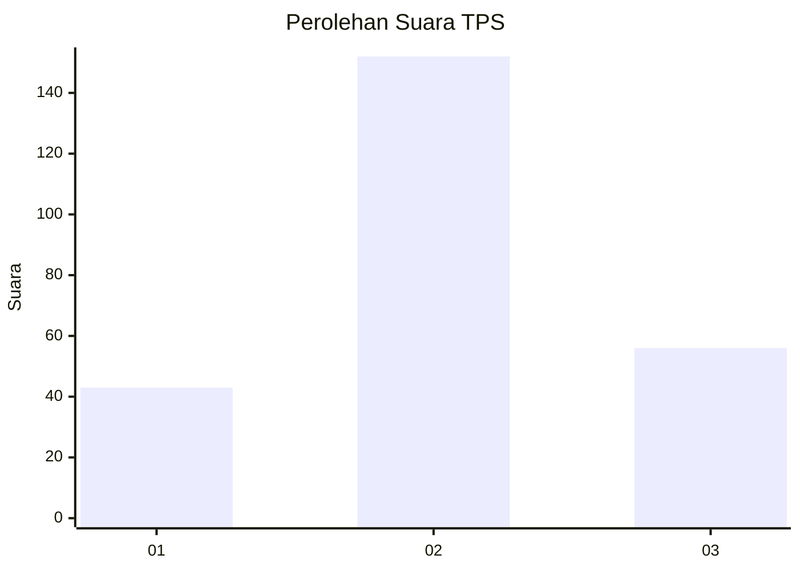
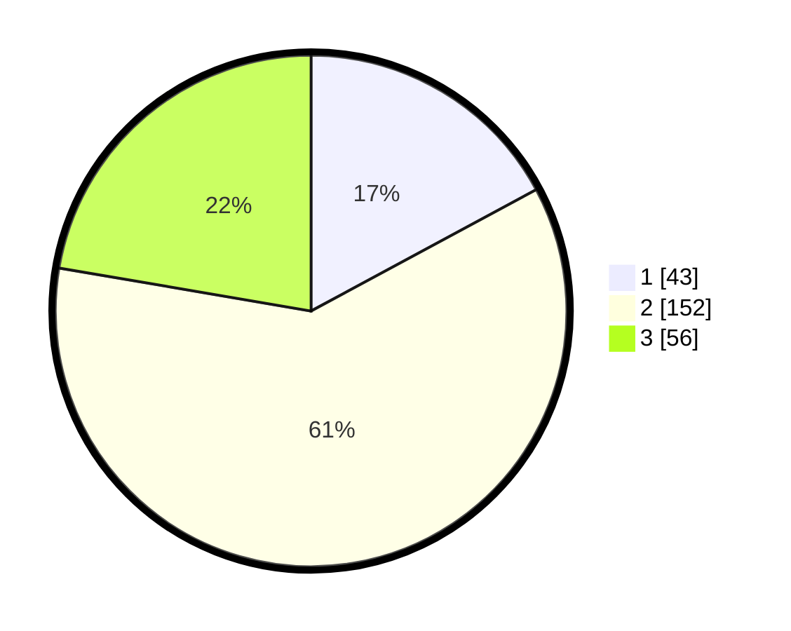

# Hasil

## Grafik

## Tabel

| No. | Nama Paslon    | Suara | Suara (raw) | Persentase |
|:--- |:-------------- | -----:| -----------:| ----------:|
| 1   | ANIES MUHAIMIN | 43    | [43][p-1]   | 17,13      |
| 2   | PRABOWO GIBRAN | 152   | [152][p-2]  | 60,56      |
| 3   | GANJAR MAHFUD  | 56    | [56][p-3]   | 22,31      |

[p-1]: https://github.com/gigit-pemilu/pemilu-2024/blob/main/pilpres/hitung-suara/sub/35-jawa-timur/sub/72-kota-blitar/sub/01-kepanjenkidul/sub/1005-tanggung/sub/013-tps/sub/paslon-1.txt
[p-2]: https://github.com/gigit-pemilu/pemilu-2024/blob/main/pilpres/hitung-suara/sub/35-jawa-timur/sub/72-kota-blitar/sub/01-kepanjenkidul/sub/1005-tanggung/sub/013-tps/sub/paslon-2.txt
[p-3]: https://github.com/gigit-pemilu/pemilu-2024/blob/main/pilpres/hitung-suara/sub/35-jawa-timur/sub/72-kota-blitar/sub/01-kepanjenkidul/sub/1005-tanggung/sub/013-tps/sub/paslon-3.txt

## Foto C Plano

https://sirekap-obj-formc.kpu.go.id/2288/pemilu/ppwp/35/72/01/10/05/3572011005013-20240219-193642--12aef8fa-e5ab-4eb0-ac97-89b0f0f829e4.jpg

https://sirekap-obj-formc.kpu.go.id/2288/pemilu/ppwp/35/72/01/10/05/3572011005013-20240219-193825--ff1386e8-0591-44c4-a5a1-bcca2ad8105a.jpg

https://sirekap-obj-formc.kpu.go.id/2288/pemilu/ppwp/35/72/01/10/05/3572011005013-20240219-193947--7ca855a7-8c45-45eb-8bef-0492def354c9.jpg

## Metadata

| Key        | Value               |
| ---------- | ------------------- |
| Time Stamp | 2024-02-24 22:31:28 |

