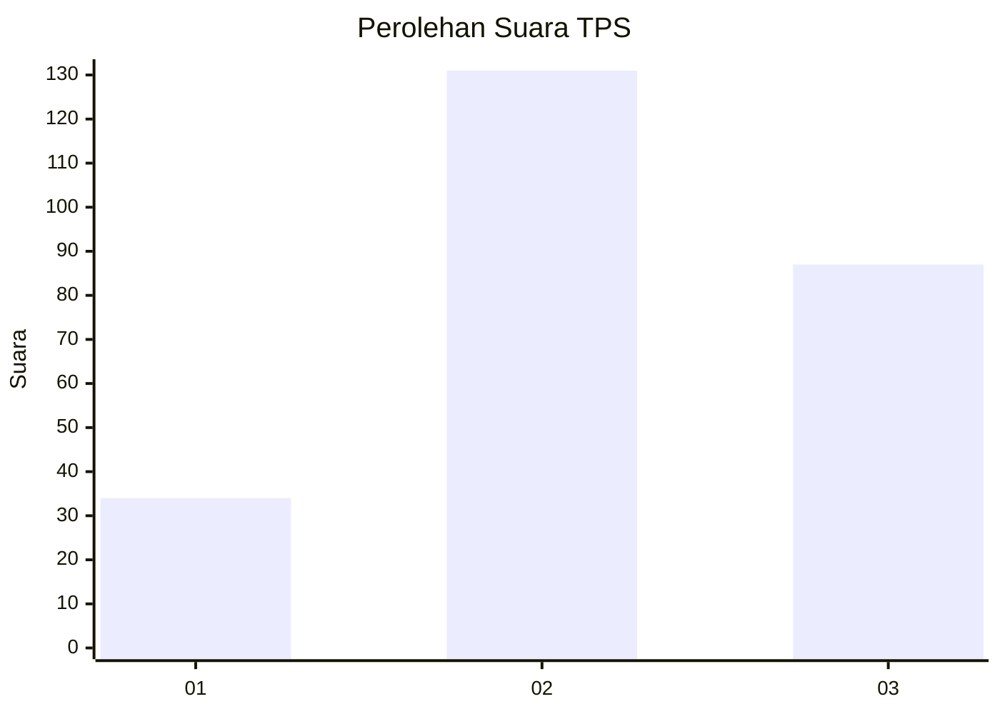
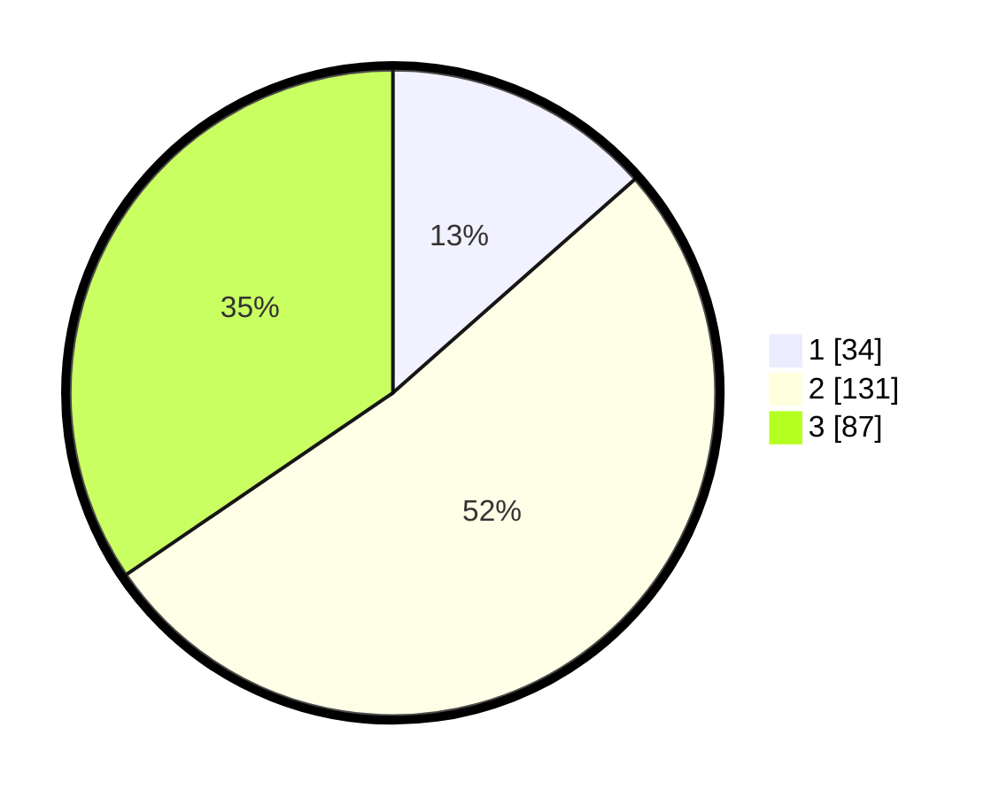

# Hasil

## Grafik

## Tabel

| No. | Nama Paslon    | Suara | Suara (raw) | Persentase |
|:--- |:-------------- | -----:| -----------:| ----------:|
| 1   | ANIES MUHAIMIN | 34    | [34][p-1]   | 13,49      |
| 2   | PRABOWO GIBRAN | 131   | [131][p-2]  | 51,98      |
| 3   | GANJAR MAHFUD  | 87    | [87][p-3]   | 34,52      |

[p-1]: https://github.com/gigit-pemilu/pemilu-2024-35-jawa-timur/blob/main/pilpres/hitung-suara/sub/35-jawa-timur/sub/72-kota-blitar/sub/02-sukorejo/sub/1001-pakunden/sub/002-tps/sub/paslon-1.txt
[p-2]: https://github.com/gigit-pemilu/pemilu-2024-35-jawa-timur/blob/main/pilpres/hitung-suara/sub/35-jawa-timur/sub/72-kota-blitar/sub/02-sukorejo/sub/1001-pakunden/sub/002-tps/sub/paslon-2.txt
[p-3]: https://github.com/gigit-pemilu/pemilu-2024-35-jawa-timur/blob/main/pilpres/hitung-suara/sub/35-jawa-timur/sub/72-kota-blitar/sub/02-sukorejo/sub/1001-pakunden/sub/002-tps/sub/paslon-3.txt

## Foto C Plano

https://sirekap-obj-formc.kpu.go.id/a60a/pemilu/ppwp/35/72/02/10/01/3572021001002-20240214-233214--c19e91ee-1ae9-4d01-bd5b-661516e14851.jpg

https://sirekap-obj-formc.kpu.go.id/a60a/pemilu/ppwp/35/72/02/10/01/3572021001002-20240214-233351--e1159531-7af1-4f1b-a5dd-6efe1028b397.jpg

https://sirekap-obj-formc.kpu.go.id/a60a/pemilu/ppwp/35/72/02/10/01/3572021001002-20240214-233449--ab77d413-4281-42ff-8065-52b687dcae83.jpg

## Metadata

| Key        | Value               |
| ---------- | ------------------- |
| Time Stamp | 2024-02-16 00:00:26 |

