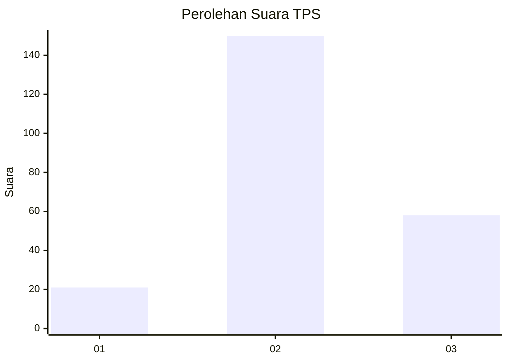
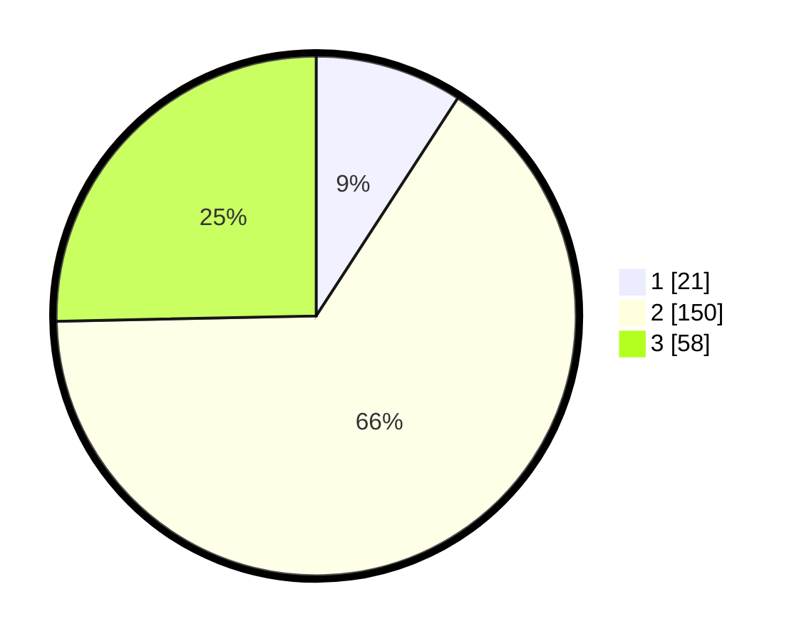

# Hasil

## Grafik

## Tabel

| No. | Nama Paslon    | Suara | Suara (raw) | Persentase |
|:--- |:-------------- | -----:| -----------:| ----------:|
| 1   | ANIES MUHAIMIN | 21    | [21][p-1]   | 9,17       |
| 2   | PRABOWO GIBRAN | 150   | [150][p-2]  | 65,50      |
| 3   | GANJAR MAHFUD  | 58    | [58][p-3]   | 25,33      |

[p-1]: https://github.com/gigit-pemilu/pemilu-2024/blob/main/pilpres/hitung-suara/sub/35-jawa-timur/sub/72-kota-blitar/sub/02-sukorejo/sub/1001-pakunden/sub/004-tps/sub/paslon-1.txt
[p-2]: https://github.com/gigit-pemilu/pemilu-2024/blob/main/pilpres/hitung-suara/sub/35-jawa-timur/sub/72-kota-blitar/sub/02-sukorejo/sub/1001-pakunden/sub/004-tps/sub/paslon-2.txt
[p-3]: https://github.com/gigit-pemilu/pemilu-2024/blob/main/pilpres/hitung-suara/sub/35-jawa-timur/sub/72-kota-blitar/sub/02-sukorejo/sub/1001-pakunden/sub/004-tps/sub/paslon-3.txt

## Foto C Plano

https://sirekap-obj-formc.kpu.go.id/37c1/pemilu/ppwp/35/72/02/10/01/3572021001004-20240215-031806--ff57b3a8-8f5e-43f7-9e14-f300c45c48cb.jpg

https://sirekap-obj-formc.kpu.go.id/37c1/pemilu/ppwp/35/72/02/10/01/3572021001004-20240215-003111--1704e1c7-e6b7-4d0c-93fd-388d5cbb3aa5.jpg

https://sirekap-obj-formc.kpu.go.id/37c1/pemilu/ppwp/35/72/02/10/01/3572021001004-20240215-003257--b7dc8881-ae7f-4884-9f0f-889e88ab703b.jpg

## Metadata

| Key        | Value               |
| ---------- | ------------------- |
| Time Stamp | 2024-02-16 00:00:26 |

