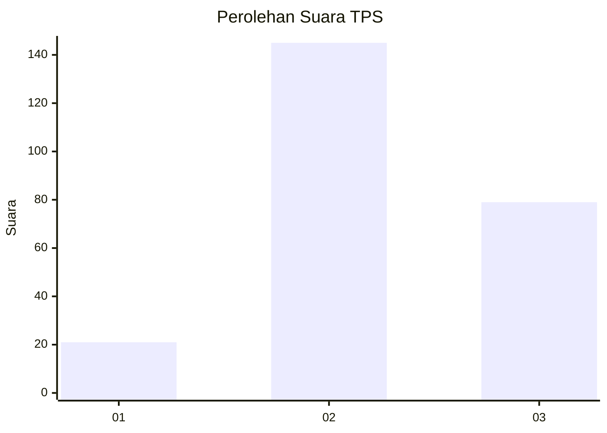
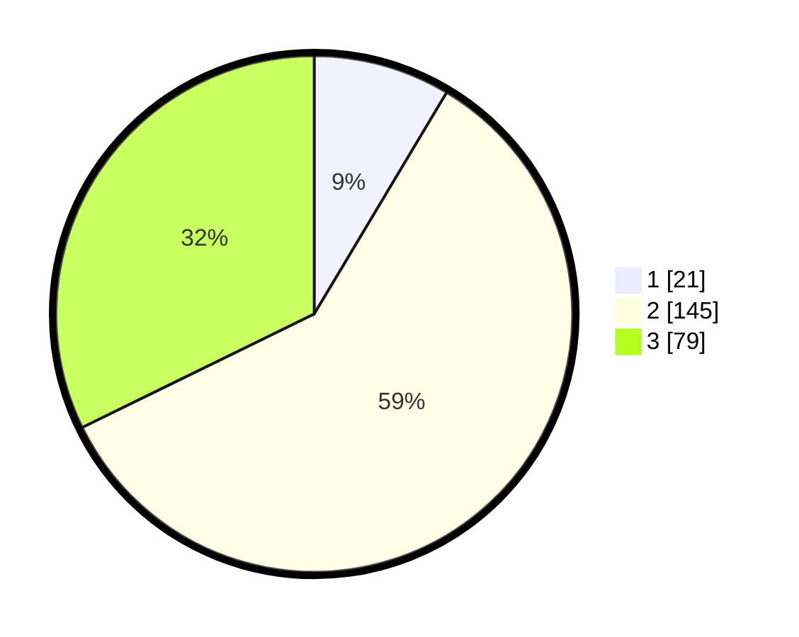

# Hasil

## Grafik

## Tabel

| No. | Nama Paslon    | Suara | Suara (raw) | Persentase |
|:--- |:-------------- | -----:| -----------:| ----------:|
| 1   | ANIES MUHAIMIN | 21    | [21][p-1]   | 8,57       |
| 2   | PRABOWO GIBRAN | 145   | [145][p-2]  | 59,18      |
| 3   | GANJAR MAHFUD  | 79    | [79][p-3]   | 32,24      |

[p-1]: https://github.com/gigit-pemilu/pemilu-2024-35-jawa-timur/blob/main/pilpres/hitung-suara/sub/35-jawa-timur/sub/72-kota-blitar/sub/02-sukorejo/sub/1004-turi/sub/004-tps/sub/paslon-1.txt
[p-2]: https://github.com/gigit-pemilu/pemilu-2024-35-jawa-timur/blob/main/pilpres/hitung-suara/sub/35-jawa-timur/sub/72-kota-blitar/sub/02-sukorejo/sub/1004-turi/sub/004-tps/sub/paslon-2.txt
[p-3]: https://github.com/gigit-pemilu/pemilu-2024-35-jawa-timur/blob/main/pilpres/hitung-suara/sub/35-jawa-timur/sub/72-kota-blitar/sub/02-sukorejo/sub/1004-turi/sub/004-tps/sub/paslon-3.txt

## Foto C Plano

https://sirekap-obj-formc.kpu.go.id/0b15/pemilu/ppwp/35/72/02/10/04/3572021004004-20240221-160926--a646e7b6-28bc-4cf4-bba5-36a9050c5af2.jpg

https://sirekap-obj-formc.kpu.go.id/0b15/pemilu/ppwp/35/72/02/10/04/3572021004004-20240221-161014--0818676c-baea-4e30-bab0-aa9c86e189f0.jpg

https://sirekap-obj-formc.kpu.go.id/0b15/pemilu/ppwp/35/72/02/10/04/3572021004004-20240221-161111--9df26333-c49d-4f15-9c43-f2f282e32dac.jpg

## Metadata

| Key        | Value               |
| ---------- | ------------------- |
| Time Stamp | 2024-02-24 22:31:28 |

