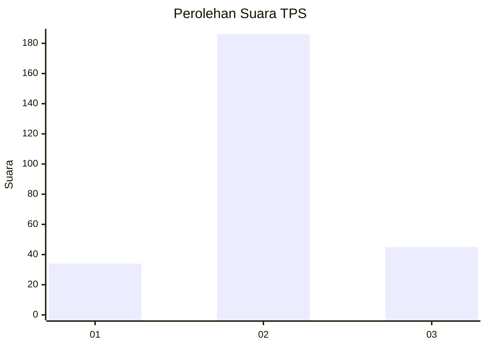
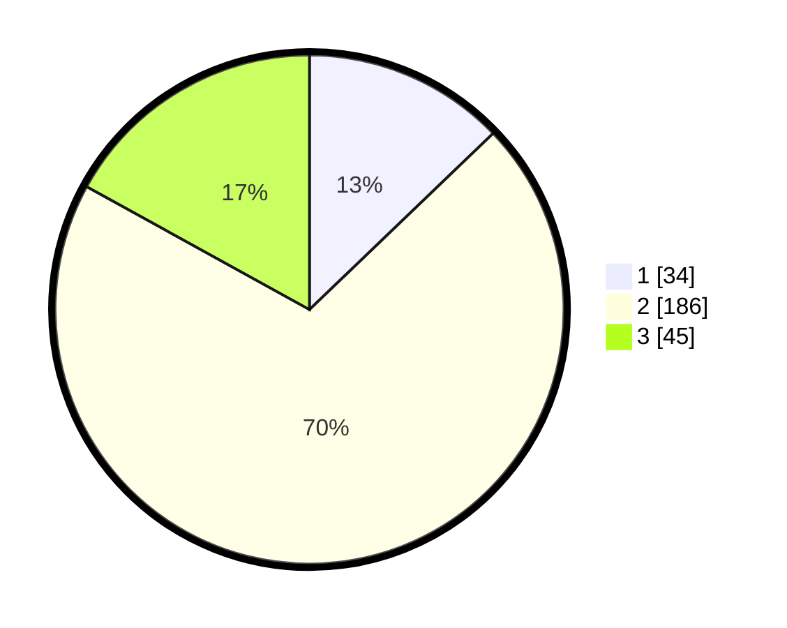

# Hasil

## Grafik

## Tabel

| No. | Nama Paslon    | Suara | Suara (raw) | Persentase |
|:--- |:-------------- | -----:| -----------:| ----------:|
| 1   | ANIES MUHAIMIN | 34    | [34][p-1]   | 12,83      |
| 2   | PRABOWO GIBRAN | 186   | [186][p-2]  | 70,19      |
| 3   | GANJAR MAHFUD  | 45    | [45][p-3]   | 16,98      |

[p-1]: https://github.com/gigit-pemilu/pemilu-2024-35-jawa-timur/blob/main/pilpres/hitung-suara/sub/35-jawa-timur/sub/72-kota-blitar/sub/02-sukorejo/sub/1004-turi/sub/009-tps/sub/paslon-1.txt
[p-2]: https://github.com/gigit-pemilu/pemilu-2024-35-jawa-timur/blob/main/pilpres/hitung-suara/sub/35-jawa-timur/sub/72-kota-blitar/sub/02-sukorejo/sub/1004-turi/sub/009-tps/sub/paslon-2.txt
[p-3]: https://github.com/gigit-pemilu/pemilu-2024-35-jawa-timur/blob/main/pilpres/hitung-suara/sub/35-jawa-timur/sub/72-kota-blitar/sub/02-sukorejo/sub/1004-turi/sub/009-tps/sub/paslon-3.txt

## Foto C Plano

https://sirekap-obj-formc.kpu.go.id/d3e2/pemilu/ppwp/35/72/02/10/04/3572021004009-20240221-162100--0ef339fa-31fc-47e7-ac07-40714f30e4a1.jpg

https://sirekap-obj-formc.kpu.go.id/d3e2/pemilu/ppwp/35/72/02/10/04/3572021004009-20240221-162202--b3812e54-da21-4950-adac-d7ebe2a8e2d6.jpg

https://sirekap-obj-formc.kpu.go.id/d3e2/pemilu/ppwp/35/72/02/10/04/3572021004009-20240221-162342--94d79719-8f81-4e52-a323-0e946ad4b1a9.jpg

## Metadata

| Key        | Value               |
| ---------- | ------------------- |
| Time Stamp | 2024-02-24 22:31:28 |

