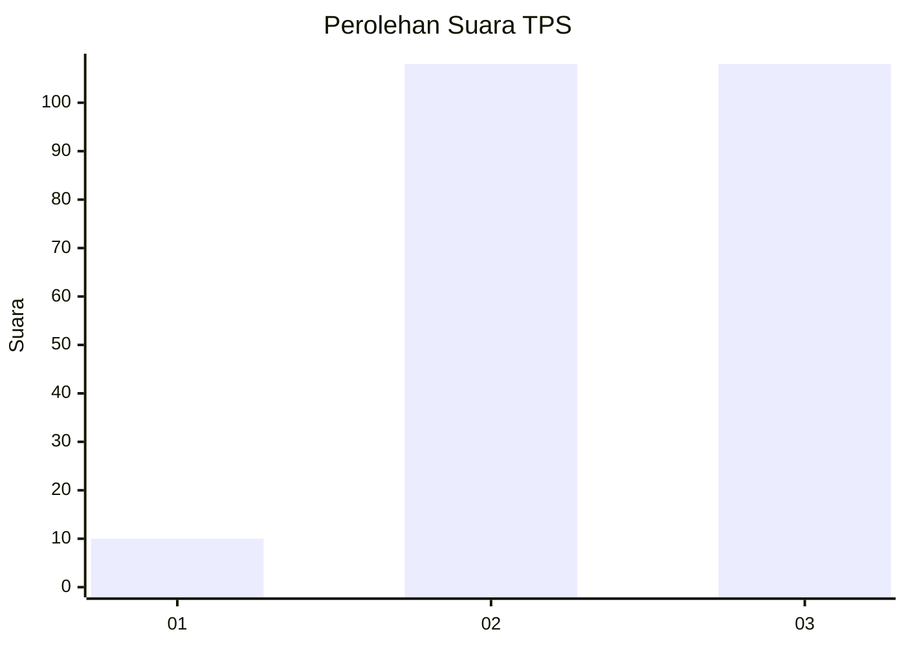
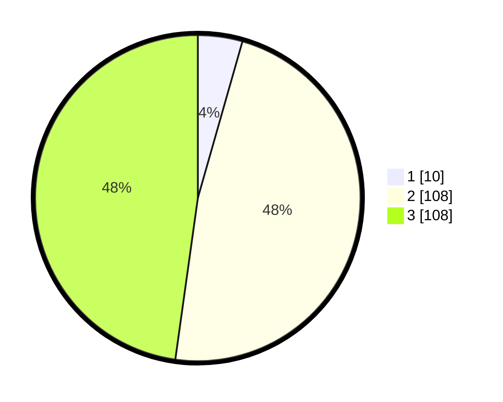

# Hasil

## Grafik

## Tabel

| No. | Nama Paslon    | Suara | Suara (raw) | Persentase |
|:--- |:-------------- | -----:| -----------:| ----------:|
| 1   | ANIES MUHAIMIN | 10    | [10][p-1]   | 4,42       |
| 2   | PRABOWO GIBRAN | 108   | [108][p-2]  | 47,79      |
| 3   | GANJAR MAHFUD  | 108   | [108][p-3]  | 47,79      |

[p-1]: https://github.com/gigit-pemilu/pemilu-2024/blob/main/pilpres/hitung-suara/sub/35-jawa-timur/sub/72-kota-blitar/sub/02-sukorejo/sub/1006-sukorejo/sub/004-tps/sub/paslon-1.txt
[p-2]: https://github.com/gigit-pemilu/pemilu-2024/blob/main/pilpres/hitung-suara/sub/35-jawa-timur/sub/72-kota-blitar/sub/02-sukorejo/sub/1006-sukorejo/sub/004-tps/sub/paslon-2.txt
[p-3]: https://github.com/gigit-pemilu/pemilu-2024/blob/main/pilpres/hitung-suara/sub/35-jawa-timur/sub/72-kota-blitar/sub/02-sukorejo/sub/1006-sukorejo/sub/004-tps/sub/paslon-3.txt

## Foto C Plano

https://sirekap-obj-formc.kpu.go.id/7c75/pemilu/ppwp/35/72/02/10/06/3572021006004-20240221-204349--23e5b6a5-89b4-45d6-b3a5-7735a07ceecf.jpg

https://sirekap-obj-formc.kpu.go.id/7c75/pemilu/ppwp/35/72/02/10/06/3572021006004-20240221-204444--537f4428-c5e6-4622-90b5-371641e35d40.jpg

https://sirekap-obj-formc.kpu.go.id/7c75/pemilu/ppwp/35/72/02/10/06/3572021006004-20240221-204543--112b1573-455f-48f7-a1cd-e4034cc4d532.jpg

## Metadata

| Key        | Value               |
| ---------- | ------------------- |
| Time Stamp | 2024-02-24 22:31:28 |

