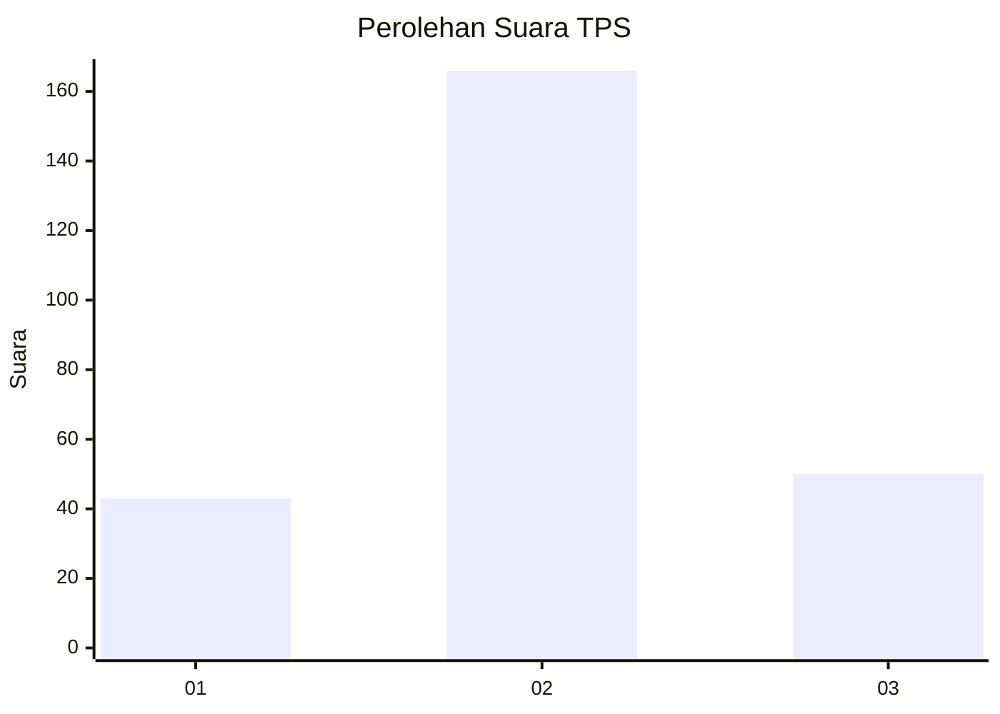
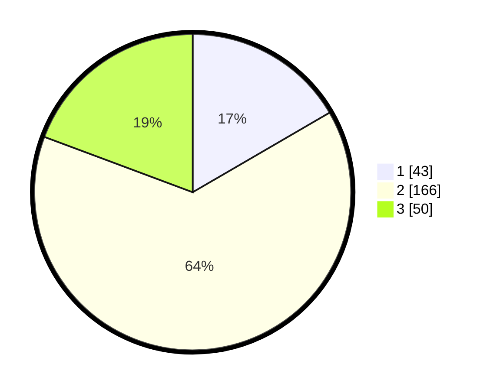

# Hasil

## Grafik

## Tabel

| No. | Nama Paslon    | Suara | Suara (raw) | Persentase |
|:--- |:-------------- | -----:| -----------:| ----------:|
| 1   | ANIES MUHAIMIN | 43    | [43][p-1]   | 16,60      |
| 2   | PRABOWO GIBRAN | 166   | [166][p-2]  | 64,09      |
| 3   | GANJAR MAHFUD  | 50    | [50][p-3]   | 19,31      |

[p-1]: https://github.com/gigit-pemilu/pemilu-2024-35-jawa-timur/blob/main/pilpres/hitung-suara/sub/35-jawa-timur/sub/72-kota-blitar/sub/02-sukorejo/sub/1007-tanjungsari/sub/004-tps/sub/paslon-1.txt
[p-2]: https://github.com/gigit-pemilu/pemilu-2024-35-jawa-timur/blob/main/pilpres/hitung-suara/sub/35-jawa-timur/sub/72-kota-blitar/sub/02-sukorejo/sub/1007-tanjungsari/sub/004-tps/sub/paslon-2.txt
[p-3]: https://github.com/gigit-pemilu/pemilu-2024-35-jawa-timur/blob/main/pilpres/hitung-suara/sub/35-jawa-timur/sub/72-kota-blitar/sub/02-sukorejo/sub/1007-tanjungsari/sub/004-tps/sub/paslon-3.txt

## Foto C Plano

https://sirekap-obj-formc.kpu.go.id/1f71/pemilu/ppwp/35/72/02/10/07/3572021007004-20240215-033047--f6ee9acc-457d-42d6-a076-ef4c735c071a.jpg

https://sirekap-obj-formc.kpu.go.id/1f71/pemilu/ppwp/35/72/02/10/07/3572021007004-20240215-033241--65508aee-6076-47df-a00e-46b93a1cc99d.jpg

https://sirekap-obj-formc.kpu.go.id/1f71/pemilu/ppwp/35/72/02/10/07/3572021007004-20240215-033316--f041e779-9577-42a6-a2dc-3e96c8966e28.jpg

## Metadata

| Key        | Value               |
| ---------- | ------------------- |
| Time Stamp | 2024-02-15 15:30:25 |

