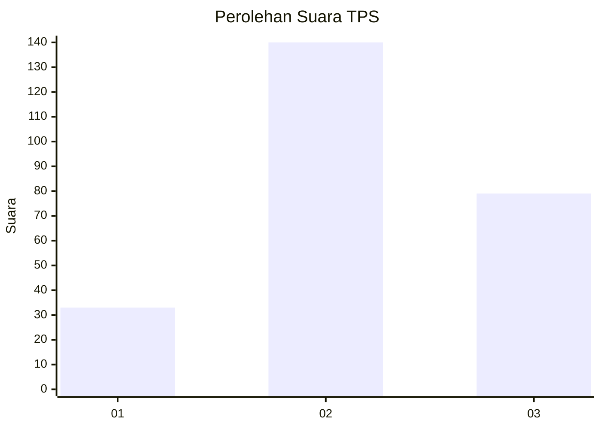
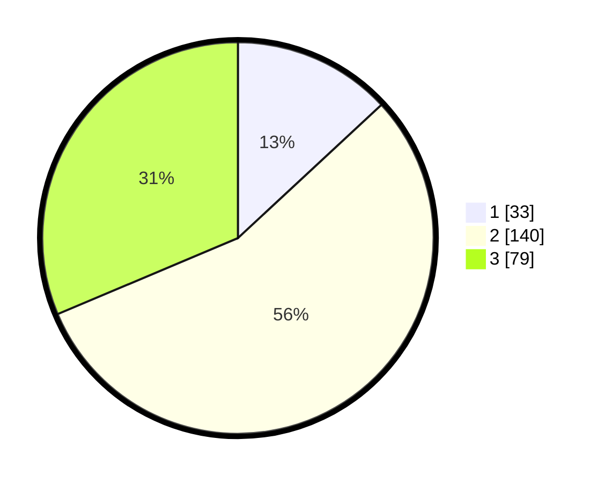

# Hasil

## Grafik

## Tabel

| No. | Nama Paslon    | Suara | Suara (raw) | Persentase |
|:--- |:-------------- | -----:| -----------:| ----------:|
| 1   | ANIES MUHAIMIN | 33    | [33][p-1]   | 13,10      |
| 2   | PRABOWO GIBRAN | 140   | [140][p-2]  | 55,56      |
| 3   | GANJAR MAHFUD  | 79    | [79][p-3]   | 31,35      |

[p-1]: https://github.com/gigit-pemilu/pemilu-2024/blob/main/pilpres/hitung-suara/sub/35-jawa-timur/sub/72-kota-blitar/sub/02-sukorejo/sub/1007-tanjungsari/sub/006-tps/sub/paslon-1.txt
[p-2]: https://github.com/gigit-pemilu/pemilu-2024/blob/main/pilpres/hitung-suara/sub/35-jawa-timur/sub/72-kota-blitar/sub/02-sukorejo/sub/1007-tanjungsari/sub/006-tps/sub/paslon-2.txt
[p-3]: https://github.com/gigit-pemilu/pemilu-2024/blob/main/pilpres/hitung-suara/sub/35-jawa-timur/sub/72-kota-blitar/sub/02-sukorejo/sub/1007-tanjungsari/sub/006-tps/sub/paslon-3.txt

## Foto C Plano

https://sirekap-obj-formc.kpu.go.id/f281/pemilu/ppwp/35/72/02/10/07/3572021007006-20240222-134956--8ed00419-63be-491d-bd1f-28ffbe8b082c.jpg

https://sirekap-obj-formc.kpu.go.id/f281/pemilu/ppwp/35/72/02/10/07/3572021007006-20240222-135048--45e140cc-cd61-45d9-8c6d-63e21ccf4208.jpg

https://sirekap-obj-formc.kpu.go.id/f281/pemilu/ppwp/35/72/02/10/07/3572021007006-20240222-135120--27c1fd1a-6b4a-4cb0-b466-66fd7c76e573.jpg

## Metadata

| Key        | Value               |
| ---------- | ------------------- |
| Time Stamp | 2024-02-24 22:31:28 |

