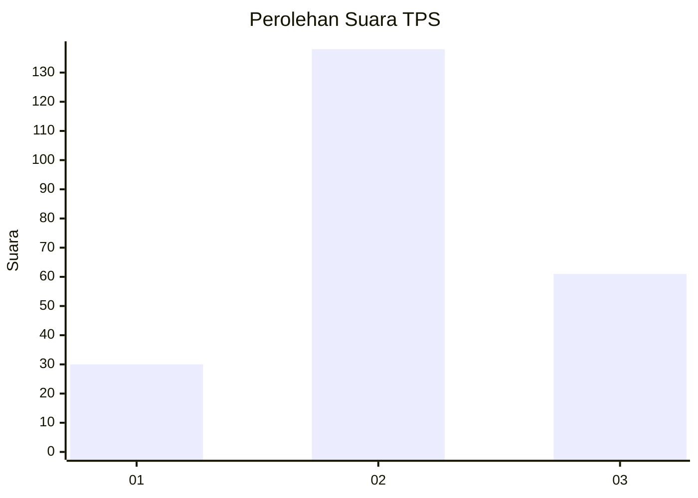
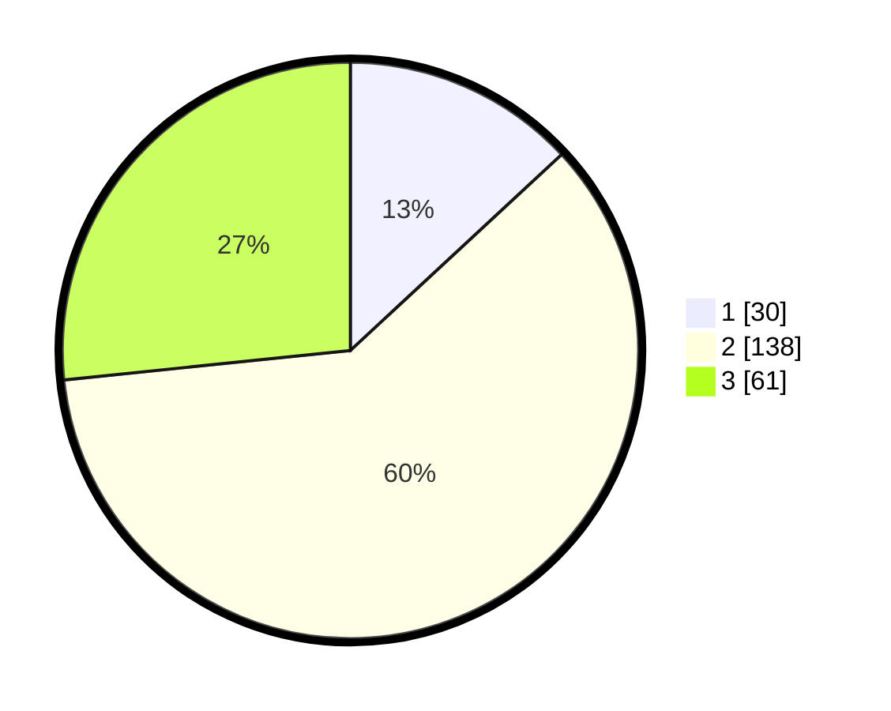

# Hasil

## Grafik

## Tabel

| No. | Nama Paslon    | Suara | Suara (raw) | Persentase |
|:--- |:-------------- | -----:| -----------:| ----------:|
| 1   | ANIES MUHAIMIN | 30    | [30][p-1]   | 13,10      |
| 2   | PRABOWO GIBRAN | 138   | [138][p-2]  | 60,26      |
| 3   | GANJAR MAHFUD  | 61    | [61][p-3]   | 26,64      |

[p-1]: https://github.com/gigit-pemilu/pemilu-2024-35-jawa-timur/blob/main/pilpres/hitung-suara/sub/35-jawa-timur/sub/72-kota-blitar/sub/03-sananwetan/sub/1001-gedog/sub/003-tps/sub/paslon-1.txt
[p-2]: https://github.com/gigit-pemilu/pemilu-2024-35-jawa-timur/blob/main/pilpres/hitung-suara/sub/35-jawa-timur/sub/72-kota-blitar/sub/03-sananwetan/sub/1001-gedog/sub/003-tps/sub/paslon-2.txt
[p-3]: https://github.com/gigit-pemilu/pemilu-2024-35-jawa-timur/blob/main/pilpres/hitung-suara/sub/35-jawa-timur/sub/72-kota-blitar/sub/03-sananwetan/sub/1001-gedog/sub/003-tps/sub/paslon-3.txt

## Foto C Plano

https://sirekap-obj-formc.kpu.go.id/7901/pemilu/ppwp/35/72/03/10/01/3572031001003-20240224-121505--cd442a69-5426-4bb9-8abc-842904534240.jpg

https://sirekap-obj-formc.kpu.go.id/7901/pemilu/ppwp/35/72/03/10/01/3572031001003-20240224-121301--cbea216e-3ef1-4e68-9d0b-0b67b189719f.jpg

https://sirekap-obj-formc.kpu.go.id/7901/pemilu/ppwp/35/72/03/10/01/3572031001003-20240224-121553--968e8d33-4cc9-46a2-a08a-184dc7efe1f7.jpg

## Metadata

| Key        | Value               |
| ---------- | ------------------- |
| Time Stamp | 2024-02-24 22:31:28 |

