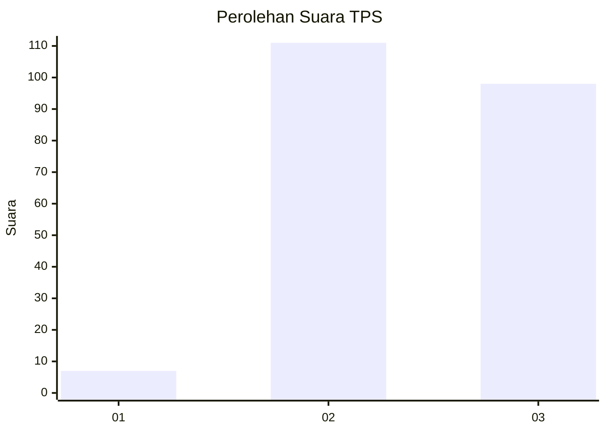
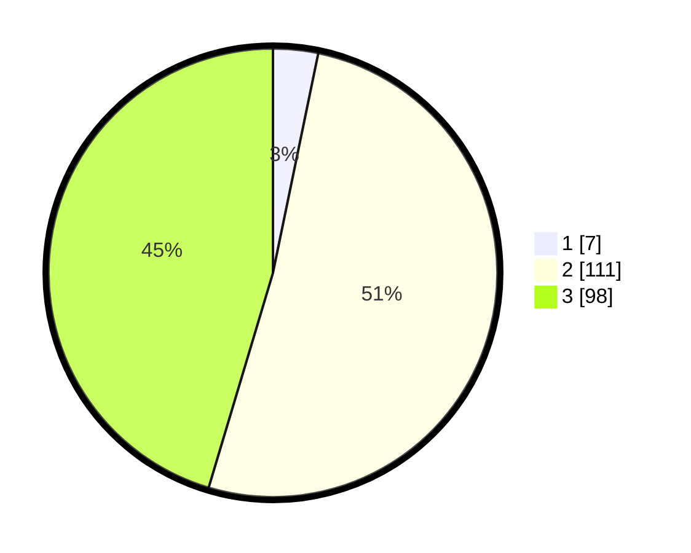

# Hasil

## Grafik

## Tabel

| No. | Nama Paslon    | Suara | Suara (raw) | Persentase |
|:--- |:-------------- | -----:| -----------:| ----------:|
| 1   | ANIES MUHAIMIN | 7     | [7][p-1]    | 3,24       |
| 2   | PRABOWO GIBRAN | 111   | [111][p-2]  | 51,39      |
| 3   | GANJAR MAHFUD  | 98    | [98][p-3]   | 45,37      |

[p-1]: https://github.com/gigit-pemilu/pemilu-2024/blob/main/pilpres/hitung-suara/sub/35-jawa-timur/sub/72-kota-blitar/sub/03-sananwetan/sub/1001-gedog/sub/024-tps/sub/paslon-1.txt
[p-2]: https://github.com/gigit-pemilu/pemilu-2024/blob/main/pilpres/hitung-suara/sub/35-jawa-timur/sub/72-kota-blitar/sub/03-sananwetan/sub/1001-gedog/sub/024-tps/sub/paslon-2.txt
[p-3]: https://github.com/gigit-pemilu/pemilu-2024/blob/main/pilpres/hitung-suara/sub/35-jawa-timur/sub/72-kota-blitar/sub/03-sananwetan/sub/1001-gedog/sub/024-tps/sub/paslon-3.txt

## Foto C Plano

https://sirekap-obj-formc.kpu.go.id/d751/pemilu/ppwp/35/72/03/10/01/3572031001024-20240215-002714--976e718f-c2e5-4ba7-bded-b84a7bd78610.jpg

https://sirekap-obj-formc.kpu.go.id/d751/pemilu/ppwp/35/72/03/10/01/3572031001024-20240215-002747--d21a2348-b86d-4de3-9758-7a86347a1c75.jpg

https://sirekap-obj-formc.kpu.go.id/d751/pemilu/ppwp/35/72/03/10/01/3572031001024-20240215-002816--642749e6-244c-42d8-b1e8-24994f8f834a.jpg

## Metadata

| Key        | Value               |
| ---------- | ------------------- |
| Time Stamp | 2024-02-24 22:31:28 |

