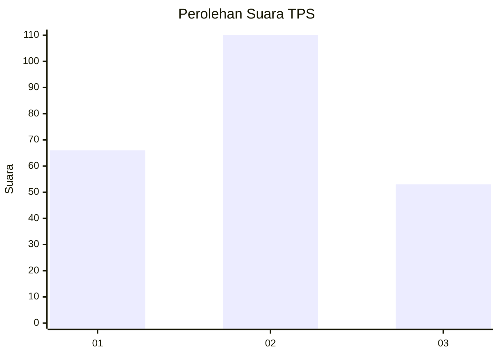
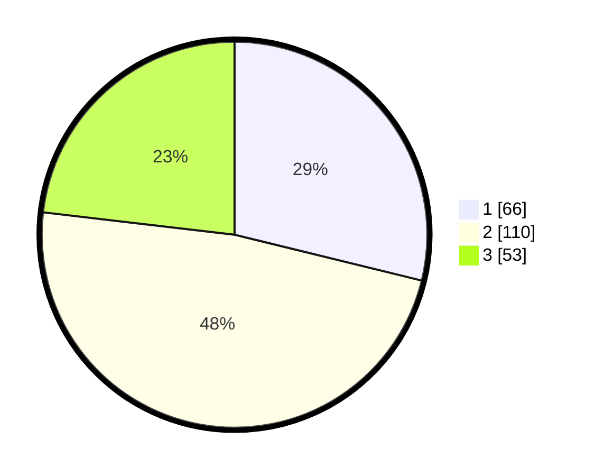

# Hasil

## Grafik

## Tabel

| No. | Nama Paslon    | Suara | Suara (raw) | Persentase |
|:--- |:-------------- | -----:| -----------:| ----------:|
| 1   | ANIES MUHAIMIN | 66    | [66][p-1]   | 28,82      |
| 2   | PRABOWO GIBRAN | 110   | [110][p-2]  | 48,03      |
| 3   | GANJAR MAHFUD  | 53    | [53][p-3]   | 23,14      |

[p-1]: https://github.com/gigit-pemilu/pemilu-2024-35-jawa-timur/blob/main/pilpres/hitung-suara/sub/35-jawa-timur/sub/72-kota-blitar/sub/03-sananwetan/sub/1002-plosokerep/sub/008-tps/sub/paslon-1.txt
[p-2]: https://github.com/gigit-pemilu/pemilu-2024-35-jawa-timur/blob/main/pilpres/hitung-suara/sub/35-jawa-timur/sub/72-kota-blitar/sub/03-sananwetan/sub/1002-plosokerep/sub/008-tps/sub/paslon-2.txt
[p-3]: https://github.com/gigit-pemilu/pemilu-2024-35-jawa-timur/blob/main/pilpres/hitung-suara/sub/35-jawa-timur/sub/72-kota-blitar/sub/03-sananwetan/sub/1002-plosokerep/sub/008-tps/sub/paslon-3.txt

## Foto C Plano

https://sirekap-obj-formc.kpu.go.id/a72f/pemilu/ppwp/35/72/03/10/02/3572031002008-20240216-085245--70d32fa2-f863-4635-8ef0-060cdd8afc83.jpg

https://sirekap-obj-formc.kpu.go.id/a72f/pemilu/ppwp/35/72/03/10/02/3572031002008-20240216-085722--2f66a799-39c3-4e29-b8a9-c8cc43b117e4.jpg

https://sirekap-obj-formc.kpu.go.id/a72f/pemilu/ppwp/35/72/03/10/02/3572031002008-20240216-145447--4690deab-760b-4717-8616-9375dafce848.jpg

## Metadata

| Key        | Value               |
| ---------- | ------------------- |
| Time Stamp | 2024-02-22 19:00:00 |

