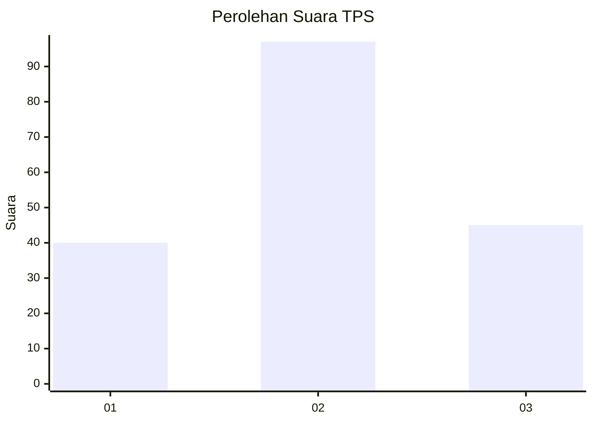
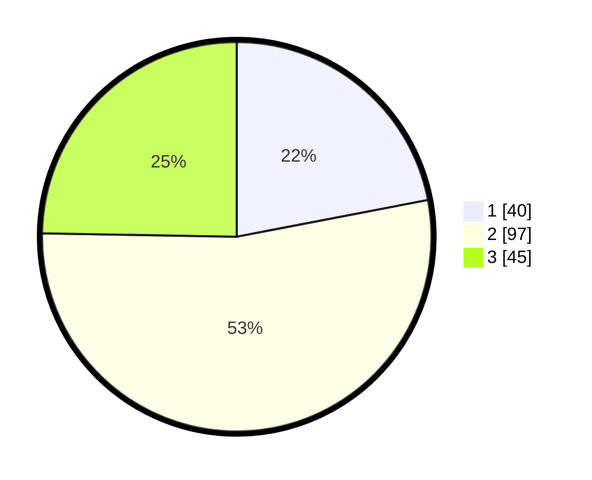

# Hasil

## Grafik

## Tabel

| No. | Nama Paslon    | Suara | Suara (raw) | Persentase |
|:--- |:-------------- | -----:| -----------:| ----------:|
| 1   | ANIES MUHAIMIN | 40    | [40][p-1]   | 21,98      |
| 2   | PRABOWO GIBRAN | 97    | [97][p-2]   | 53,30      |
| 3   | GANJAR MAHFUD  | 45    | [45][p-3]   | 24,73      |

[p-1]: https://github.com/gigit-pemilu/pemilu-2024-35-jawa-timur/blob/main/pilpres/hitung-suara/sub/35-jawa-timur/sub/72-kota-blitar/sub/03-sananwetan/sub/1004-sananwetan/sub/004-tps/sub/paslon-1.txt
[p-2]: https://github.com/gigit-pemilu/pemilu-2024-35-jawa-timur/blob/main/pilpres/hitung-suara/sub/35-jawa-timur/sub/72-kota-blitar/sub/03-sananwetan/sub/1004-sananwetan/sub/004-tps/sub/paslon-2.txt
[p-3]: https://github.com/gigit-pemilu/pemilu-2024-35-jawa-timur/blob/main/pilpres/hitung-suara/sub/35-jawa-timur/sub/72-kota-blitar/sub/03-sananwetan/sub/1004-sananwetan/sub/004-tps/sub/paslon-3.txt

## Foto C Plano

https://sirekap-obj-formc.kpu.go.id/6bb0/pemilu/ppwp/35/72/03/10/04/3572031004004-20240215-020909--0d4e876a-c5d5-41b5-9b22-8ee0f7703949.jpg

https://sirekap-obj-formc.kpu.go.id/6bb0/pemilu/ppwp/35/72/03/10/04/3572031004004-20240215-021019--d88f4dca-3b44-4916-bfa7-8f8740f41d29.jpg

https://sirekap-obj-formc.kpu.go.id/6bb0/pemilu/ppwp/35/72/03/10/04/3572031004004-20240215-032145--ef4433d1-473e-4c14-ba7d-8084ace9b719.jpg

## Metadata

| Key        | Value               |
| ---------- | ------------------- |
| Time Stamp | 2024-02-16 01:00:27 |

