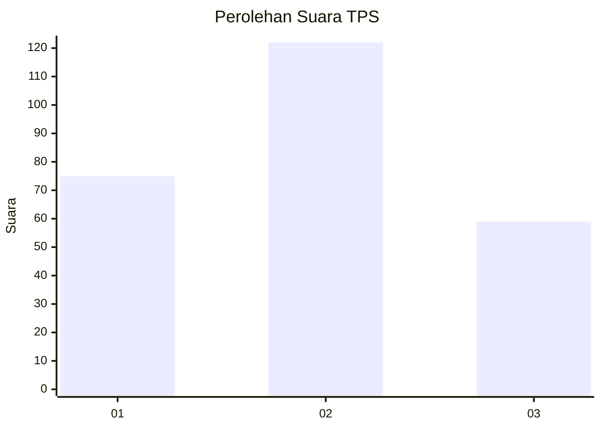
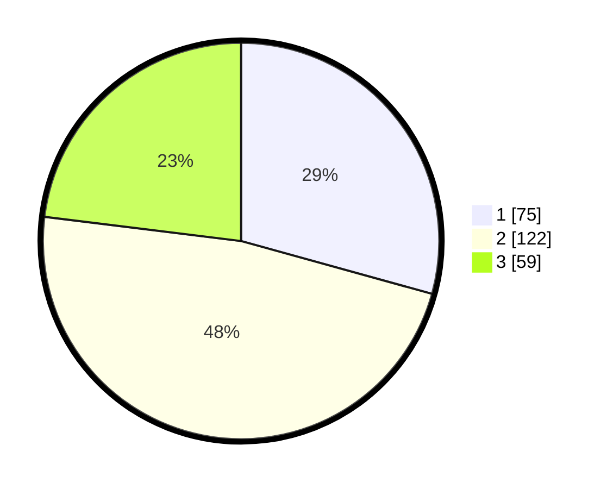

# Hasil

## Grafik

## Tabel

| No. | Nama Paslon    | Suara | Suara (raw) | Persentase |
|:--- |:-------------- | -----:| -----------:| ----------:|
| 1   | ANIES MUHAIMIN | 75    | [75][p-1]   | 29,30      |
| 2   | PRABOWO GIBRAN | 122   | [122][p-2]  | 47,66      |
| 3   | GANJAR MAHFUD  | 59    | [59][p-3]   | 23,05      |

[p-1]: https://github.com/gigit-pemilu/pemilu-2024-35-jawa-timur/blob/main/pilpres/hitung-suara/sub/35-jawa-timur/sub/72-kota-blitar/sub/03-sananwetan/sub/1006-karangtengah/sub/020-tps/sub/paslon-1.txt
[p-2]: https://github.com/gigit-pemilu/pemilu-2024-35-jawa-timur/blob/main/pilpres/hitung-suara/sub/35-jawa-timur/sub/72-kota-blitar/sub/03-sananwetan/sub/1006-karangtengah/sub/020-tps/sub/paslon-2.txt
[p-3]: https://github.com/gigit-pemilu/pemilu-2024-35-jawa-timur/blob/main/pilpres/hitung-suara/sub/35-jawa-timur/sub/72-kota-blitar/sub/03-sananwetan/sub/1006-karangtengah/sub/020-tps/sub/paslon-3.txt

## Foto C Plano

https://sirekap-obj-formc.kpu.go.id/996e/pemilu/ppwp/35/72/03/10/06/3572031006020-20240214-220938--7fa6588b-a25b-4a42-b7f4-1d53ce53114b.jpg

https://sirekap-obj-formc.kpu.go.id/996e/pemilu/ppwp/35/72/03/10/06/3572031006020-20240214-220940--eba9a7c2-8d2e-422c-917f-004bbee1b2d9.jpg

https://sirekap-obj-formc.kpu.go.id/996e/pemilu/ppwp/35/72/03/10/06/3572031006020-20240214-220944--d99b276c-0d3e-4fd2-ba48-e6951e6f701b.jpg

## Metadata

| Key        | Value               |
| ---------- | ------------------- |
| Time Stamp | 2024-02-16 01:30:27 |

