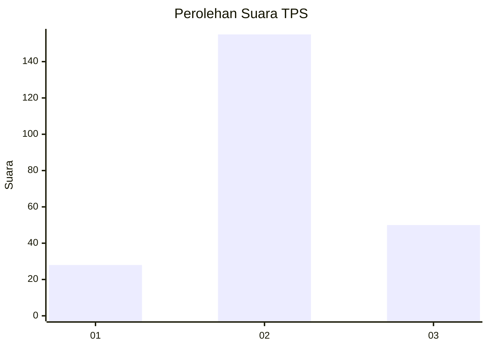
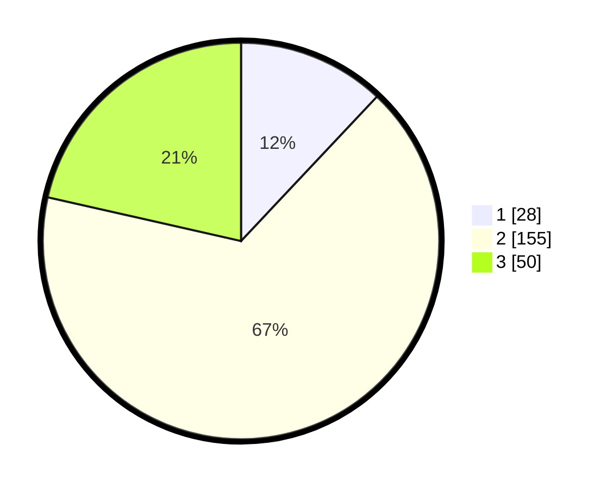

# Hasil

## Grafik

## Tabel

| No. | Nama Paslon    | Suara | Suara (raw) | Persentase |
|:--- |:-------------- | -----:| -----------:| ----------:|
| 1   | ANIES MUHAIMIN | 28    | [28][p-1]   | 12,02      |
| 2   | PRABOWO GIBRAN | 155   | [155][p-2]  | 66,52      |
| 3   | GANJAR MAHFUD  | 50    | [50][p-3]   | 21,46      |

[p-1]: https://github.com/gigit-pemilu/pemilu-2024-35-jawa-timur/blob/main/pilpres/hitung-suara/sub/35-jawa-timur/sub/73-kota-malang/sub/01-blimbing/sub/1001-balearjosari/sub/001-tps/sub/paslon-1.txt
[p-2]: https://github.com/gigit-pemilu/pemilu-2024-35-jawa-timur/blob/main/pilpres/hitung-suara/sub/35-jawa-timur/sub/73-kota-malang/sub/01-blimbing/sub/1001-balearjosari/sub/001-tps/sub/paslon-2.txt
[p-3]: https://github.com/gigit-pemilu/pemilu-2024-35-jawa-timur/blob/main/pilpres/hitung-suara/sub/35-jawa-timur/sub/73-kota-malang/sub/01-blimbing/sub/1001-balearjosari/sub/001-tps/sub/paslon-3.txt

## Foto C Plano

https://sirekap-obj-formc.kpu.go.id/286e/pemilu/ppwp/35/73/01/10/01/3573011001001-20240215-004941--bb5d38a3-f72b-4102-bc08-fef6d35c3768.jpg

https://sirekap-obj-formc.kpu.go.id/286e/pemilu/ppwp/35/73/01/10/01/3573011001001-20240214-223032--245c1755-a589-404e-b01b-860508b8f17f.jpg

https://sirekap-obj-formc.kpu.go.id/286e/pemilu/ppwp/35/73/01/10/01/3573011001001-20240214-223517--e65064f7-f876-414c-b642-4731dee9f749.jpg

## Metadata

| Key        | Value               |
| ---------- | ------------------- |
| Time Stamp | 2024-02-15 20:30:46 |

