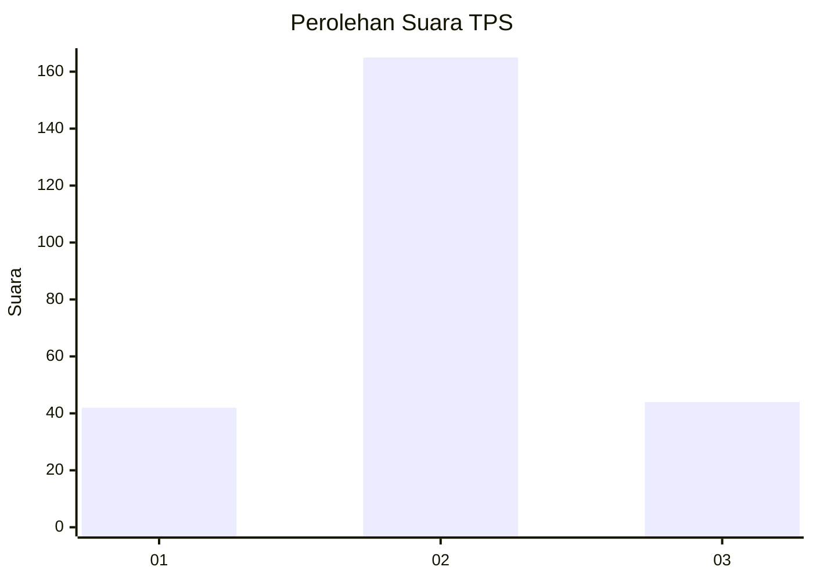
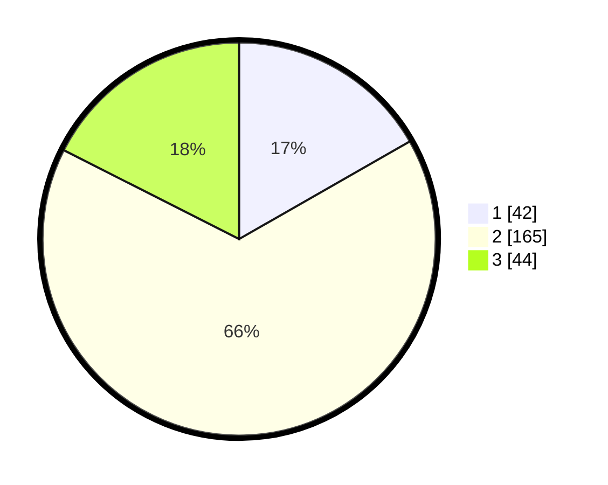

# Hasil

## Grafik

## Tabel

| No. | Nama Paslon    | Suara | Suara (raw) | Persentase |
|:--- |:-------------- | -----:| -----------:| ----------:|
| 1   | ANIES MUHAIMIN | 42    | [42][p-1]   | 16,73      |
| 2   | PRABOWO GIBRAN | 165   | [165][p-2]  | 65,74      |
| 3   | GANJAR MAHFUD  | 44    | [44][p-3]   | 17,53      |

[p-1]: https://github.com/gigit-pemilu/pemilu-2024-35-jawa-timur/blob/main/pilpres/hitung-suara/sub/35-jawa-timur/sub/73-kota-malang/sub/01-blimbing/sub/1001-balearjosari/sub/002-tps/sub/paslon-1.txt
[p-2]: https://github.com/gigit-pemilu/pemilu-2024-35-jawa-timur/blob/main/pilpres/hitung-suara/sub/35-jawa-timur/sub/73-kota-malang/sub/01-blimbing/sub/1001-balearjosari/sub/002-tps/sub/paslon-2.txt
[p-3]: https://github.com/gigit-pemilu/pemilu-2024-35-jawa-timur/blob/main/pilpres/hitung-suara/sub/35-jawa-timur/sub/73-kota-malang/sub/01-blimbing/sub/1001-balearjosari/sub/002-tps/sub/paslon-3.txt

## Foto C Plano

https://sirekap-obj-formc.kpu.go.id/d849/pemilu/ppwp/35/73/01/10/01/3573011001002-20240214-201408--2220b7be-4d18-4531-baa4-a2d94be18c5d.jpg

https://sirekap-obj-formc.kpu.go.id/d849/pemilu/ppwp/35/73/01/10/01/3573011001002-20240214-201637--86c9f166-b2f4-4e4d-a65a-5547fd34ffb4.jpg

https://sirekap-obj-formc.kpu.go.id/d849/pemilu/ppwp/35/73/01/10/01/3573011001002-20240214-211025--57e31655-6823-468e-99e2-3bf3d8b5845d.jpg

## Metadata

| Key        | Value               |
| ---------- | ------------------- |
| Time Stamp | 2024-02-17 16:36:25 |

