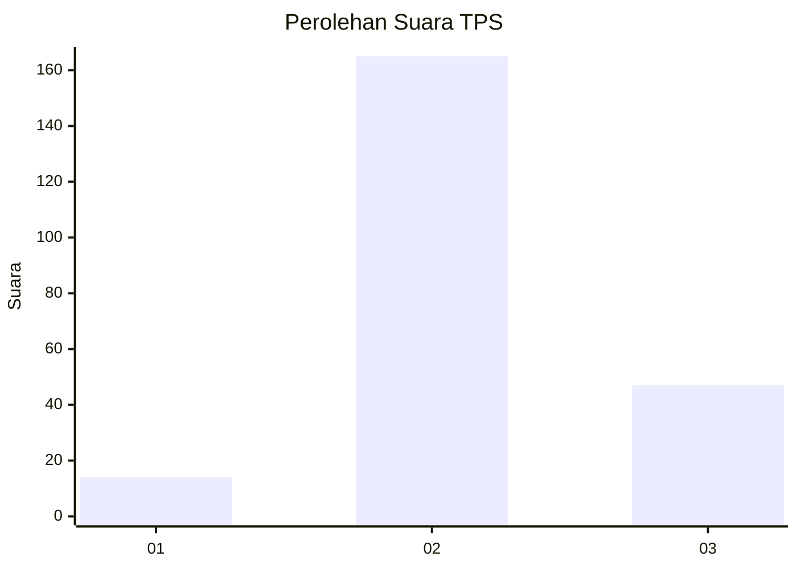

# Hasil

## Grafik

## Tabel

| No. | Nama Paslon    | Suara | Suara (raw) | Persentase |
|:--- |:-------------- | -----:| -----------:| ----------:|
| 1   | ANIES MUHAIMIN | 14    | [14][p-1]   | 6,19       |
| 2   | PRABOWO GIBRAN | 165   | [165][p-2]  | 73,01      |
| 3   | GANJAR MAHFUD  | 47    | [47][p-3]   | 20,80      |

[p-1]: https://github.com/gigit-pemilu/pemilu-2024/blob/main/pilpres/hitung-suara/sub/35-jawa-timur/sub/73-kota-malang/sub/01-blimbing/sub/1001-balearjosari/sub/006-tps/sub/paslon-1.txt
[p-2]: https://github.com/gigit-pemilu/pemilu-2024/blob/main/pilpres/hitung-suara/sub/35-jawa-timur/sub/73-kota-malang/sub/01-blimbing/sub/1001-balearjosari/sub/006-tps/sub/paslon-2.txt
[p-3]: https://github.com/gigit-pemilu/pemilu-2024/blob/main/pilpres/hitung-suara/sub/35-jawa-timur/sub/73-kota-malang/sub/01-blimbing/sub/1001-balearjosari/sub/006-tps/sub/paslon-3.txt

## Foto C Plano

https://sirekap-obj-formc.kpu.go.id/6b61/pemilu/ppwp/35/73/01/10/01/3573011001006-20240214-221859--0588bc27-a008-4bd0-9922-150d53a3a89d.jpg

https://sirekap-obj-formc.kpu.go.id/6b61/pemilu/ppwp/35/73/01/10/01/3573011001006-20240214-222914--0c9187f8-eb88-4796-a825-e2daf548cbca.jpg

https://sirekap-obj-formc.kpu.go.id/6b61/pemilu/ppwp/35/73/01/10/01/3573011001006-20240214-223149--6d6bc072-010d-4df2-b6c9-68131b4efc11.jpg

## Metadata

| Key        | Value               |
| ---------- | ------------------- |
| Time Stamp | 2024-02-17 16:36:25 |

