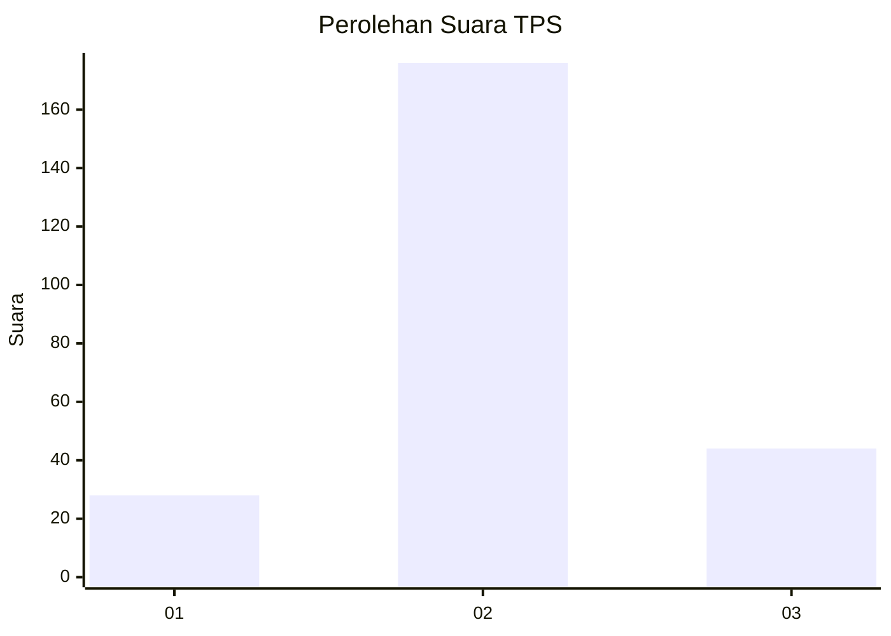
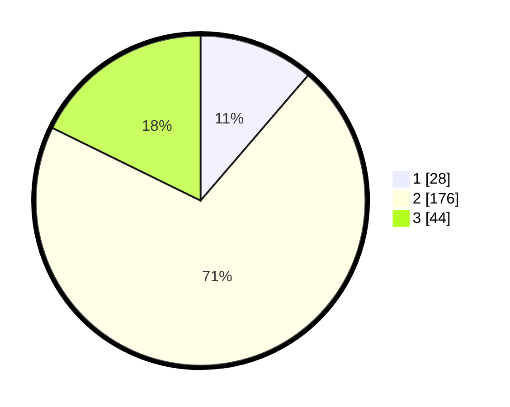

# Hasil

## Grafik

## Tabel

| No. | Nama Paslon    | Suara | Suara (raw) | Persentase |
|:--- |:-------------- | -----:| -----------:| ----------:|
| 1   | ANIES MUHAIMIN | 28    | [28][p-1]   | 11,29      |
| 2   | PRABOWO GIBRAN | 176   | [176][p-2]  | 70,97      |
| 3   | GANJAR MAHFUD  | 44    | [44][p-3]   | 17,74      |

[p-1]: https://github.com/gigit-pemilu/pemilu-2024/blob/main/pilpres/hitung-suara/sub/35-jawa-timur/sub/73-kota-malang/sub/01-blimbing/sub/1001-balearjosari/sub/007-tps/sub/paslon-1.txt
[p-2]: https://github.com/gigit-pemilu/pemilu-2024/blob/main/pilpres/hitung-suara/sub/35-jawa-timur/sub/73-kota-malang/sub/01-blimbing/sub/1001-balearjosari/sub/007-tps/sub/paslon-2.txt
[p-3]: https://github.com/gigit-pemilu/pemilu-2024/blob/main/pilpres/hitung-suara/sub/35-jawa-timur/sub/73-kota-malang/sub/01-blimbing/sub/1001-balearjosari/sub/007-tps/sub/paslon-3.txt

## Foto C Plano

https://sirekap-obj-formc.kpu.go.id/d95f/pemilu/ppwp/35/73/01/10/01/3573011001007-20240214-215954--4df0e0a7-8c5b-4812-b65e-93b675a3e717.jpg

https://sirekap-obj-formc.kpu.go.id/d95f/pemilu/ppwp/35/73/01/10/01/3573011001007-20240214-234449--1700d46a-1e5d-47c5-ac9d-fdbea8762b47.jpg

https://sirekap-obj-formc.kpu.go.id/d95f/pemilu/ppwp/35/73/01/10/01/3573011001007-20240214-234548--78a805a2-5c5d-49fe-9b0f-bcd02ebc91e1.jpg

## Metadata

| Key        | Value               |
| ---------- | ------------------- |
| Time Stamp | 2024-02-24 22:31:28 |

