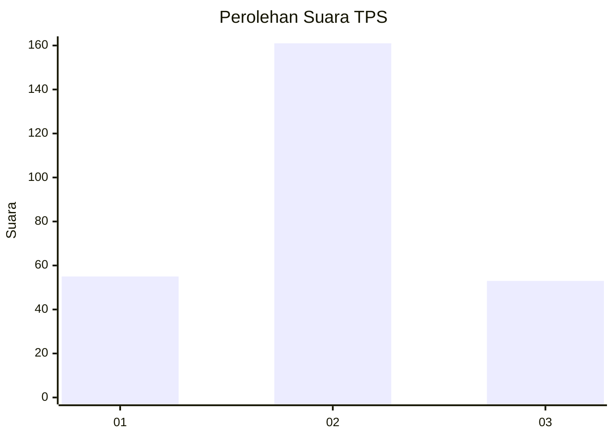
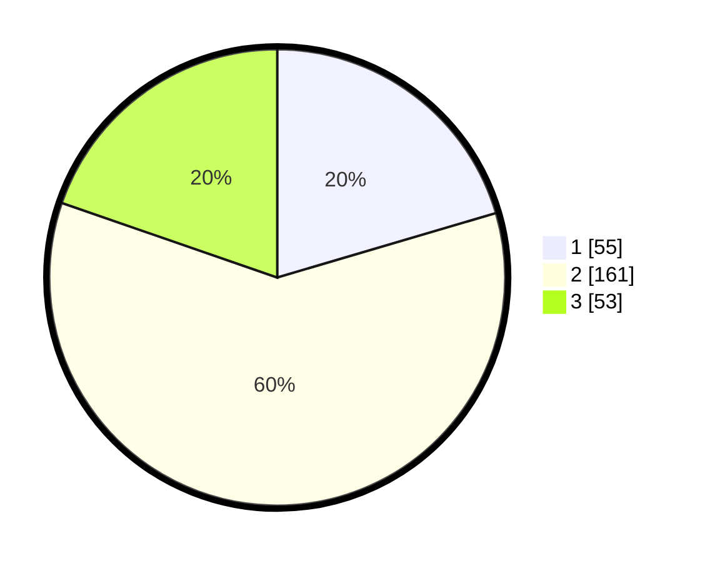

# Hasil

## Grafik

## Tabel

| No. | Nama Paslon    | Suara | Suara (raw) | Persentase |
|:--- |:-------------- | -----:| -----------:| ----------:|
| 1   | ANIES MUHAIMIN | 55    | [55][p-1]   | 20,45      |
| 2   | PRABOWO GIBRAN | 161   | [161][p-2]  | 59,85      |
| 3   | GANJAR MAHFUD  | 53    | [53][p-3]   | 19,70      |

[p-1]: https://github.com/gigit-pemilu/pemilu-2024-35-jawa-timur/blob/main/pilpres/hitung-suara/sub/35-jawa-timur/sub/73-kota-malang/sub/01-blimbing/sub/1002-arjosari/sub/017-tps/sub/paslon-1.txt
[p-2]: https://github.com/gigit-pemilu/pemilu-2024-35-jawa-timur/blob/main/pilpres/hitung-suara/sub/35-jawa-timur/sub/73-kota-malang/sub/01-blimbing/sub/1002-arjosari/sub/017-tps/sub/paslon-2.txt
[p-3]: https://github.com/gigit-pemilu/pemilu-2024-35-jawa-timur/blob/main/pilpres/hitung-suara/sub/35-jawa-timur/sub/73-kota-malang/sub/01-blimbing/sub/1002-arjosari/sub/017-tps/sub/paslon-3.txt

## Foto C Plano

https://sirekap-obj-formc.kpu.go.id/53fd/pemilu/ppwp/35/73/01/10/02/3573011002017-20240215-003206--7b2aeee8-e352-4608-9230-a3299b9a5448.jpg

https://sirekap-obj-formc.kpu.go.id/53fd/pemilu/ppwp/35/73/01/10/02/3573011002017-20240215-003259--d52b63af-0986-4d27-be89-8e80055f9e74.jpg

https://sirekap-obj-formc.kpu.go.id/53fd/pemilu/ppwp/35/73/01/10/02/3573011002017-20240215-003342--af45c9b6-1524-4d24-91da-6ba839bab808.jpg

## Metadata

| Key        | Value               |
| ---------- | ------------------- |
| Time Stamp | 2024-02-17 16:36:25 |

