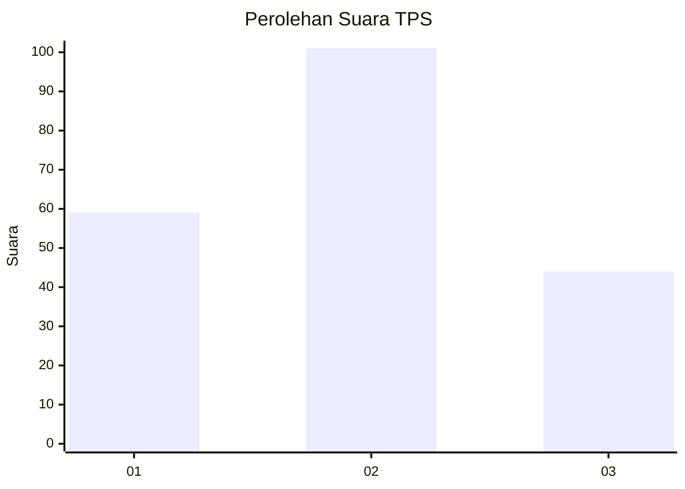
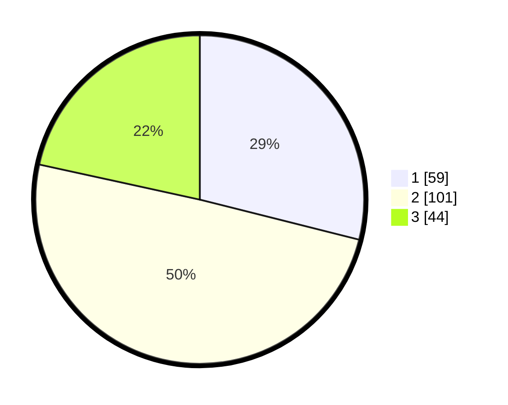

# Hasil

## Grafik

## Tabel

| No. | Nama Paslon    | Suara | Suara (raw) | Persentase |
|:--- |:-------------- | -----:| -----------:| ----------:|
| 1   | ANIES MUHAIMIN | 59    | [59][p-1]   | 28,92      |
| 2   | PRABOWO GIBRAN | 101   | [101][p-2]  | 49,51      |
| 3   | GANJAR MAHFUD  | 44    | [44][p-3]   | 21,57      |

[p-1]: https://github.com/gigit-pemilu/pemilu-2024/blob/main/pilpres/hitung-suara/sub/35-jawa-timur/sub/73-kota-malang/sub/01-blimbing/sub/1002-arjosari/sub/026-tps/sub/paslon-1.txt
[p-2]: https://github.com/gigit-pemilu/pemilu-2024/blob/main/pilpres/hitung-suara/sub/35-jawa-timur/sub/73-kota-malang/sub/01-blimbing/sub/1002-arjosari/sub/026-tps/sub/paslon-2.txt
[p-3]: https://github.com/gigit-pemilu/pemilu-2024/blob/main/pilpres/hitung-suara/sub/35-jawa-timur/sub/73-kota-malang/sub/01-blimbing/sub/1002-arjosari/sub/026-tps/sub/paslon-3.txt

## Foto C Plano

https://sirekap-obj-formc.kpu.go.id/6ddd/pemilu/ppwp/35/73/01/10/02/3573011002026-20240215-003527--4169761a-4832-4579-a1ad-dd79025a0ea7.jpg

https://sirekap-obj-formc.kpu.go.id/6ddd/pemilu/ppwp/35/73/01/10/02/3573011002026-20240215-004210--cf1e8c7a-3915-4df8-8d53-6be9e8190a7f.jpg

https://sirekap-obj-formc.kpu.go.id/6ddd/pemilu/ppwp/35/73/01/10/02/3573011002026-20240215-003733--fa42fb3c-f68c-4f28-9c28-5601df15de90.jpg

## Metadata

| Key        | Value               |
| ---------- | ------------------- |
| Time Stamp | 2024-02-17 16:36:25 |

