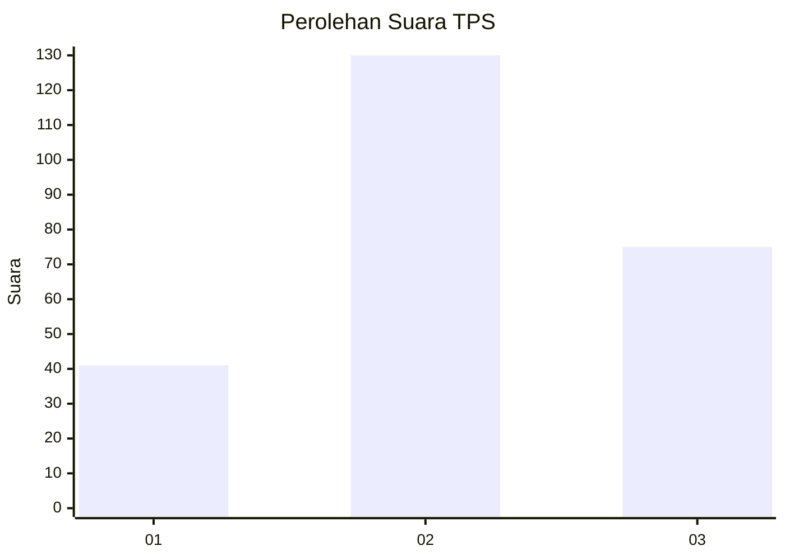
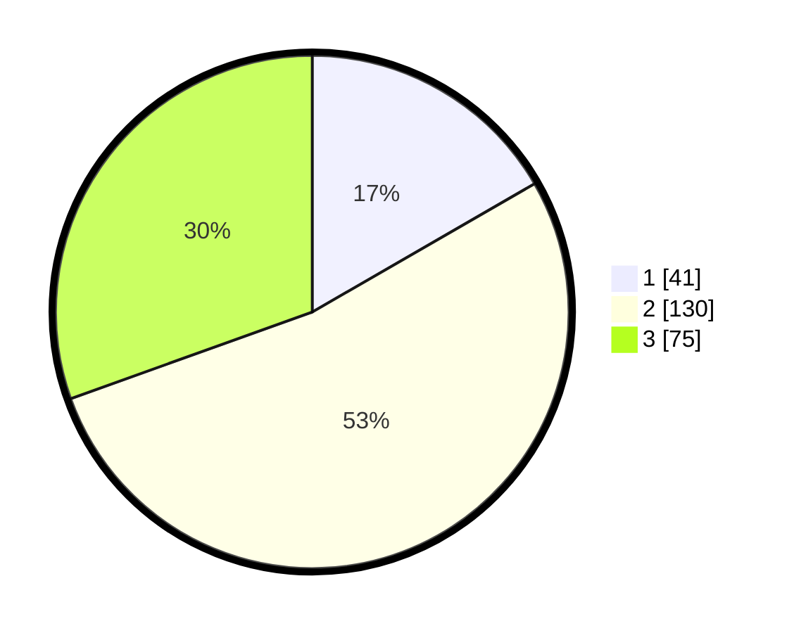

# Hasil

## Grafik

## Tabel

| No. | Nama Paslon    | Suara | Suara (raw) | Persentase |
|:--- |:-------------- | -----:| -----------:| ----------:|
| 1   | ANIES MUHAIMIN | 41    | [41][p-1]   | 16,67      |
| 2   | PRABOWO GIBRAN | 130   | [130][p-2]  | 52,85      |
| 3   | GANJAR MAHFUD  | 75    | [75][p-3]   | 30,49      |

[p-1]: https://github.com/gigit-pemilu/pemilu-2024/blob/main/pilpres/hitung-suara/sub/35-jawa-timur/sub/73-kota-malang/sub/01-blimbing/sub/1004-purwodadi/sub/006-tps/sub/paslon-1.txt
[p-2]: https://github.com/gigit-pemilu/pemilu-2024/blob/main/pilpres/hitung-suara/sub/35-jawa-timur/sub/73-kota-malang/sub/01-blimbing/sub/1004-purwodadi/sub/006-tps/sub/paslon-2.txt
[p-3]: https://github.com/gigit-pemilu/pemilu-2024/blob/main/pilpres/hitung-suara/sub/35-jawa-timur/sub/73-kota-malang/sub/01-blimbing/sub/1004-purwodadi/sub/006-tps/sub/paslon-3.txt

## Foto C Plano

https://sirekap-obj-formc.kpu.go.id/b467/pemilu/ppwp/35/73/01/10/04/3573011004006-20240215-005307--d188f994-5c5f-421f-a105-97a021918f63.jpg

https://sirekap-obj-formc.kpu.go.id/b467/pemilu/ppwp/35/73/01/10/04/3573011004006-20240215-005342--dc518fe9-00a0-4880-a573-9dfb52fbadcb.jpg

https://sirekap-obj-formc.kpu.go.id/b467/pemilu/ppwp/35/73/01/10/04/3573011004006-20240215-005437--df9cc6f4-f9d6-460d-af2f-fc84bd7fd4b3.jpg

## Metadata

| Key        | Value               |
| ---------- | ------------------- |
| Time Stamp | 2024-02-27 11:00:00 |

