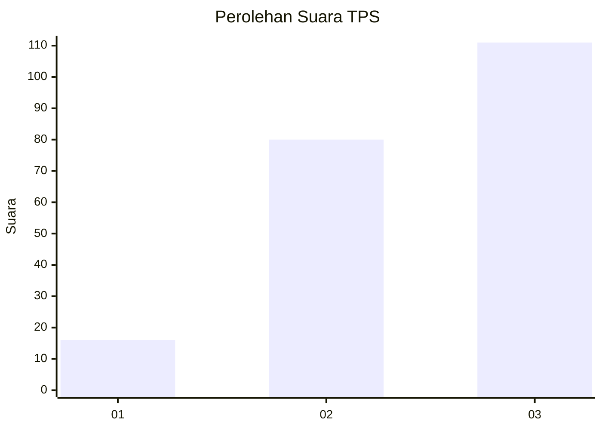
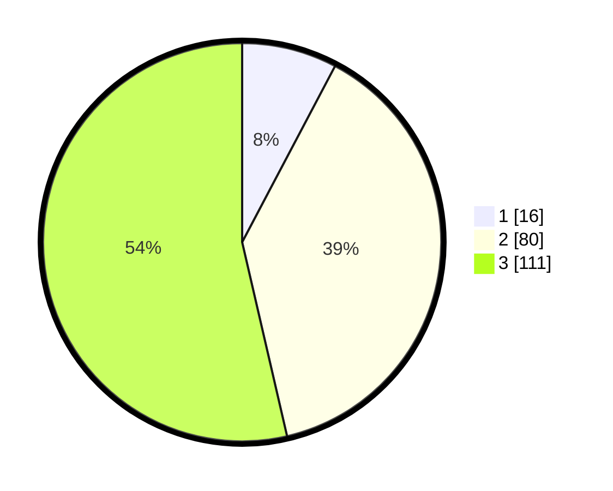

# Hasil

## Grafik

## Tabel

| No. | Nama Paslon    | Suara | Suara (raw) | Persentase |
|:--- |:-------------- | -----:| -----------:| ----------:|
| 1   | ANIES MUHAIMIN | 16    | [16][p-1]   | 7,73       |
| 2   | PRABOWO GIBRAN | 80    | [80][p-2]   | 38,65      |
| 3   | GANJAR MAHFUD  | 111   | [111][p-3]  | 53,62      |

[p-1]: https://github.com/gigit-pemilu/pemilu-2024-35-jawa-timur/blob/main/pilpres/hitung-suara/sub/35-jawa-timur/sub/73-kota-malang/sub/01-blimbing/sub/1004-purwodadi/sub/043-tps/sub/paslon-1.txt
[p-2]: https://github.com/gigit-pemilu/pemilu-2024-35-jawa-timur/blob/main/pilpres/hitung-suara/sub/35-jawa-timur/sub/73-kota-malang/sub/01-blimbing/sub/1004-purwodadi/sub/043-tps/sub/paslon-2.txt
[p-3]: https://github.com/gigit-pemilu/pemilu-2024-35-jawa-timur/blob/main/pilpres/hitung-suara/sub/35-jawa-timur/sub/73-kota-malang/sub/01-blimbing/sub/1004-purwodadi/sub/043-tps/sub/paslon-3.txt

## Foto C Plano

https://sirekap-obj-formc.kpu.go.id/f7a8/pemilu/ppwp/35/73/01/10/04/3573011004043-20240214-160137--1b3c9275-704a-4fce-85c5-5c68092c098d.jpg

https://sirekap-obj-formc.kpu.go.id/f7a8/pemilu/ppwp/35/73/01/10/04/3573011004043-20240215-003058--96cbec21-8c74-4ec0-a5f0-e127ccd9986e.jpg

https://sirekap-obj-formc.kpu.go.id/f7a8/pemilu/ppwp/35/73/01/10/04/3573011004043-20240214-160059--da21d3e6-6f5d-475e-a77d-d61a602a9ed5.jpg

## Metadata

| Key        | Value               |
| ---------- | ------------------- |
| Time Stamp | 2024-02-24 22:31:28 |

