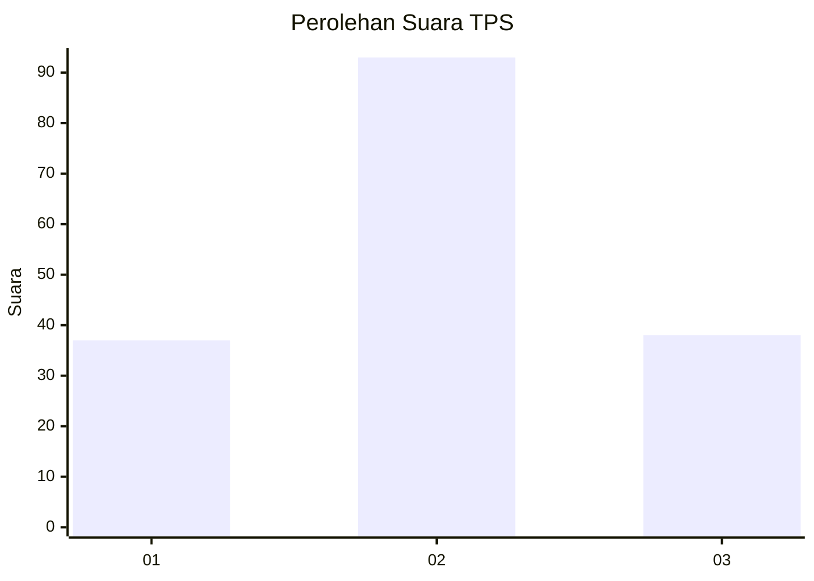
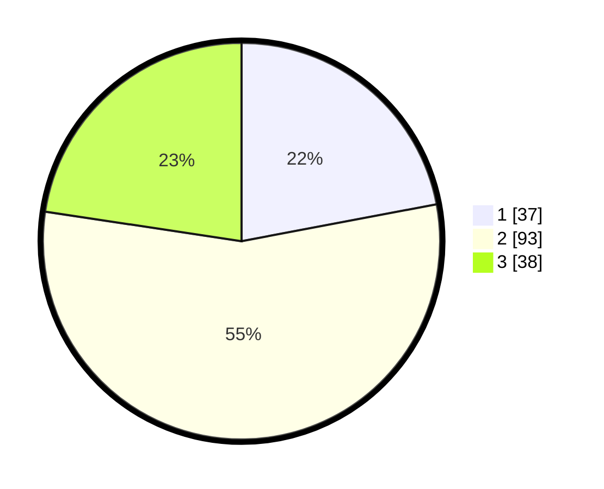

# Hasil

## Grafik

## Tabel

| No. | Nama Paslon    | Suara | Suara (raw) | Persentase |
|:--- |:-------------- | -----:| -----------:| ----------:|
| 1   | ANIES MUHAIMIN | 37    | [37][p-1]   | 22,02      |
| 2   | PRABOWO GIBRAN | 93    | [93][p-2]   | 55,36      |
| 3   | GANJAR MAHFUD  | 38    | [38][p-3]   | 22,62      |

[p-1]: https://github.com/gigit-pemilu/pemilu-2024-35-jawa-timur/blob/main/pilpres/hitung-suara/sub/35-jawa-timur/sub/73-kota-malang/sub/01-blimbing/sub/1005-blimbing/sub/010-tps/sub/paslon-1.txt
[p-2]: https://github.com/gigit-pemilu/pemilu-2024-35-jawa-timur/blob/main/pilpres/hitung-suara/sub/35-jawa-timur/sub/73-kota-malang/sub/01-blimbing/sub/1005-blimbing/sub/010-tps/sub/paslon-2.txt
[p-3]: https://github.com/gigit-pemilu/pemilu-2024-35-jawa-timur/blob/main/pilpres/hitung-suara/sub/35-jawa-timur/sub/73-kota-malang/sub/01-blimbing/sub/1005-blimbing/sub/010-tps/sub/paslon-3.txt

## Foto C Plano

https://sirekap-obj-formc.kpu.go.id/2b9d/pemilu/ppwp/35/73/01/10/05/3573011005010-20240215-012530--86c5bb9f-2468-4e7a-8d2b-fc93289acd5f.jpg

https://sirekap-obj-formc.kpu.go.id/2b9d/pemilu/ppwp/35/73/01/10/05/3573011005010-20240215-012627--3c790ed1-e139-4e76-9260-e271ea7f4f4f.jpg

https://sirekap-obj-formc.kpu.go.id/2b9d/pemilu/ppwp/35/73/01/10/05/3573011005010-20240215-012710--50bebfc9-dbcd-49ed-b391-5900fc46b3df.jpg

## Metadata

| Key        | Value               |
| ---------- | ------------------- |
| Time Stamp | 2024-02-25 11:00:00 |

