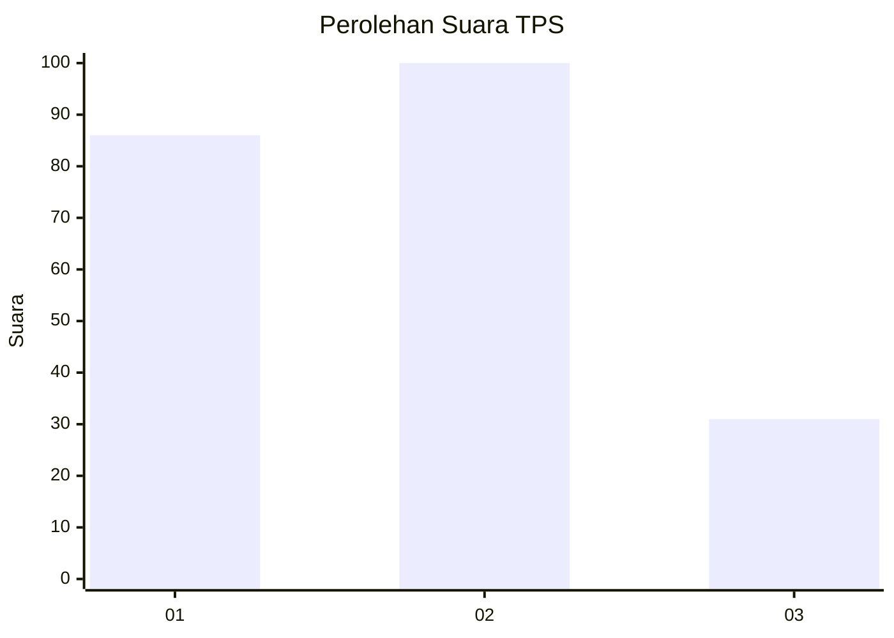
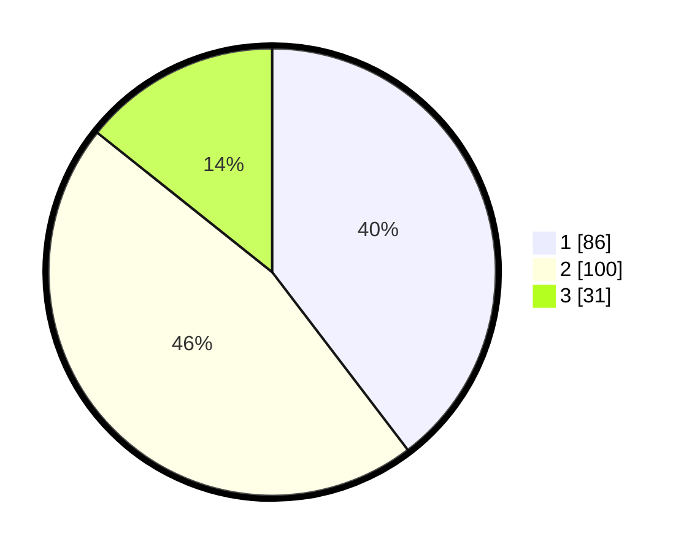

# Hasil

## Grafik

## Tabel

| No. | Nama Paslon    | Suara | Suara (raw) | Persentase |
|:--- |:-------------- | -----:| -----------:| ----------:|
| 1   | ANIES MUHAIMIN | 86    | [86][p-1]   | 39,63      |
| 2   | PRABOWO GIBRAN | 100   | [100][p-2]  | 46,08      |
| 3   | GANJAR MAHFUD  | 31    | [31][p-3]   | 14,29      |

[p-1]: https://github.com/gigit-pemilu/pemilu-2024/blob/main/pilpres/hitung-suara/sub/35-jawa-timur/sub/73-kota-malang/sub/01-blimbing/sub/1006-pandanwangi/sub/037-tps/sub/paslon-1.txt
[p-2]: https://github.com/gigit-pemilu/pemilu-2024/blob/main/pilpres/hitung-suara/sub/35-jawa-timur/sub/73-kota-malang/sub/01-blimbing/sub/1006-pandanwangi/sub/037-tps/sub/paslon-2.txt
[p-3]: https://github.com/gigit-pemilu/pemilu-2024/blob/main/pilpres/hitung-suara/sub/35-jawa-timur/sub/73-kota-malang/sub/01-blimbing/sub/1006-pandanwangi/sub/037-tps/sub/paslon-3.txt

## Foto C Plano

https://sirekap-obj-formc.kpu.go.id/d5be/pemilu/ppwp/35/73/01/10/06/3573011006037-20240214-193432--c8dfaa2b-472d-4228-881e-c47009450d05.jpg

https://sirekap-obj-formc.kpu.go.id/d5be/pemilu/ppwp/35/73/01/10/06/3573011006037-20240215-033213--bc74755e-bc45-43bb-86f4-568f7eccba2b.jpg

https://sirekap-obj-formc.kpu.go.id/d5be/pemilu/ppwp/35/73/01/10/06/3573011006037-20240214-215217--813e5afe-157c-4d2f-bf78-f27300114037.jpg

## Metadata

| Key        | Value               |
| ---------- | ------------------- |
| Time Stamp | 2024-02-15 12:00:28 |

