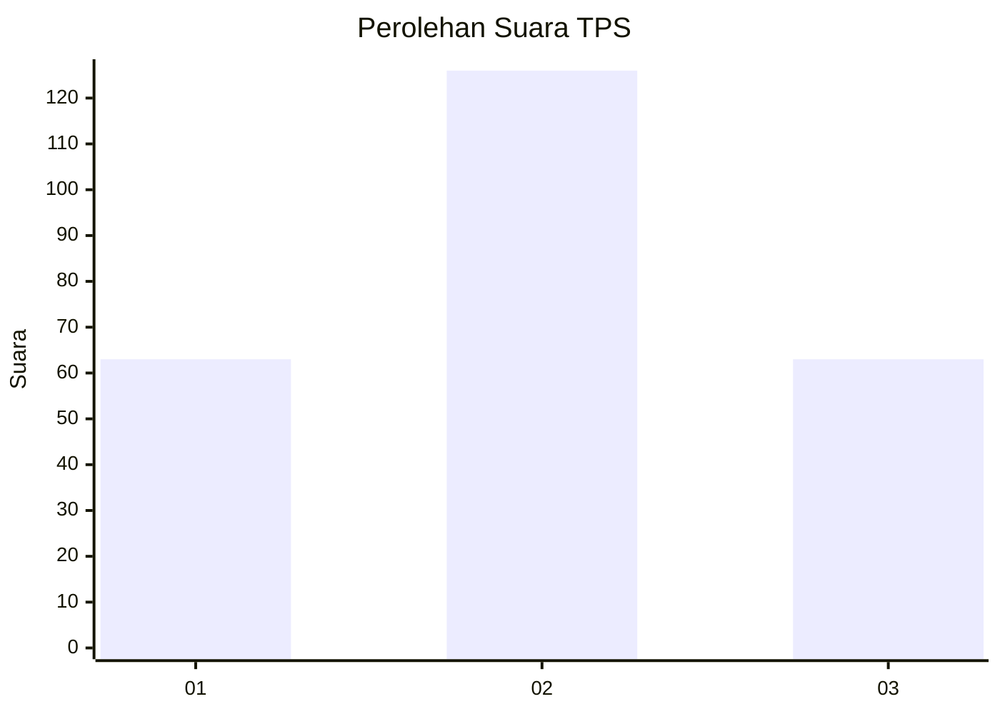
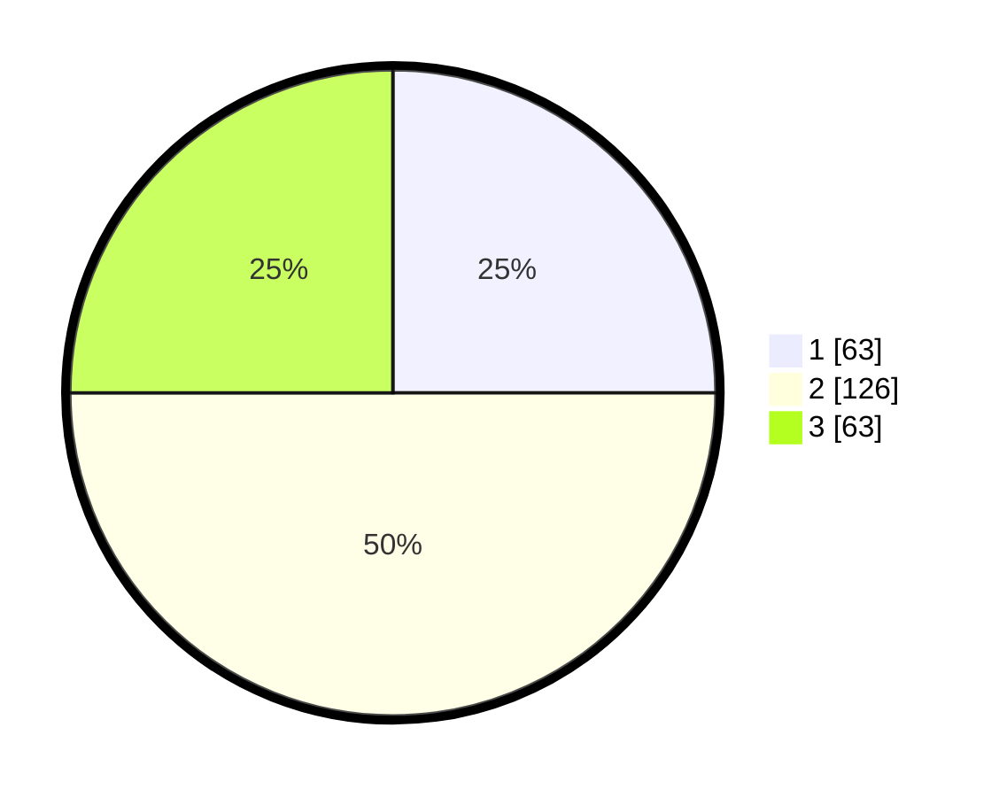

# Hasil

## Grafik

## Tabel

| No. | Nama Paslon    | Suara | Suara (raw) | Persentase |
|:--- |:-------------- | -----:| -----------:| ----------:|
| 1   | ANIES MUHAIMIN | 63    | [63][p-1]   | 25,00      |
| 2   | PRABOWO GIBRAN | 126   | [126][p-2]  | 50,00      |
| 3   | GANJAR MAHFUD  | 63    | [63][p-3]   | 25,00      |

[p-1]: https://github.com/gigit-pemilu/pemilu-2024/blob/main/pilpres/hitung-suara/sub/35-jawa-timur/sub/73-kota-malang/sub/01-blimbing/sub/1006-pandanwangi/sub/038-tps/sub/paslon-1.txt
[p-2]: https://github.com/gigit-pemilu/pemilu-2024/blob/main/pilpres/hitung-suara/sub/35-jawa-timur/sub/73-kota-malang/sub/01-blimbing/sub/1006-pandanwangi/sub/038-tps/sub/paslon-2.txt
[p-3]: https://github.com/gigit-pemilu/pemilu-2024/blob/main/pilpres/hitung-suara/sub/35-jawa-timur/sub/73-kota-malang/sub/01-blimbing/sub/1006-pandanwangi/sub/038-tps/sub/paslon-3.txt

## Foto C Plano

https://sirekap-obj-formc.kpu.go.id/8ab1/pemilu/ppwp/35/73/01/10/06/3573011006038-20240215-012551--155ff175-76d3-42b7-a8f9-bf9afa5cbf56.jpg

https://sirekap-obj-formc.kpu.go.id/8ab1/pemilu/ppwp/35/73/01/10/06/3573011006038-20240215-012736--89284805-3e9d-4b8e-bdb7-937aa4826033.jpg

https://sirekap-obj-formc.kpu.go.id/8ab1/pemilu/ppwp/35/73/01/10/06/3573011006038-20240215-012940--f5cac06c-1266-41c5-9a3c-717945a0359d.jpg

## Metadata

| Key        | Value               |
| ---------- | ------------------- |
| Time Stamp | 2024-02-24 22:31:28 |

