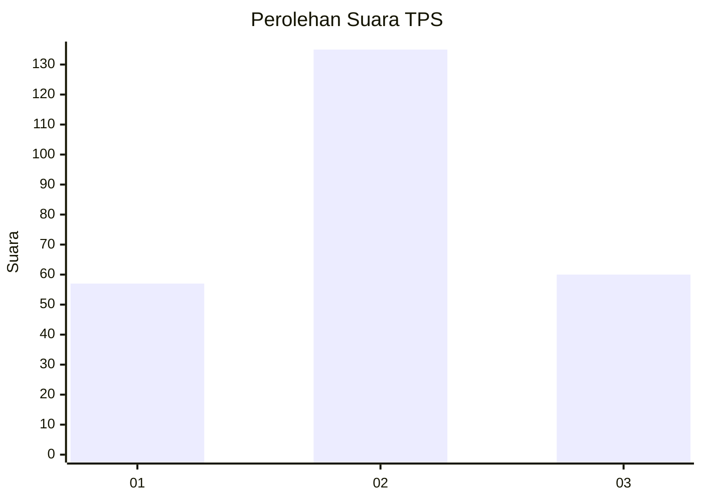
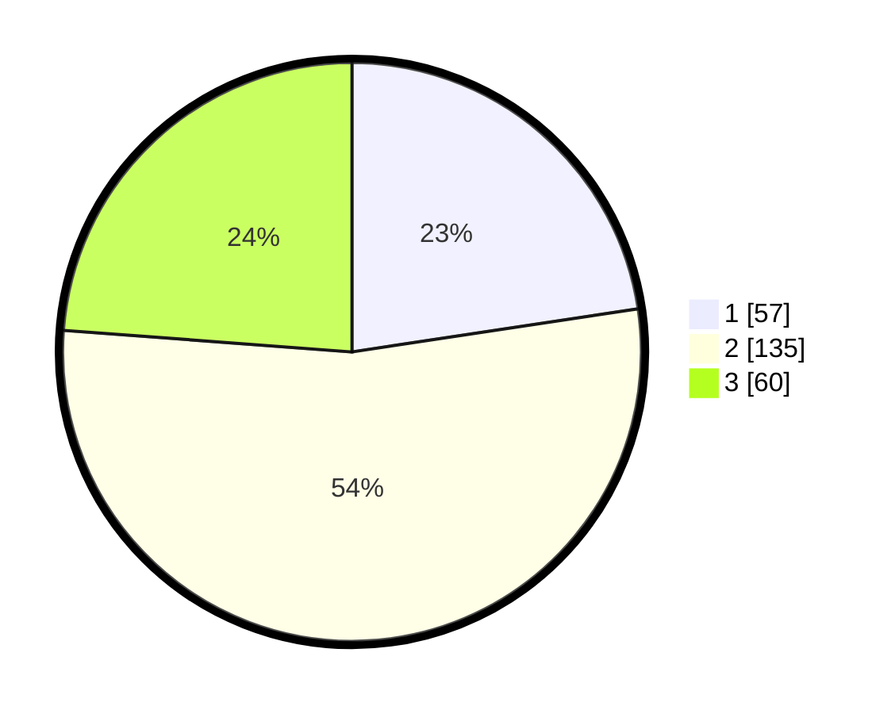

# Hasil

## Grafik

## Tabel

| No. | Nama Paslon    | Suara | Suara (raw) | Persentase |
|:--- |:-------------- | -----:| -----------:| ----------:|
| 1   | ANIES MUHAIMIN | 57    | [57][p-1]   | 22,62      |
| 2   | PRABOWO GIBRAN | 135   | [135][p-2]  | 53,57      |
| 3   | GANJAR MAHFUD  | 60    | [60][p-3]   | 23,81      |

[p-1]: https://github.com/gigit-pemilu/pemilu-2024-35-jawa-timur/blob/main/pilpres/hitung-suara/sub/35-jawa-timur/sub/73-kota-malang/sub/01-blimbing/sub/1006-pandanwangi/sub/056-tps/sub/paslon-1.txt
[p-2]: https://github.com/gigit-pemilu/pemilu-2024-35-jawa-timur/blob/main/pilpres/hitung-suara/sub/35-jawa-timur/sub/73-kota-malang/sub/01-blimbing/sub/1006-pandanwangi/sub/056-tps/sub/paslon-2.txt
[p-3]: https://github.com/gigit-pemilu/pemilu-2024-35-jawa-timur/blob/main/pilpres/hitung-suara/sub/35-jawa-timur/sub/73-kota-malang/sub/01-blimbing/sub/1006-pandanwangi/sub/056-tps/sub/paslon-3.txt

## Foto C Plano

https://sirekap-obj-formc.kpu.go.id/44e2/pemilu/ppwp/35/73/01/10/06/3573011006056-20240215-011509--295456b3-55aa-45d6-9b8e-851ac6beb3f6.jpg

https://sirekap-obj-formc.kpu.go.id/44e2/pemilu/ppwp/35/73/01/10/06/3573011006056-20240215-011741--997346dd-dda3-486f-ad31-4e66a7f316d2.jpg

https://sirekap-obj-formc.kpu.go.id/44e2/pemilu/ppwp/35/73/01/10/06/3573011006056-20240215-012015--dd41bde8-0f4a-486a-97a1-cf0630ca6793.jpg

## Metadata

| Key        | Value               |
| ---------- | ------------------- |
| Time Stamp | 2024-02-24 22:31:28 |

