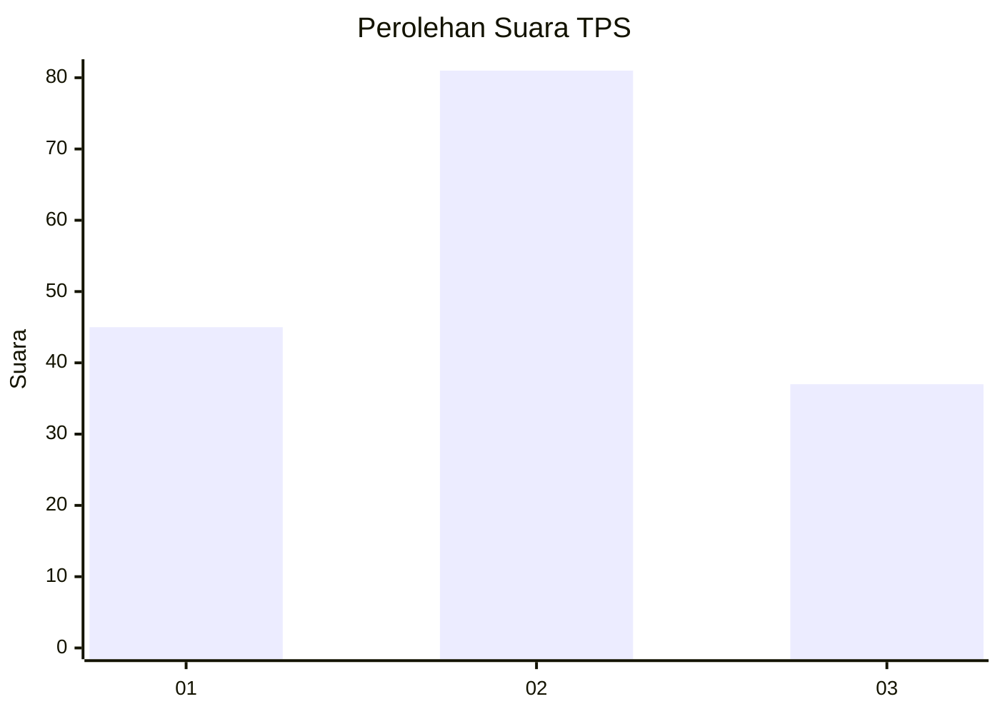
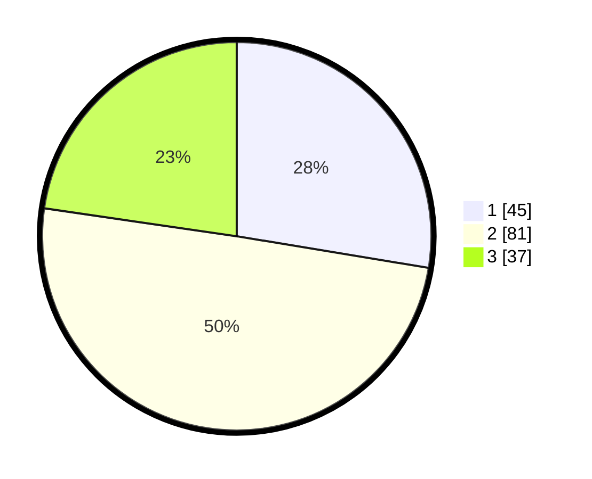

# Hasil

## Grafik

## Tabel

| No. | Nama Paslon    | Suara | Suara (raw) | Persentase |
|:--- |:-------------- | -----:| -----------:| ----------:|
| 1   | ANIES MUHAIMIN | 45    | [45][p-1]   | 27,61      |
| 2   | PRABOWO GIBRAN | 81    | [81][p-2]   | 49,69      |
| 3   | GANJAR MAHFUD  | 37    | [37][p-3]   | 22,70      |

[p-1]: https://github.com/gigit-pemilu/pemilu-2024/blob/main/pilpres/hitung-suara/sub/35-jawa-timur/sub/73-kota-malang/sub/01-blimbing/sub/1006-pandanwangi/sub/077-tps/sub/paslon-1.txt
[p-2]: https://github.com/gigit-pemilu/pemilu-2024/blob/main/pilpres/hitung-suara/sub/35-jawa-timur/sub/73-kota-malang/sub/01-blimbing/sub/1006-pandanwangi/sub/077-tps/sub/paslon-2.txt
[p-3]: https://github.com/gigit-pemilu/pemilu-2024/blob/main/pilpres/hitung-suara/sub/35-jawa-timur/sub/73-kota-malang/sub/01-blimbing/sub/1006-pandanwangi/sub/077-tps/sub/paslon-3.txt

## Foto C Plano

https://sirekap-obj-formc.kpu.go.id/a184/pemilu/ppwp/35/73/01/10/06/3573011006077-20240215-194959--4f5fa82b-d7e2-48ff-b967-18bf5f0b29ba.jpg

https://sirekap-obj-formc.kpu.go.id/a184/pemilu/ppwp/35/73/01/10/06/3573011006077-20240215-193843--7309e80b-1c83-46a9-a49e-a813ccd168a2.jpg

https://sirekap-obj-formc.kpu.go.id/a184/pemilu/ppwp/35/73/01/10/06/3573011006077-20240215-195137--68868ccc-2bbb-46f5-95dc-78adc78d5a67.jpg

## Metadata

| Key        | Value               |
| ---------- | ------------------- |
| Time Stamp | 2024-02-16 08:00:28 |

