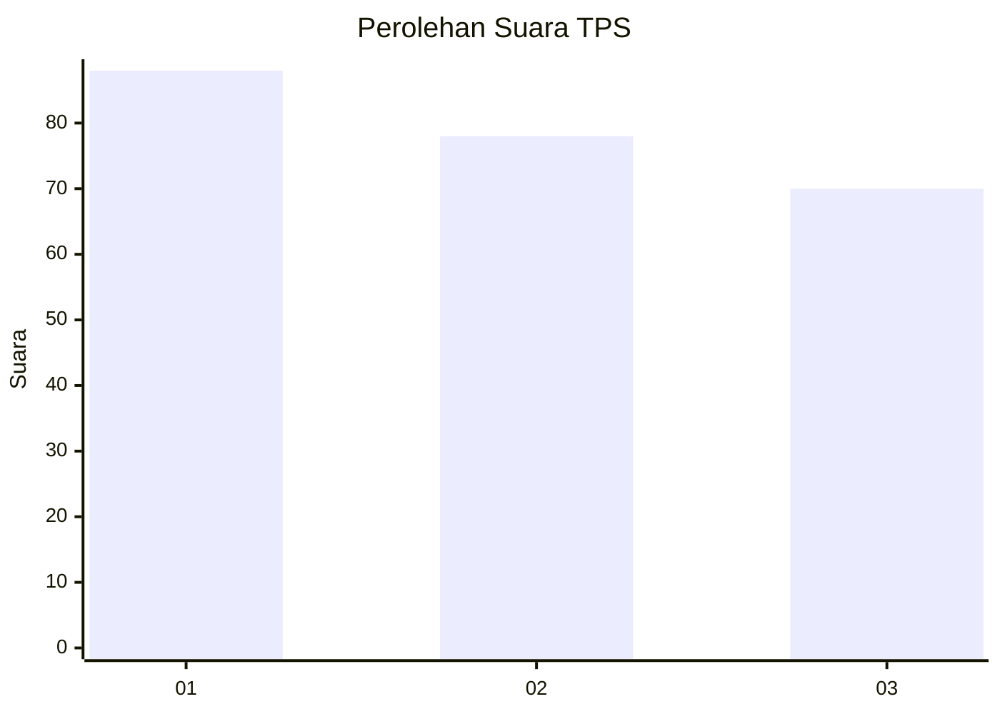
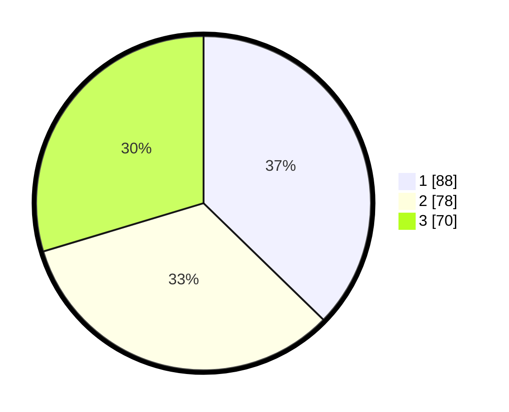

# Hasil

## Grafik

## Tabel

| No. | Nama Paslon    | Suara | Suara (raw) | Persentase |
|:--- |:-------------- | -----:| -----------:| ----------:|
| 1   | ANIES MUHAIMIN | 88    | [88][p-1]   | 37,29      |
| 2   | PRABOWO GIBRAN | 78    | [78][p-2]   | 33,05      |
| 3   | GANJAR MAHFUD  | 70    | [70][p-3]   | 29,66      |

[p-1]: https://github.com/gigit-pemilu/pemilu-2024-35-jawa-timur/blob/main/pilpres/hitung-suara/sub/35-jawa-timur/sub/73-kota-malang/sub/01-blimbing/sub/1006-pandanwangi/sub/080-tps/sub/paslon-1.txt
[p-2]: https://github.com/gigit-pemilu/pemilu-2024-35-jawa-timur/blob/main/pilpres/hitung-suara/sub/35-jawa-timur/sub/73-kota-malang/sub/01-blimbing/sub/1006-pandanwangi/sub/080-tps/sub/paslon-2.txt
[p-3]: https://github.com/gigit-pemilu/pemilu-2024-35-jawa-timur/blob/main/pilpres/hitung-suara/sub/35-jawa-timur/sub/73-kota-malang/sub/01-blimbing/sub/1006-pandanwangi/sub/080-tps/sub/paslon-3.txt

## Foto C Plano

https://sirekap-obj-formc.kpu.go.id/8a07/pemilu/ppwp/35/73/01/10/06/3573011006080-20240215-182358--bcd678a1-6749-4fa6-9000-324d3b4670be.jpg

https://sirekap-obj-formc.kpu.go.id/8a07/pemilu/ppwp/35/73/01/10/06/3573011006080-20240215-182403--550a3efc-bcb3-4c32-a332-1b5d3c5fcade.jpg

https://sirekap-obj-formc.kpu.go.id/8a07/pemilu/ppwp/35/73/01/10/06/3573011006080-20240215-182409--b3dbb716-1d7c-40dc-bbc9-365341530ec2.jpg

## Metadata

| Key        | Value               |
| ---------- | ------------------- |
| Time Stamp | 2024-02-25 15:00:00 |

