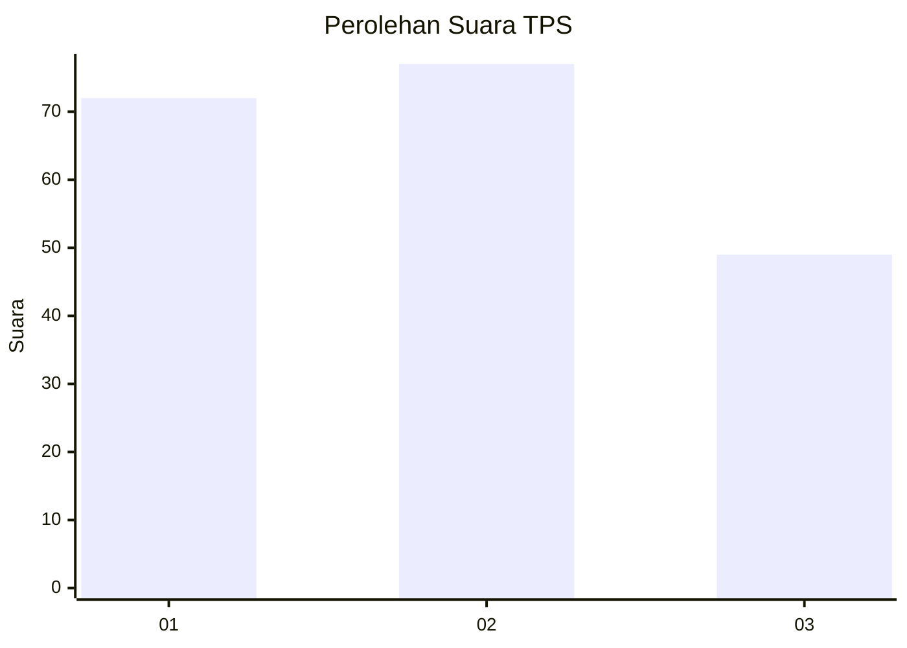
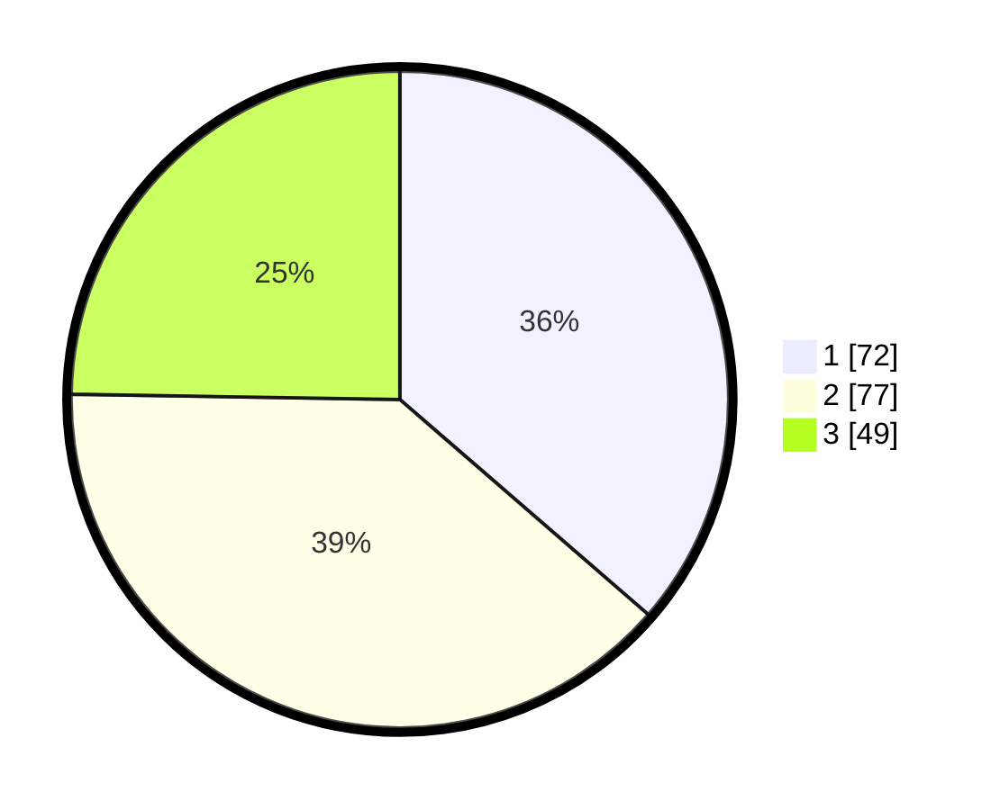

# Hasil

## Grafik

## Tabel

| No. | Nama Paslon    | Suara | Suara (raw) | Persentase |
|:--- |:-------------- | -----:| -----------:| ----------:|
| 1   | ANIES MUHAIMIN | 72    | [72][p-1]   | 36,36      |
| 2   | PRABOWO GIBRAN | 77    | [77][p-2]   | 38,89      |
| 3   | GANJAR MAHFUD  | 49    | [49][p-3]   | 24,75      |

[p-1]: https://github.com/gigit-pemilu/pemilu-2024/blob/main/pilpres/hitung-suara/sub/35-jawa-timur/sub/73-kota-malang/sub/01-blimbing/sub/1006-pandanwangi/sub/085-tps/sub/paslon-1.txt
[p-2]: https://github.com/gigit-pemilu/pemilu-2024/blob/main/pilpres/hitung-suara/sub/35-jawa-timur/sub/73-kota-malang/sub/01-blimbing/sub/1006-pandanwangi/sub/085-tps/sub/paslon-2.txt
[p-3]: https://github.com/gigit-pemilu/pemilu-2024/blob/main/pilpres/hitung-suara/sub/35-jawa-timur/sub/73-kota-malang/sub/01-blimbing/sub/1006-pandanwangi/sub/085-tps/sub/paslon-3.txt

## Foto C Plano

https://sirekap-obj-formc.kpu.go.id/7204/pemilu/ppwp/35/73/01/10/06/3573011006085-20240214-220948--e3cb2755-7b54-4308-b7a5-ee477e9733e6.jpg

https://sirekap-obj-formc.kpu.go.id/7204/pemilu/ppwp/35/73/01/10/06/3573011006085-20240214-221002--53954989-9af2-4fe2-89d3-6badc5658949.jpg

https://sirekap-obj-formc.kpu.go.id/7204/pemilu/ppwp/35/73/01/10/06/3573011006085-20240214-221015--88ec3e48-5163-43a6-ba07-da7d071e3b2d.jpg

## Metadata

| Key        | Value               |
| ---------- | ------------------- |
| Time Stamp | 2024-02-25 22:00:00 |

