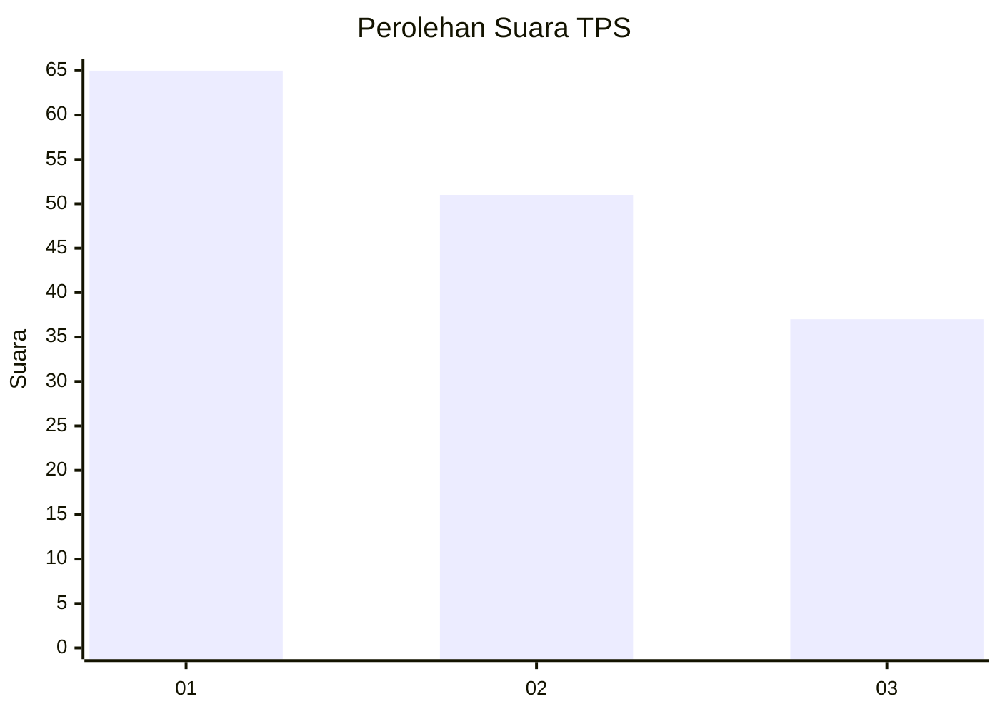
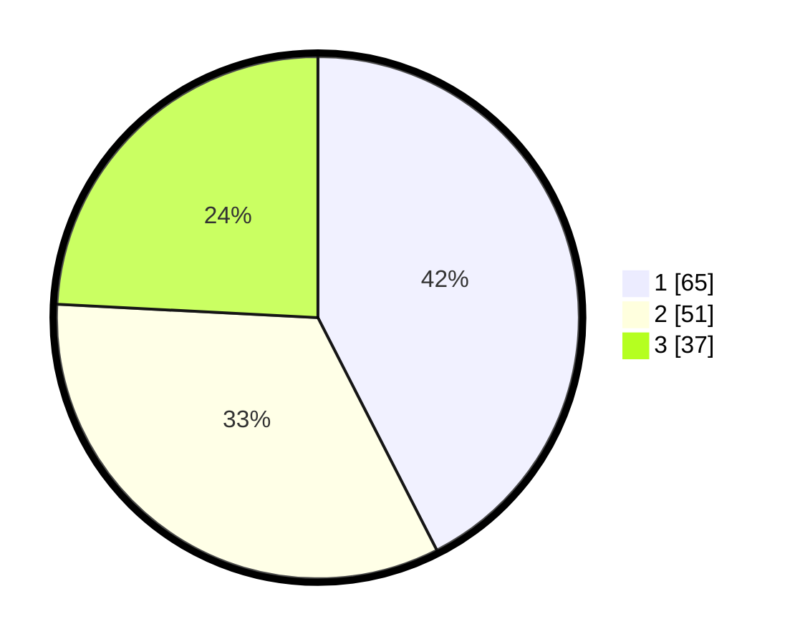

# Hasil

## Grafik

## Tabel

| No. | Nama Paslon    | Suara | Suara (raw) | Persentase |
|:--- |:-------------- | -----:| -----------:| ----------:|
| 1   | ANIES MUHAIMIN | 65    | [65][p-1]   | 42,48      |
| 2   | PRABOWO GIBRAN | 51    | [51][p-2]   | 33,33      |
| 3   | GANJAR MAHFUD  | 37    | [37][p-3]   | 24,18      |

[p-1]: https://github.com/gigit-pemilu/pemilu-2024/blob/main/pilpres/hitung-suara/sub/35-jawa-timur/sub/73-kota-malang/sub/01-blimbing/sub/1006-pandanwangi/sub/086-tps/sub/paslon-1.txt
[p-2]: https://github.com/gigit-pemilu/pemilu-2024/blob/main/pilpres/hitung-suara/sub/35-jawa-timur/sub/73-kota-malang/sub/01-blimbing/sub/1006-pandanwangi/sub/086-tps/sub/paslon-2.txt
[p-3]: https://github.com/gigit-pemilu/pemilu-2024/blob/main/pilpres/hitung-suara/sub/35-jawa-timur/sub/73-kota-malang/sub/01-blimbing/sub/1006-pandanwangi/sub/086-tps/sub/paslon-3.txt

## Foto C Plano

https://sirekap-obj-formc.kpu.go.id/d61b/pemilu/ppwp/35/73/01/10/06/3573011006086-20240215-050321--7be7049a-6dac-4f39-984f-b8c50cf2c6a3.jpg

https://sirekap-obj-formc.kpu.go.id/d61b/pemilu/ppwp/35/73/01/10/06/3573011006086-20240215-050324--2a432835-04f5-4ca7-8153-5f7fa0cb5df9.jpg

https://sirekap-obj-formc.kpu.go.id/d61b/pemilu/ppwp/35/73/01/10/06/3573011006086-20240215-050327--4060c4c6-a84b-4019-aeed-d4d83490417b.jpg

## Metadata

| Key        | Value               |
| ---------- | ------------------- |
| Time Stamp | 2024-02-25 12:00:00 |

