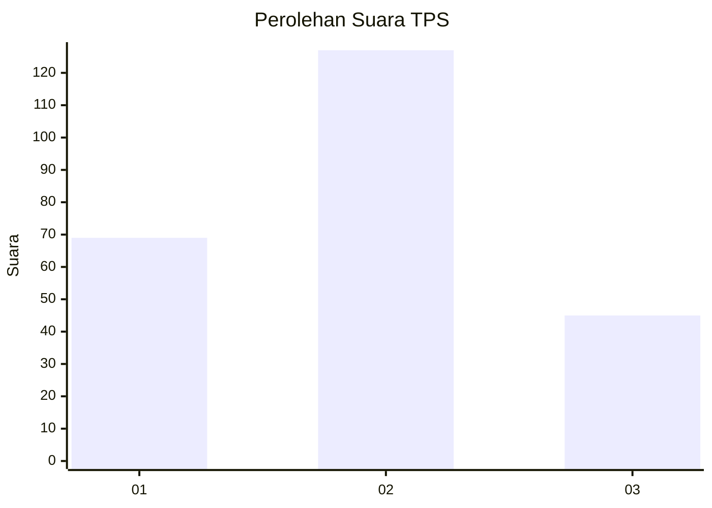
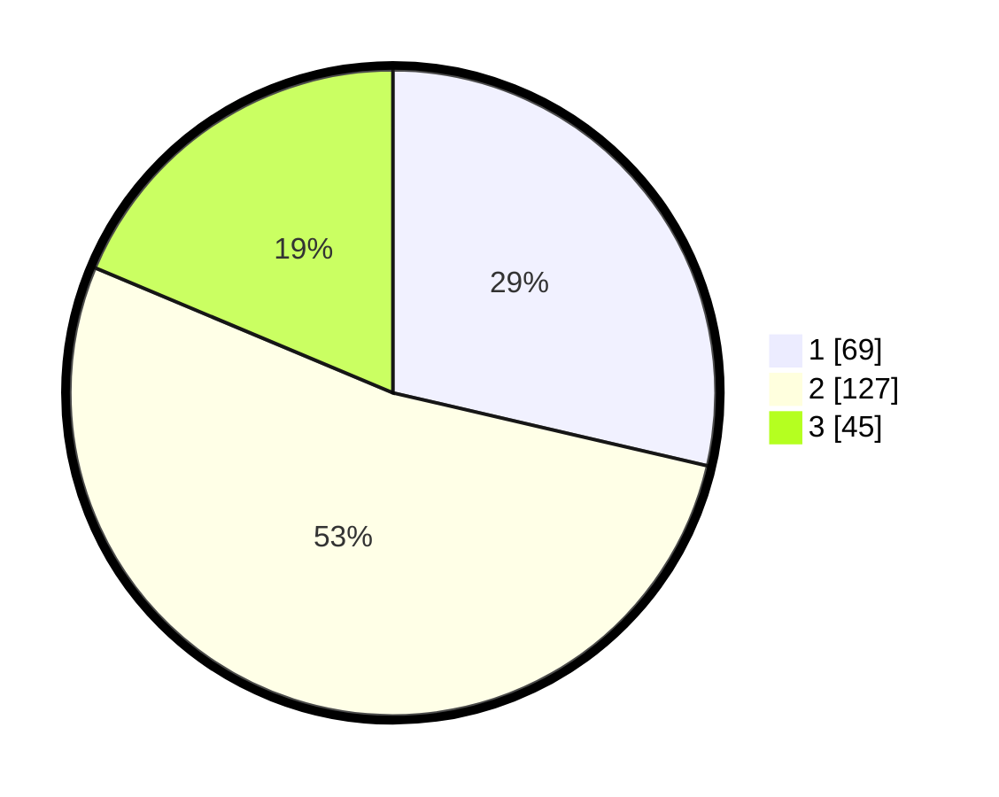

# Hasil

## Grafik

## Tabel

| No. | Nama Paslon    | Suara | Suara (raw) | Persentase |
|:--- |:-------------- | -----:| -----------:| ----------:|
| 1   | ANIES MUHAIMIN | 69    | [69][p-1]   | 28,63      |
| 2   | PRABOWO GIBRAN | 127   | [127][p-2]  | 52,70      |
| 3   | GANJAR MAHFUD  | 45    | [45][p-3]   | 18,67      |

[p-1]: https://github.com/gigit-pemilu/pemilu-2024-35-jawa-timur/blob/main/pilpres/hitung-suara/sub/35-jawa-timur/sub/73-kota-malang/sub/01-blimbing/sub/1007-purwantoro/sub/032-tps/sub/paslon-1.txt
[p-2]: https://github.com/gigit-pemilu/pemilu-2024-35-jawa-timur/blob/main/pilpres/hitung-suara/sub/35-jawa-timur/sub/73-kota-malang/sub/01-blimbing/sub/1007-purwantoro/sub/032-tps/sub/paslon-2.txt
[p-3]: https://github.com/gigit-pemilu/pemilu-2024-35-jawa-timur/blob/main/pilpres/hitung-suara/sub/35-jawa-timur/sub/73-kota-malang/sub/01-blimbing/sub/1007-purwantoro/sub/032-tps/sub/paslon-3.txt

## Foto C Plano

https://sirekap-obj-formc.kpu.go.id/dde0/pemilu/ppwp/35/73/01/10/07/3573011007032-20240214-223728--7789d902-93f8-415b-bfdb-b3029dd05c0c.jpg

https://sirekap-obj-formc.kpu.go.id/dde0/pemilu/ppwp/35/73/01/10/07/3573011007032-20240214-223822--f304de32-33e8-4a27-8306-2a5db566315f.jpg

https://sirekap-obj-formc.kpu.go.id/dde0/pemilu/ppwp/35/73/01/10/07/3573011007032-20240214-223948--87fb4086-5f94-41bb-99ae-ed7c2e5736d8.jpg

## Metadata

| Key        | Value               |
| ---------- | ------------------- |
| Time Stamp | 2024-02-25 12:00:00 |

