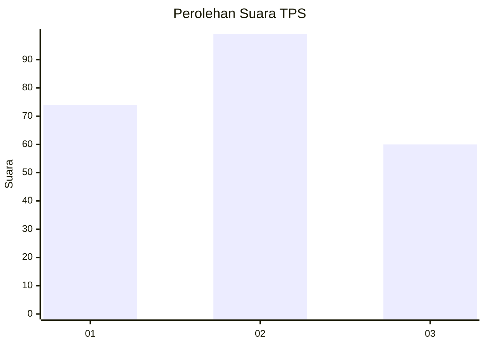
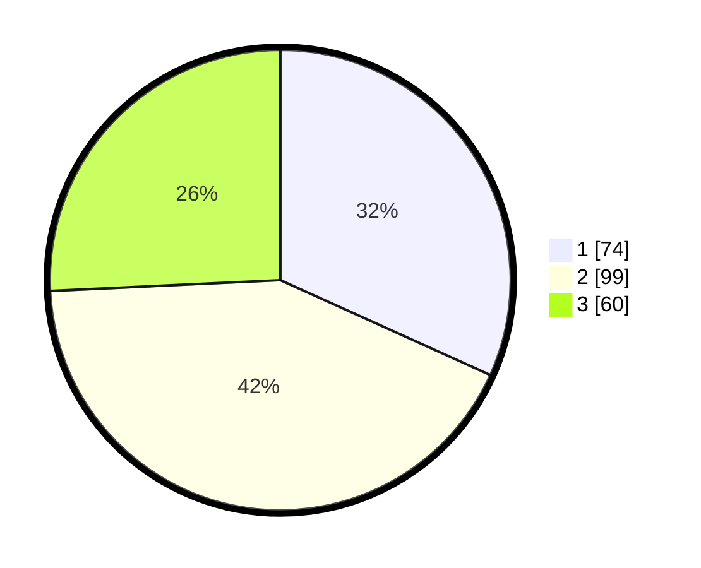

# Hasil

## Grafik

## Tabel

| No. | Nama Paslon    | Suara | Suara (raw) | Persentase |
|:--- |:-------------- | -----:| -----------:| ----------:|
| 1   | ANIES MUHAIMIN | 74    | [74][p-1]   | 31,76      |
| 2   | PRABOWO GIBRAN | 99    | [99][p-2]   | 42,49      |
| 3   | GANJAR MAHFUD  | 60    | [60][p-3]   | 25,75      |

[p-1]: https://github.com/gigit-pemilu/pemilu-2024/blob/main/pilpres/hitung-suara/sub/35-jawa-timur/sub/73-kota-malang/sub/01-blimbing/sub/1007-purwantoro/sub/045-tps/sub/paslon-1.txt
[p-2]: https://github.com/gigit-pemilu/pemilu-2024/blob/main/pilpres/hitung-suara/sub/35-jawa-timur/sub/73-kota-malang/sub/01-blimbing/sub/1007-purwantoro/sub/045-tps/sub/paslon-2.txt
[p-3]: https://github.com/gigit-pemilu/pemilu-2024/blob/main/pilpres/hitung-suara/sub/35-jawa-timur/sub/73-kota-malang/sub/01-blimbing/sub/1007-purwantoro/sub/045-tps/sub/paslon-3.txt

## Foto C Plano

https://sirekap-obj-formc.kpu.go.id/8cff/pemilu/ppwp/35/73/01/10/07/3573011007045-20240214-214418--ed51b360-7200-4b9c-8639-9dd4c7975a90.jpg

https://sirekap-obj-formc.kpu.go.id/8cff/pemilu/ppwp/35/73/01/10/07/3573011007045-20240214-155437--c6b043fc-21e5-48cd-a0fb-26478478aaa5.jpg

https://sirekap-obj-formc.kpu.go.id/8cff/pemilu/ppwp/35/73/01/10/07/3573011007045-20240214-155553--118cf9bb-5125-4405-9973-32b5c409cab5.jpg

## Metadata

| Key        | Value               |
| ---------- | ------------------- |
| Time Stamp | 2024-02-15 06:00:23 |

